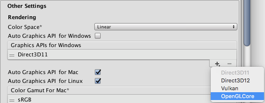

# Graphics API support

Unity supports DirectX, Metal, OpenGL, and Vulkan graphics APIs, depending on the availability of the API on a particular platform. Unity uses a built-in set of graphics APIs, or the graphics APIs that you select in the Editor. 

To use Unity’s default graphics APIs:

1. Open the [Player](class-PlayerSettings) settings  (menu: __Edit &gt; Project Settings__, then select the __Player__ category).

2. Navigate to __Other Settings__ and make sure __Auto Graphics API__ is checked:

    

When __Auto Graphics API__ for a platform is checked, the Player build includes a set of built-in graphics APIs and uses the appropriate one at run time to produce a best case scenario.

When __Auto Graphics API__ for a platform is not checked, the Editor uses the first API in the list. So, for example, to see how your application runs on OpenGL in the Editor, move __OpenGLCore__ to the top of the list and the Editor switches to use OpenGL rendering.

To override the default graphics APIs and use an alternate graphics API for the Editor and Player, uncheck the relevant __Auto Graphics API__, click the plus (+) button and choose the graphics API from the drop-down menu.

The graphics API at the top of the __Auto Graphics API__ list is the default API. If the default API isn’t supported by the specific platform, Unity uses the next API in the __Auto Graphics API__ list.

For information on how graphics rendering behaves between the platforms and Shader language semantics, see [Platform-specific rendering differences](SL-PlatformDifferences). Tessellation and geometry shaders are only supported by a subset of graphics APIs. This is controlled by the [Shader Compilation Target level](SL-ShaderCompileTargets).

For graphics API specific information, see documentation on [Metal](Metal), [DirectX](UsingDX11GL3Features) and [OpenGL](OpenGLCoreDetails). 

---

* 2018-06-02  <!-- include IncludeTextNewPageYesEdit -->

