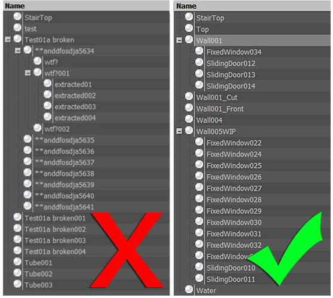
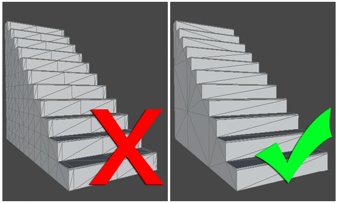
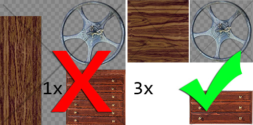
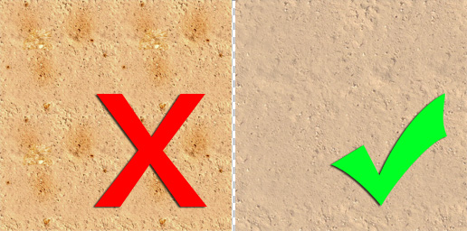
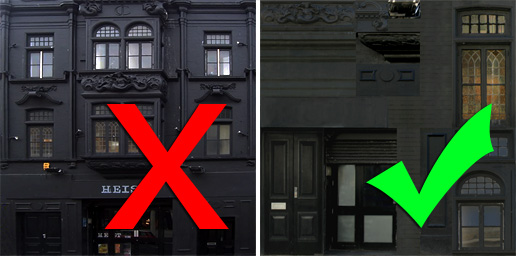

# Art Asset best practice guide

Unity supports textured 3D models from a variety of programs or sources. This short guide has been put together by games artists with developers at Unity to help you create Assets that work better and more efficiently in your Unity project.

## Scale and units

Working to scale can be important for both lighting and physics simulation.

* Set your system and project units to Metric for your software to work consistently with Unity.
    * Be aware that different systems use different units - for example, the system unit default for Max is inches while in Maya it is centimeters.
    * Unity has different scaling for importing FBX vs. importing native 3D modeling software files. Make sure you check the [FBX import scale settings](FBXImporter-Model). For example, if you want to achieve **Scale Factor** = 1 and **Object Transform Scale** = 1, use one of the [proprietary file formats](3D-formats) and set the **Convert Units** option.
    * If in doubt, export a meter cube with your Scene to match in Unity.
* Animation frame rate defaults can be different in different packages. Because of this, it is a good idea to set this consistently across your pipeline (for example, at 30fps).

## Files and objects

* Name objects in your Scene sensibly and uniquely. This helps you locate and troubleshoot specific Meshes in your project.
* Avoid special characters such as `*()?"#$`.
* Use simple but descriptive names for both objects and files in order to allow for duplication later.
* Keep your hierarchies as simple as you can.
* With big projects in your 3D application, consider having a working file outside your Unity project directory. This can often save time when running updates and importing unnecessary data.

 

### Mesh

* Build with an efficient topology. Use polygons only where you need them.
* Optimise your geometry if it has too many polygons. Many character models need to be intelligently optimized or even rebuilt by an artist, especially if sourced or built from:
    * 3D capture data
    * Poser
    * Zbrush
    * Other high density NURBS patch models designed for render
* Where you can afford them, evenly spaced polygons in buildings, landscape and architecture will help spread lighting and avoid awkward kinks.
* Avoid really long thin triangles.

 

The method you use to construct objects can have a massive effect on the number of polygons, especially when not optimized. In this diagram, the same shape mesh has 156 triangles on the right and 726 on the left. 726 may not sound like a great deal of polygons, but if this is used 40 times in a level, you will really start to see the savings. A good rule of thumb is often to start simple and add detail where needed. It's always easier to add polygons than take them away.

### Textures

If you author your textures to a power of two (for example, 512x512 or 256x1024), the textures will be more efficient and won't need rescaling at build time. You can use up to 4096x4096 pixels, but 2048x2048 is the highest available on many graphics cards and platforms.

Search online for expert advice on creating good textures, but some of these guidelines can help you get the most efficient results from your project:

* Work with a high-resolution source file outside your Unity project (such as a .psd or Gimp file). You can always downsize from the source, but not the other way round.
* Use the Texture resolution output you require in your Scene (save a copy, for example a 256x256 optimised .png or a .tga file). You can make a judgement based on where the Texture will be seen and where it is mapped.
* Store your output Texture files together in your Unity project (for example, in \Assets\textures).
* Make sure your 3D working file refers to the same Textures, for consistency when you save or export.
* Make use of the available space in your Texture, but be aware of different Materials requiring different parts of the same Texture. You can end up using or loading that Texture multiple times.
* For alpha and elements that may require different Shaders, separate the Textures. For example, the single Texture, below left, has been replaced by three smaller Textures, below right.

 

* Make use of tiling Textures which seamlessly repeat. This allows you to use better resolution repeating over space.
* Remove easily noticeable repeating elements from your bitmap, and be careful with contrast. To add details, use decals and objects to break up the repeats.

 

* Unity takes care of compression for the output platform, so unless your source is already a .jpg of the correct resolution, it's better to use a lossless format for your Textures.
* When creating a Texture page from photographs, reduce the page to individual modular sections that can repeat. For example, you don't need 12 of the same window using up Texture space. This means you can have more pixel detail for that one window.

 

### Materials

* Organize and name the materials in your Scene. This way you can find and edit your materials in Unity more easily when they've imported.
* You can choose to create Materials in Unity from either:
    * &lt;modelname&gt; - &lt;material name&gt; 
    or
    * &lt;texture name&gt; 
    Make sure you know which one you want.
* Settings for Materials in your native package will not all be imported to Unity:
    * __Diffuse Colour__, __Diffuse Texture__ and __Names__ are usually supported.
    * Shader model, specular, normal, other secondary Textures and substance material settings are not recognised or imported.

### Import and export

Unity can use two types of files: saved 3D application files, and exported 3D formats. Which you decide to use can be quite important. For more information, see [Model file formats](3D-formats).

---

*  2018-04-25  <!-- include IncludeTextAmendPageSomeEdit -->

*  2018-09-26  <!-- include IncludeTextAmendPageSomeEdit -->
