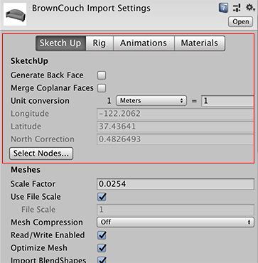
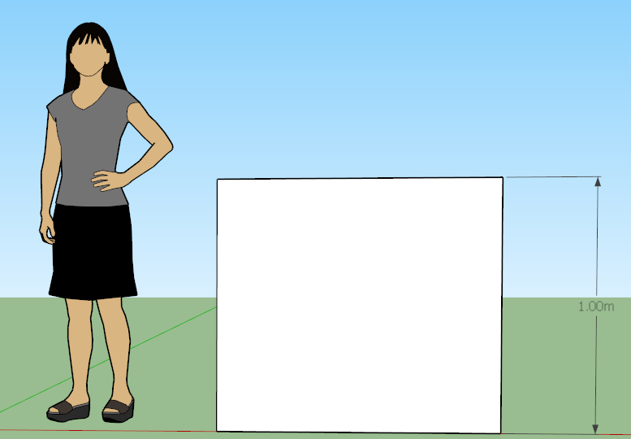
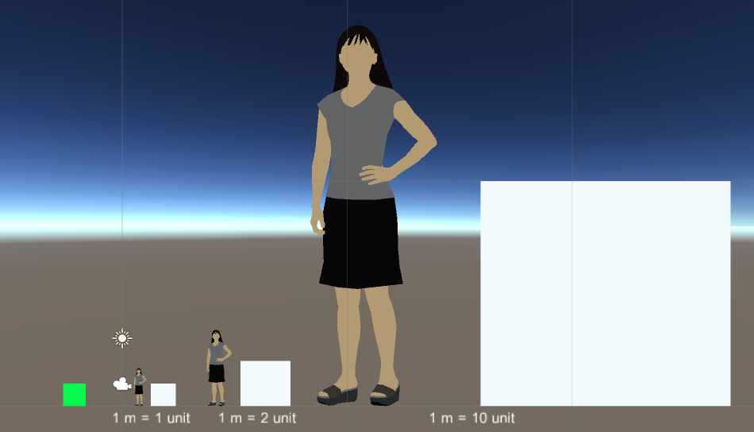
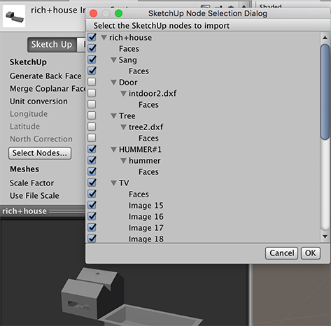

# SketchUp Settings

SketchUp is software that is commonly used for architecture modeling. 
Unity reads SketchUp files directly and supports the following SketchUp features:

* Textures and Materials, which Unity imports according to the settings on the [Materials tab](FBXImporter-Materials).
* Component Definitions and Groups, which are converted into meshes, instanced as GameObjects which you can place in the scene.
* Camera data for each scene in the file.

*Tip*: For information on how to export an FBX file from SketchUp, see [Exporting from other applications](HOWTO-exportFBX).

## Limitations
* GIF Textures are not supported.
* Only limited data from SketchUp Scenes are imported.
* Unity does not support or import the following SketchUp features:
	* 2D Components (Text, dimensions)
	* [Animation settings](http://help.sketchup.com/en/article/114452)
	* [Attributes](http://help.sketchup.com/en/article/114547)
	* [Drawing Styles](http://help.sketchup.com/en/article/117009)
	* [Dynamic components](http://help.sketchup.com/en/article/22496)
	* [Layers](http://help.sketchup.com/en/article/114598)
	* [Lines](http://help.sketchup.com/en/article/94824)
	* [Section Planes](http://help.sketchup.com/en/article/94999)
	* [Shadow settings](http://help.sketchup.com/en/article/114934)

## SketchUp-specific Import Settings
To import a SketchUp file directly into Unity, drag it into the Assets folder using the Finder (MacOS) or the File Manager (Windows).
When you click the Asset file inside Unity, the Model Inspector appears in a special __Sketch Up__ tab:

|**Property:** ||**Function:** |
|:---|:---|:---|
|__SketchUp__|||
|__Generate Back Face__||Generate back-facing polygons in Unity. By default, Unity only imports the front-facing polygons to reduce polygon counts unless there is Material assigned to the back-facing polygons in SketchUp. |
|__Merge Coplanar Faces__||Merge coplanar faces when generating meshes in Unity.|
|__Unit Conversion__||Length measurement to unit conversion.|
||Unit drop-down box|Choose the unit to use for the conversion. Defaults to *Meters*.|
||Value to convert|This value determines how the __Scale Factor__ is calculated (see [Unit conversion](#UnitConversion) below).|
|__Longitude__||Read-only value from the *Geo Coordinate* system, used to identify a position on a geographic system.|
|__Latitude__||Read-only value from the *Geo Coordinate* system, used to identify a position on a geographic system.|
|__North Correction__||Read-only value from the *Geo Coordinate* system, used to describe the angle needed to rotate North to the Z axis.|
|__Select Nodes__||Open a window where you can specify which nodes to import. A node represents an Entity, Group, or Component Instance in SketchUp. For example, if you have one file containing several couches, you can select the one you want to import. For more information, see [Selecting SketchUpNodes](#SelectingNodes) below. |

The rest of the options on the Inspector window are the [regular FBX Model import options](class-FBXImporter) that are available for any 3D modeling application. 

## Unit conversion

By default, Unity scales SketchUp models to 1 meter (0.0254 inches) to 1 unit length.

Changing the default __Unit Conversion__ values affects the scale of the imported file:

## Selecting SketchUp Nodes

Unity supports the visibility setting in the SketchUp file for each node. 
If a node is hidden in the SketchUp file, Unity does not import the node by default. 
However, you can override this behavior by clicking the __Select Nodes__ button to display the SketchUp node hierarchy in the SketchUp Node Selection Dialog window.

Each group and component instance in the file appears in the hierarchy as a node, which you can select or deselect. When you are finished selecting the nodes to include, click the OK button to import only the checked nodes.

---

*  2018-04-25  <!-- include IncludeTextAmendPageSomeEdit -->
