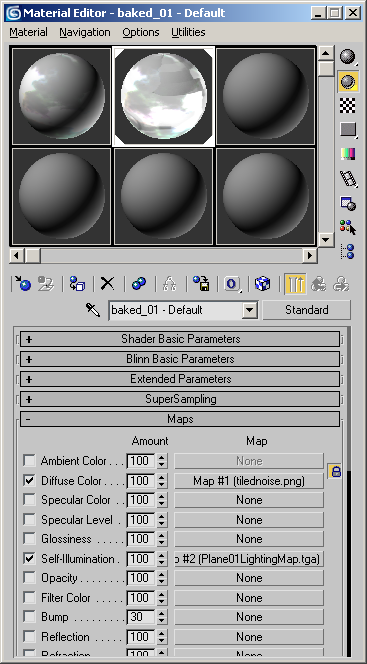
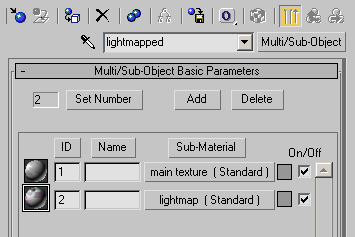
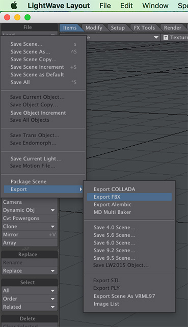
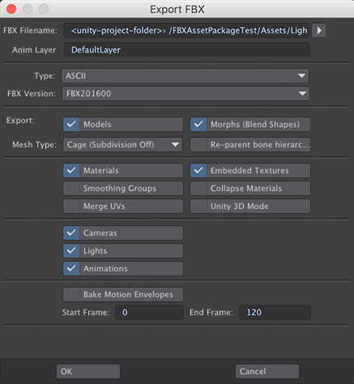

# Exporting from other applications

Unity supports FBX files which you can export from many 3D modeling applications. Use these guidelines to help ensure the best results:

1. [Select](#Select) what you want to export inside your 3D modeling application.
2. [Prepare](#Prepare) what you need to include inside your 3D modeling application.
3. Check the [FBX settings](#Export) before exporting.
4. [Verify and import](#Import) the FBX file into Unity.

**Note**: In addition to these generation guidelines about exporting from 3d modeling applications, some 3d modeling applications have more specific information under these sections:

 * [Autodesk® Maya®](#Maya)
 * [MAXON Cinema 4D](#Cinema4D)
 * [Autodesk® 3ds Max®](#Max)
 * [NewTek LightWave](#LightWave)

## Selecting what to export 

Think about what you want to export: some scene objects are essential but others may be unnecessary. 
Applications often let you export **selected objects** or a **whole scene**.
You can optimize the data in Unity by keeping only the essential objects.

If you choose to export only specific objects in your scene, you can:

 * Export only the **selected objects** if your application supports it. 
 * Remove unwanted data from your scene and export the **whole scene**.
 * Make a preset or a custom scene exporter to automate or simplify the selection export process.

## Preparing what you need to include

Prepare your Assets for export, using the following considerations:

|**Object:** |**Preparations:** |
|:---|:---|
|__Meshes__|All NURBS, NURMS, splines, patches, and subdiv surfaces must be converted to polygons (triangulation or quadrangulation)|
|__Animation__|Select the correct rig. Check the frame rate. Check the animation length.|
|__Blend Shapes__ or __Morphing__|Make sure your Blend Shapes or Morph targets are assigned. Set up the export Mesh appropriately.|
|**Bake deformers**|Make sure that you bake deformers onto your Model before exporting to FBX. For example, if you are exporting a complex rig from Maya, you can [bake the deformation onto skin weights](#bake-deformers) before you export the Model to FBX.|
|__Textures__|Make sure your textures are either sourced from your Unity Project or copy them into a folder called `textures` inside your Unity Project.   **Note:** We don't recommend embedding textures in the FBX file using the __Embed Media__ option. You must extract textures before using them, so embedding them just bloats your project unnecessarily and slows the import process.|
|__Smoothing__|Verify any smoothing groups and smooth Mesh settings.  **Important:** Importing blendshape normals requires having smoothing groups in the FBX file.|

## Setting the FBX export options 

Check your FBX export settings:

 * Check each setting in the export dialogue of your 3D modeling application so that you know what to match up the FBX import settings in Unity.
 * Select whether to export Animation, Deformations, Skins, Morphs according to your needs.
 * Nodes, markers and their transforms can be exported to Unity.
 * Select any Cameras, Lights, and Visibility settings you want to import into Unity.
 * Use the [Latest Version of FBX](https://www.autodesk.com/products/fbx/overview) where possible. Autodesk regularly updates their FBX installer. 
 * Make sure you use the same FBX version to import files into Unity as you used to export them from your 3D modeling application. Using different versions of the software can provide unexpected results.

## Verifying and importing into Unity

Before importing your FBX file into Unity:

1. Verify the size of your exported file. Perform a sanity check on the file size (e.g. &gt;10kb?).

2. Re-import your FBX file into a new scene back into the 3D modeling software you used to generate it. Check to make sure it is what you expected.

To import your file into Unity, follow the instructions for [Importing](ImportingAssets), keeping in mind how you set the export options in your 3D modeling software.

## Scaling factors 

Unity's physics and lighting systems expect **1** meter in the game world to be **1** unit in the imported file.

The defaults for different 3D packages are as follows:

*  .fbx, .max, .jas, .c4d = **0.01**
*  .mb, .ma, .lxo, .dxf, .blend, .dae = **1** 
* .3ds = **0.1**

When importing Model files into Unity from a 3D modeling application with a different scaling factor, you can convert the file units to use the Unity scale by [enabling the __Convert Units__ option](FBXImporter-Model).

## Export settings in specific 3D modeling applications

### Autodesk® Maya®

You can use the [FBX Export options](http://help.autodesk.com/view/MAYAUL/2018/ENU/?guid=GUID-FE8DBEAA-C2DD-43B3-9933-4BA4CDDEAA89) to pick what to export in your FBX file.

#### Exporting BlendShapes (morphing)

When exporting BlendShapes (Morphing) from Maya, follow these guidelines:

* Apply the blend shape to the export mesh with its targets in order.
* If you require Maya animation keyframes, you can animate keyframes on the blend shape node.
* Enable the __Animation__ &gt; __Deformed Models__ &gt; __Blend Shapes__ FBX Export option in Maya before exporting the mesh.
* If you also want to export skin deformation, enable the __Animation__ &gt; __Deformed Models__ &gt; __Skins__ FBX Export option in Maya before exporting the mesh.

When you've imported the file into Unity, select it in the __Project__ view and enable __Bake Animations__ in the [Animations tab of the Model Importer](class-AnimationClip).

#### Exporting complex deformation

You can create very complex character rigs in Maya. For performance reasons, Unity only supports linear blend skinning with four influences per vertex. If your character uses more than four influences, when you import the Model into Unity, the animation may appear choppy or distorted. Or if you are using deformation other than clusters, the animation may be completely absent.

To solve this problem, bake the deformation joints before exporting your Model from Maya, using the *Bake Deformer* tool (from Maya's top menu: **Skin** > **Bake Deformers to Skin Weights**).  

For more information, see [Bake deformers on a character](http://help.autodesk.com/view/MAYAUL/2018/ENU/?guid=GUID-8B68FF4A-E9BC-44E9-B0D9-53CFE0C008FC) in the Autodesk documentation.

### Cinema 4D

#### Animated characters using IK

If you are using IK to animate your characters in Cinema 4D, you have to bake the IK before exporting using the __Plugins &gt; Mocca &gt; Cappucino__ menu in Cinema 4D. 
If you don't bake your IK prior to importing into Unity, you only get animated locators and no animated bones.

#### Maximizing import speed 

You can speed up file import into Unity by turning off the __Embed Textures__ preference in Cinema 4D before you export. Check the [Cinema 4D documentation](https://help.maxon.net/us/#FFBXEXPORT-FBXEXPORT_GROUP) for instructions.

### Autodesk® 3ds Max®

You can use the [FBX Export options](https://help.autodesk.com/view/3DSMAX/2018/ENU/?guid=GUID-EB0F5BB7-2E59-4EF6-8B16-F59CC56A4747) to pick what to export in your FBX file.

When exporting from 3ds Max, there are some extra considerations when dealing with the following:

* [Exporting quads](#Quads)
* [Bone-based Animations](#Bones)
* [Morph targets](#Blendshapes) (Blendshapes)
* [UV sets for Lightmapping](#Lightmapping)

#### Exporting quads

3ds Max's editable Mesh always exports triangles. The Editable Poly retains quads and N-gons on import. So if you want to import quads into Unity, you have to use an Editable Poly in 3ds Max.

#### Bone-based Animations

Follow these guidelines when you want to export bone-based animations in 3ds Max:

* After setting up the bone structure and the animations (using FK or IK), select all bones and/or IK solvers.
* Select **Motion** &gt; **Motion Paths** &gt; **Collapse**. Unity makes a key filter, so the amount of keys you export is irrelevant.
* Click the OK button on the FBX Exporter window.
* Copy the FBX file into the Assets folder.
* Open Unity and reassign the Texture to the Material in the root bone.

When exporting a bone hierarchy with Mesh and animations from 3ds Max to Unity, the exported GameObject hierarchy corresponds to the hierarchy you can see in the 3ds Max Schematic View. However, Unity uses a GameObject as the new root, containing the animations, and places the Mesh and material information in the root bone.

If you prefer to keep animation and Mesh information in the same Unity GameObject, parent the Mesh node to a bone in the bone hierarchy in 3ds Max before exporting. 

#### Morph targets (Blendshapes) 

Follow these guidelines when you want to export Morph targets in 3ds Max:

* Apply the Morpher Modifier to the export Mesh with appropriate morph targets set up in the Channel List.
* If you require 3ds Max animation keyframes, you can animate keyframes on the Mesh/modifier.
* Before exporting the Mesh, eEnable the __Animation__ &gt; __Deformed Models__ &gt; __Blend Shapes__ FBX Export option in 3ds Max.
* If you also want to export skin deformation, enable the __Animation__ &gt; __Deformed Models__ &gt; __Skins__ FBX Export option in 3ds Max before exporting the Mesh.

#### UV sets for Lightmapping

Unity has a built-in [lightmapper](GIIntro), but you can also create lightmaps using texture baking (**Render To Texture** on the Rendering menu) feature and automatic unwrapping functionality in 3ds Max. 

Usually one UV set is used for main texture and/or normal maps, and another UV set is used for the lightmap Texture. For both UV sets to come through properly, set the Material in 3ds Max to Standard and set up both Diffuse (for the main Texture)and Self-Illumination (for the lightmap) map slots:

 

**Note**: If the object uses a Shell type of Material, Autodesk's FBX exporter does **not export UVs correctly**.

Alternatively, you can use Multi/Sub Object material type and setup two sub-materials, using the main texture and the lightmap in their diffuse map slots, as shown below. However, if the faces in your Model use different sub-material IDs, this results in multiple materials being imported, which is not optimal for performance.

 

### LightWave

You can access the FBX export settings window inside LightWave by selecting **Save** &gt; **Export** &gt; **Export FBX** from the **File** toolbar in LightWave Layout:

 

The Export FBX window appears.

 

|**Property:** ||**Function:** |
|:---|:---|:---|
|__FBX Filename__||Set the name and location of the FBX file. Use a location under the Unity `Assets` folder.|
|__Anim Layer__||Name of the animation layer to use. |
|__Type__||Use __Binary__ to reduce filesize or __ASCII__ for a text-editable FBX file.|
|__FBX Version__||Select the most recent FBX version from the list, making sure that it matches the version that Unity is using.|
|__Export__|||
|__Models__||Export all models in the scene|
|__Morphs (Blend Shapes)__||Export all BlendShapes in the scene|
|__Mesh type__|||
||__Cage (Subdivision Off)__|Export the object without any subdivision applied to it|
||__Subdivision__|Subdivide the mesh when it is exported|
|__Re-parent bone hierarchy__||Create a null to act as the new parent of the bone hierarchy.  When exporting a rig from Layout with the bone hierarchy parented to the mesh, the actual movement of the deformed mesh is twice what it should be. Enabling this new parent keeps the mesh in place.|
|__Materials__||Convert LightWave’s standard Surface channels and image maps. This does not include procedural textures and nodes.|
|__Embedded Textures__||Save embedded Textures as image maps included directly in the FBX file instead of in a separate image directory. This creates much larger, but self-contained, FBX files.|
|__Smoothing Groups__||Convert LightWave's normals into smoothing groups.|
|__Collapse Materials__||Collapse surfaces with identical Material names, exporting the Materials separately. However, if both Material names and all surface parameters match, the two Materials are always merged, regardless of this setting.|
|__Merge UVs__||Collapse multiple UV maps into a single map per object.|
|__Unity 3D Mode__||Correct rotation errors caused by converting between coordinate systems across LightWave, FBX, and Unity.  Both LightWave and Unity use *left-handed* coordinate systems but FBX is *right-handed*. When LightWave exports to FBX, it converts to right-handed coordinates along the Z axis. When Unity imports the FBX file, it converts back to left-handed coordinates along the X axis, which results in an apparent 180 degree rotation of the scene. Using the setting means that when you go into Unity and look down the Z axis, the imported FBX looks exactly the same as it does inside LightWave.|
|__Cameras__||Export all cameras in the scene.|
|__Lights__||Export all lights in the scene.|
|__Animations__||Export simple animations based on movement, rotation or scaling without baking. Character animation or other animation using IK or dynamics should still be baked, using __Bake Motion Envelopes__.|
|__Bake Motion Envelopes__||Set an arbitrary start and end point for baking, in case there are setup frames you do not wish to capture. Only available if __Animations__ is checked.|
|__Start Frame__ and __End Frame__||Export data only inside this timeframe.|
|__Scale Scene__||Set a scale for your scene to match the [Unity file scale](#Scaling) value.|

---

*  2018-09-26  <!-- include IncludeTextAmendPageSomeEdit -->
