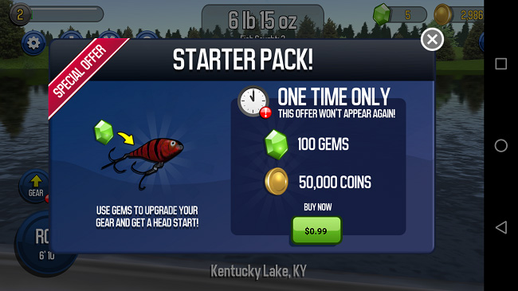

# IAP Promo

## Overview
IAP Promo allows developers to easily promote micro-transactions. Use it to target different players with unique purchase opportunities at various points in the game. 

### Requirements
Your game must use Unity version 5.4+, and enable the following services:

- [Unity IAP](https://docs.unity3d.com/Manual/UnityIAP.html) SDK 1.17+ 
- [Unity Ads](https://docs.unity3d.com/Manual/UnityAds.html) SDK 2.2+ (without mediation)

**Note**: Unity recommends using the latest [Unity IAP SDK](https://assetstore.unity.com/packages/add-ons/services/billing/unity-iap-68207) (1.2+) and [Unity Ads SDK](https://assetstore.unity.com/packages/add-ons/services/unity-ads-66123) (2.3+) for access to the latest features. Using older versions of the SDKs may cause initialization errors.

### IAP Promo compoments
There are three major components of an IAP Promo, all of which have their own articles: 

- [Placements](https://docs.unity3d.com/Manual/IAPPromoPlacements)
- [Products](https://docs.unity3d.com/Manual/IAPPromoProducts)
- [Promotions](https://docs.unity3d.com/Manual/IAPPromoPromotions)

__Placements__ trigger fill requests, whereby the feature searches associated __Promotions__ for targeted __Products__ to show the player. Players can make in-app purchases directly from the resulting interstitial ad.

## Maximizing revenue with machine learning
IAP Promo eliminates the need for traditional A/B testing methods. Its machine learning software leverages the aggregated data in Unity’s network, looks for data patterns, then feeds them into a model to improve your game. This enables personalized offers, even for brand new players. This completely automated service works around the clock.

### How it works
When a __Placement__ makes a request, the system looks at all available __Products__ that are eligible to display. It then applies [business criteria filtering](https://docs.unity3d.com/Manual/IAPPromoPromotions.html#BusinessLogic) (for example, geographic or OS targeting), and uses data science to select the best Product for a user given the remaining options. The model considers many data points to inform its choice, such as device characteristics and player session behavior. We define the best offer as the Product that maximizes lifetime value (LTV).

### Getting started
To leverage IAP Promo’s machine learning feature, simply add multiple [Products](https://docs.unity3d.com/Manual/IAPPromoProducts) to a [Promotion](https://docs.unity3d.com/Manual/IAPPromoPromotions), and let Unity do the work.

Consider for example a __Promotion__ that targets players when they complete a level:

* When the player completes a level, the game calls an ‘EndLevel’ __Placement__. The Placement’s fill request returns a list of three possible __Products__:
    * A $1.99 currency bundle with a 10% bonus
    * A $2.99 currency bundle with a 10% bonus
    * A $4.99 currency bundle with a 10% bonus
* The system finds that the player meets targeting criteria for all three offers.
* The algorithm determines which currency bundle best maximizes the player’s LTV, and displays that offer.

We recommend supplying at least three price points per __Promotion__ (low, medium, and high), with appropriately commensurate payouts. As with any data-driven model, the more data points available, the more effective it is. There is no limit to the number of __Products__ you can add to a __Promotion__; you may even choose to provide a __Product__ for each price tier in the game’s app store.

 
 

-----
* 2018-09-10  <!-- include IncludeTextAmendPageYesEdit -->
