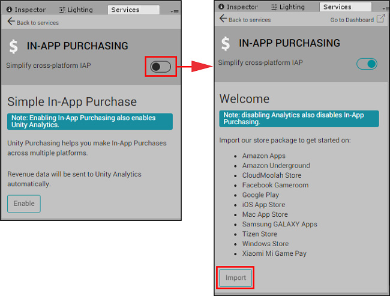
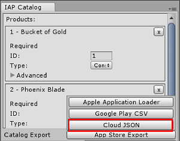

# IAP Promo integration
## Overview
**Important note**: Your game must initialize Unity IAP before initializing Unity Ads for IAP Promo to work. 

This integration guide covers four major steps: 

* [Preparing your Project in the Unity Editor](#Preparation)
* [Implementation](#Implementation)
    * [IAP](#ImplementingIAP)
    * [Ads](#ImplementingAds)
* [Configuring Promotions](#ConfiguringPromotions)
* [Testing your integration](#Testing)

<a name="Preparation"></a>
## Preparing your Project in the Unity Editor

### Setting up Unity Services
To use IAP Promo, you need to:

1. [Configure your project for Unity Services](https://docs.unity3d.com/Manual/SettingUpProjectServices.html). 
2. Enable the [Unity IAP SDK](https://assetstore.unity.com/packages/add-ons/services/billing/unity-iap-68207) (1.2+) and [Unity Ads SDK](https://assetstore.unity.com/packages/add-ons/services/unity-ads-66123) (2.3+) in your Project.

#### Setting up Unity IAP
IAP Promo requires a supported version of the Unity IAP SDK (1.17+). To acquire the latest IAP SDK, either enable __In-App Purchasing__ in the Services window (__Window &gt; Services__), or import it from the [Asset store](https://assetstore.unity.com/packages/add-ons/services/billing/unity-iap-68207). If you're enabling it from the Services window, be sure to **Import** the Asset package when prompted.



See documentation on [Setting up IAP](https://docs.unity3d.com/Manual/UnityIAPSettingUp.html) for additional information.

#### Setting up Unity Ads
IAP Promo requires a supported version of the Unity Ads SDK (2.2+). Acquire the latest Ads SDK by importing it from the [Asset store](https://assetstore.unity.com/packages/add-ons/services/unity-ads-66123). This enables Unity Ads for your Project.

See [Setting up Ads for Unity](https://docs.unity3d.com/Manual/UnityAdsUnityIntegration.html) for additional information. 

<a name="Implementation"></a>
## Implementation
With the required services set up, you can implement them in your game. 

<a name="ImplementingIAP"></a>
### Implementing IAP
There are two options for initialization: codeless or scripting. 

#### Using Codeless IAP
[Codeless IAP](https://docs.unity3d.com/Manual/UnityIAPCodelessIAP.html) handles initialization for you. If you use Codeless IAP initialization, you must call the Unity Ads initialization method elsewhere in your code.

To use Codeless IAP, populate a __Product Catalog__, then create an __IAP Listener__ to fetch that catalog:

1. In the Editor, select __Window &gt; UnityIAP &gt; IAP Catalog__ to open the __IAP Catalog__ window. This window lists all of your previously configured Products. You must have at least one __Product__ configured in your __Product Catalog__. For a complete walkthrough on setting up __Products__, see [Codeless IAP](https://docs.unity3d.com/Manual/UnityIAPCodelessIAP.html).

2. In the __IAP Catalog__ window, select __App Store Export &gt; Cloud JSON__ to export a local copy of the __Product Catalog__.<br/>

3. Create an __IAP Listener__. Select __Window &gt; Unity IAP &gt; Create IAP Listener__, and add it to the first scene of your game. The listener fetches your __Product Catalog__ as soon as the game boots. This avoids errors where the game requests __Promotions__ but a __Product__ isn't ready because the codeless button hasn't appeared in the scene yet.

#### Using scripting
If you do not use Codeless IAP, you must [initialize Unity IAP manually](https://docs.unity3d.com/Manual/UnityIAPInitialization.html) through a script. See the following code example: 

```
using System.Collections;
using System.Collections.Generic;

using UnityEngine;
using UnityEngine.Events;
using UnityEngine.Purchasing;
using UnityEngine.UI;

public class UnityIAP : MonoBehaviour, IStoreListener
{
    private IStoreController controller;

    private const string product_coins = "100.gold.coins";
    private const string product_hat = "top_hat";
    private const string product_elite = "elite_status";
    private const string product_bundle = "gem_super_box";
    public int coin_count = 0;
    public int gems_count = 0;
    public bool hat_owned = false;
    public bool elite_member = false;

    private void Start()
    {
        Debug.Log("UnityIAP.Init()");

        StandardPurchasingModule module = StandardPurchasingModule.Instance();
        ProductCatalog catalog = ProductCatalog.LoadDefaultCatalog();
        ConfigurationBuilder builder = ConfigurationBuilder.Instance(module);
        IAPConfigurationHelper.PopulateConfigurationBuilder(ref builder, catalog);

        UnityPurchasing.Initialize(this, builder);
    }

    public void OnInitialized(IStoreController controller, IExtensionProvider extensions)
    {
        Debug.Log("UnityIAP.OnInitialized(...)");
        this.controller = controller;

        // Include any additional initialization logic as needed
    }

    public void OnInitializeFailed(InitializationFailureReason error)
    {
        Debug.Log("UnityIAP.OnInitializeFailed(" + error + ")");

        // Include any additional initialization failure logic as needed 
    }

    public void Buy(string productId)
    {
        Debug.Log("UnityIAP.BuyClicked(" + productId + ")");
        this.controller.InitiatePurchase(productId);
    }

    public void OnPurchaseFailed(Product item, PurchaseFailureReason r)
    {
        Debug.Log("UnityIAP.OnPurchaseFailed(" + item + ", " + r + ")");
    }

    public PurchaseProcessingResult ProcessPurchase(PurchaseEventArgs e)
    {
        string purchasedItem = e.purchasedProduct.definition.id;

        switch (purchasedItem)
        {
            case product_coins:
                Debug.Log("IAPLog: Congratualtions you are richer!");
                coin_count += 100;
                Debug.Log("IAPLog: Coin count: " + coin_count);
                break;

            case product_hat:
                hat_owned = true;
                Button topHatButton = GameObject.Find("buyTopHat").GetComponent<Button>();
                topHatButton.interactable = false;
                topHatButton.GetComponentInChildren<Text>().text = "That hat is dashing!";
                Debug.Log("IAPLog: Hat owned: " + hat_owned);
                break;

            case product_elite:
                elite_member = true;
                Button eliteButton = GameObject.Find("buyElite").GetComponent<Button>();
                eliteButton.interactable = false;
                eliteButton.GetComponentInChildren<Text>().text = "Welcome to Elite Status";
                Debug.Log("IAPLog: Elite member: " + elite_member);
                break;
            case product_bundle:
                gems_count += 5000;
                break;
        }

        return PurchaseProcessingResult.Complete;
    }
}
```

<a name="ImplementingAds"></a>
### Implementing Unity Ads
You must also [initialize Unity Ads](https://unityads.unity3d.com/help/monetization/integration-guide-unity), whether or not you use the Codeless or manual IAP initialization method. The following code sample illustrates an initialization method to invoke:

```
using System.Collections;
using System.Collections.Generic;

using UnityEngine;
using UnityEngine.Advertisements;
using UnityEngine.Events;
using UnityEngine.Purchasing;
using UnityEngine.UI;

public class AdsManager : MonoBehaviour
{
    #if UNITY_IOS
        private string gameId = "0000000"; // Your iOS game ID here
    #elif UNITY_ANDROID
        private string gameId = "9999999"; // Your Android game ID here
    #else
        private string gameId = "0123456"; // Prevents Editor Errors
    #endif

    public void Init()
    {
        Debug.Log("UnityAds.Init()");
        if (!Advertisement.isSupported || Advertisement.isInitialized)
        {
            Debug.Log("Could not initialize ads");
            return;
        }

        Debug.Log("Initializing Unity Ads with game ID: " + gameId);
        Advertisement.Initialize(gameId, false);
    }

    public void ShowAdUnit()
    {
        Debug.Log("Unity Ads Log: Ad shown");
        Advertisement.Show("testAdButton"); // Ad Placement ID for ad here
    }

    public void ShowPromo()
    {
        Debug.Log("Unity Ads Log: Promo Shown");
        Advertisement.Show("testPromoButton"); // Ad Placement ID for Promo here
    }
}
```

<a name="ConfiguringPromotions"></a>
## Configuring Promotions on the Developer Dashboard
Navigate to the [IAP Promo section of the Developer Dashboard](https://iap.unityads.unity3d.com) to configure your IAP Promo offers: 

- Use [Placements](https://docs.unity3d.com/Manual/IAPPromoPlacements) to control when and how your __Promotions__ display in-game.
- Use the [Products](https://docs.unity3d.com/Manual/IAPPromoProducts) interface to import your __Product Catalog__ and manage each Product's creative assets. 
- Define the parameters of your [Promotions](https://docs.unity3d.com/Manual/IAPPromoPromotions), such as when to run them, which __Placements__ and __Products__ they include, and which users they target.

<a name="Testing"></a>
## Testing your integration
Call your IAP Promo content by implementing the following example code:

```
public void ShowPromo()
{
    Advertisement.Show (placementID);
}
```

Press __Play__ in the Editor to check that a test ad appears when the __Placement__ makes its request. To see real promotional creative assets, you must build the game to a device in production mode.


<br/>
<br/>

-----
* <span class="page-edit">2018-09-10  <!-- include IncludeTextAmendPageYesEdit --></span>
 
