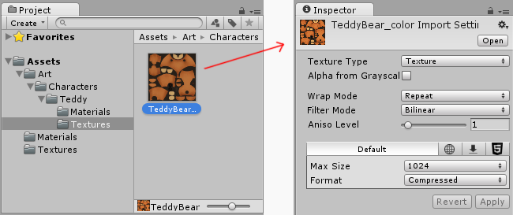
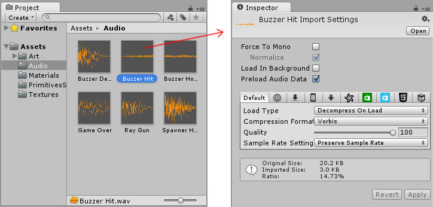

# Importing

You can bring Assets created outside of Unity into your Unity Project by either exporting the file directly into the Assets folder under your Project, or copying it into that folder. For many common formats, you can save your source file directly into your Project's Assets folder and Unity can read it. Unity also detects when you save new changes to the file and re-imports files as necessary.

When you create a Unity Project, you are creating a folder (named after your Project) which contains the following subfolders:

Save or copy files that you want to use in your Project into the Assets folder. You can use the __Project window__ inside Unity to view the contents of your Assets folder. Therefore, if you save or copy a file to your Assets folder, Unity imports it and appears in your Project window.

Unity automatically detects files as they are added to the Assets folder, or if they are modified. When you put any Asset into your Assets folder, it appears in your __Project View__.

 

If you drag a file into Unity's Project window from your computer (either from the Finder on Mac, or from the Explorer on Windows), Unity *copies* it into your Assets folder, and it appears in the Project window.

The items that appear in your Project window represent (in most cases) actual files on your computer, and if you delete them within Unity, you are deleting them from your computer too.

The above image shows an example of a few files and folders inside the Assets folder of a Unity Project. You can create as many folders as you like and use them to organize your Assets.

The image above shows **.meta** files listed in the file system, but not visible in Unity's Project window. Unity creates these .meta files for each asset and folder, but they are [hidden](https://en.wikipedia.org/wiki/Hidden_file_and_hidden_directory) by default, so you may not see them in your file system either.

They contain important information about how the asset is used in the Project and they must stay with the asset file they relate to, so if you move or rename an asset file in your file system, you must also move/rename the meta file to match. 

The simplest way to safely move or rename your assets is to always do it from within Unity's Project folder. This way, Unity automatically moves or renames the corresponding meta file. If you like, you can read more about .meta files and what goes on [behind-the-scenes during the import process](BehindtheScenes).

If you want to bring collections of Assets into your Project, you can use [Asset packages](AssetPackages).

## Inspecting Assets

Each type of Asset that Unity supports has a set of Import Settings, which affect how the Asset appears or behaves. To view an Asset's import settings, select the Asset in the __Project View__. The import settings for this Asset will appear in the __Inspector__. The options that appear vary depending on the type of Asset selected.

For example, the import settings for an image allow you to choose whether Unity imports it as a Texture, a 2D sprite, or a normal map. The import settings for an FBX file allow you to adjust the scale, generate normals or lightmap coordinates, and split & trim animation clips defined in the file.

For other Asset types, the import settings look different. The various settings you see relate to the type of Asset selected. Here's an example of an Audio Asset, with its related import settings shown in the inspector:

If you are developing a cross-platform Project, you can override the "default" settings and assign different import settings on a per-platform basis.

## See also:

* [Packages](AssetPackages)
* [Materials and Shaders](Materials)
* [Textures and Videos](Textures)
* [Sprite Editor](SpriteEditor)
* [Sprite Packer](SpritePacker)
* [Audio Files](AudioFiles)
* [Tracker Modules](TrackerModules)

---

*  2018-04-25  <!-- include IncludeTextAmendPageSomeEdit -->
