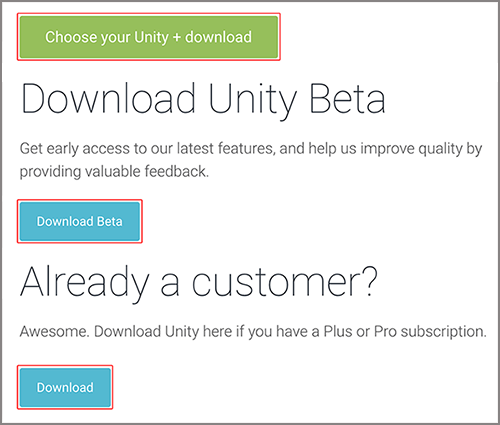
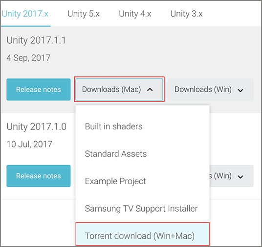

# Installing Unity without the hub

Download and install the Unity Editor from the [Unity download page] (https://unity3d.com/get-unity/download). This page gives you Unity Installer download links for both the latest full release version of Unity as well as the current Beta. If you require a Unity Plus or Pro license, you first need to confirm details for the license (number of seats, payment plan etc.). 

The [Unity download page](https://unity3d.com/get-unity/download) presents you with the following options:





On the Unity download page, choose your desired version of the Unity Installer.

## Unity installer

The Unity installer is a small executable program (approximately 1 MB in size) that lets you select which components of the Unity Editor you want to download and install.

If you’re not sure which components you want to install, leave the default selections, click **Continue**, and follow the installer’s instructions. 


**Note**: On PC there is also an extra option for Microsoft Visual Studio Community 2017.

## Installing Unity without the Unity installer

If you prefer, you can download and install all of the components separately, without using the Unity installer. The components are normal installer executable programs and packages, so you may find it simpler to use the installer, especially if you are a new Unity user. Some users, such as those wishing to automate deployment of Unity in an organization, may prefer to install from the command line.

### Installing Unity on Windows from the command line

If you want to automate deployment of Unity in an organization, you can install the Editor from the command line.

Use the following options when installing the Editor and other components from the command line on Windows.

**Note**: Installer command line arguments are case-sensitive.

#### Unity Editor install

| Command| Details |
|:---|:---|
|__/S__|Performs a silent (no questions asked) install.|
|__/D=PATH__|Sets the default install directory. Useful when combined with the silent install option. Default folder is **C:\Program Files (x86)\Unity** (32-bit) or **C:\Program Files\Unity** (64-bit).|

**Example**:

````
UnitySetup64.exe /S /D=E:\Development\Unity
````

This example installs Unity silently to a **E:\Development\Unity** folder, which will be the root of the Unity installation. In this case, the Editor executable will be installed in **E:\Development\Unity\Editor\Unity.exe**. The `/D` argument must be last and without quotes, even if the path contains spaces.

#### Unity Editor uninstall

To perform a silent uninstall, run `Uninstall.exe /S` from the ommand line or a script.

**Note**: Although the process finishes right away, it takes a few seconds before the files are actually removed. This is because the uninstaller is copied to a temporary location in order to be able to remove itself. Also, make sure the working directory is not inside the Unity install location, as it won't be able to remove the folder if this is the case.

#### Standard Assets install

To silently install Standard Assets:

````
UnityStandardAssetsSetup.exe /S /D=E:\Development\Unity
````

**Note**: If specifying a folder, use the Unity root folder (that is, the folder containing the Editor folder, and not where __Unity.exe__ is installed into).

#### Example Project install

To silently install the Example Project, use: 

````
UnityExampleProjectSetup.exe /S /D=E:\Development\Unity
````

**Note**: The default folder is `C:\Users\Public\Documentation\Unity Projects\Standard Assets Example Project`.

### Installing Unity on OS X from the command line

The individual Unity installers are provided as .pkg files, which can be installed using the `installer` command, as described below.

#### Unity Editor install

To install the Editor into a `/Applications/Unity` folder on the specified target volume, enter:

````
sudo installer [-dumplog] -package Unity.pkg -target /
````

#### Standard Assets install

To install the Standard Assets into a `/Applications/Unity/Standard Assets` folder on the specified volume, enter:

````
sudo installer [-dumplog] -package StandardAssets.pkg -target /
````

#### Example Project install

To install the Example Project into a `/Users/Shared/Unity/Standard-Assets` folder on the specified volume, enter:

````
sudo installer [-dumplog] -package Examples.pkg -target /
````

<a name="#TorrentDownload"></a>
## Torrent download

If you prefer to download Unity via a BitTorrent client, you can download get a torrent link from the [Unity download archive page](http://unity3d.com/get-unity/download/archive). Not all versions have a torrent download. If a version is available to download as a torrent, the option is presented as __Torrent download (Win+Mac)__ in the __Downloads__ dropdown menu.



## Installing several versions at once

You can install as many versions of Unity as you like on the same computer. 

On a Mac, the installer creates a folder called __Unity__, and overwrites any existing folder with this name. If you want more than one version of Unity on your Mac, rename the existing __Unity__ folder before installing another version. 

On a PC, the install folder is always named __Unity X.Y.Z[fp]W__, where the __f__ is for an official release, and __p__ is used to mark a patch release.

We strongly recommend that if you rename a Unity folder, you name the new folder logically (for example, add the version number to the end of the name). Note that any existing shortcuts, aliases and links to the offline docs may no longer point to the old version of Unity. This can be particularly confusing with the offline docs; if you suddenly find that browser bookmarks to the offline docs no longer work, then check that they have the right folder name in the URL.

---

* <span class="page-edit">2018-06-12 <!-- include IncludeTextAmendPageYesEdit --></span>

* <span class="page-history">Installation advice updated in Unity 2017.2</span>

* <span class="page-history">Installation advice updated in Unity 2017.4</span>
