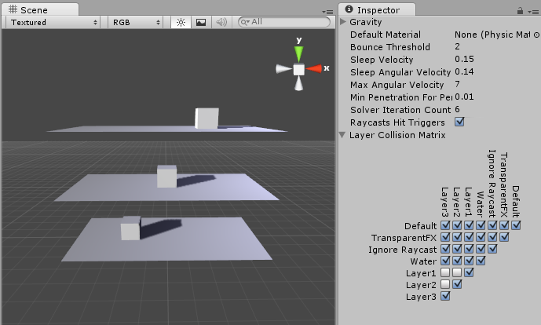
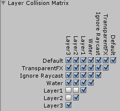

#Layer-based collision detection

Layer-based collision detection is a way to make a GameObject collide with another GameObject that is set up to a specific Layer or Layers.

 

The image above shows six GameObjects (3 planes, 3 cubes) in the Scene view, and the __Layer Collision Matrix__ in the window to the right. The Layer Collision Matrix defines which GameObjects can collide with which Layers.

In the example, the Layer Collision Matrix is set up so that only GameObjects that belong to the same layer can collide: 

* Layer 1 is checked for Layer 1 only
* Layer 2 is checked for Layer 2 only
* Layer 3 is checked for Layer 3 only

Change this to suit your needs: if, for example, you want Layer 1 to collide with Layer 2 and 3, but not with Layer 1, find the row for __Layer 1__, then check the boxes for the __Layer 2__ and __Layer 3__ colums, and leave the __Layer 1__ column checkbox blank.

##Setting up layer-based collision detection

1. To select a Layer for your GameObjects to belong to, select the GameObject, navigate to the Inspector window, select the __Layer__ dropdown at the top, and either choose a Layer or add a new Layer. Repeat for each GameObject until you have finished assigning your GameObjects to Layers.

1. In the Unity menu bar, go to __Edit__ > __Project Settings__, then select the __Physics__ category to open the [Physics](class-PhysicsManager) window.
1. Select which layers on the Collision Matrix will interact with the other layers by checking them.
  
