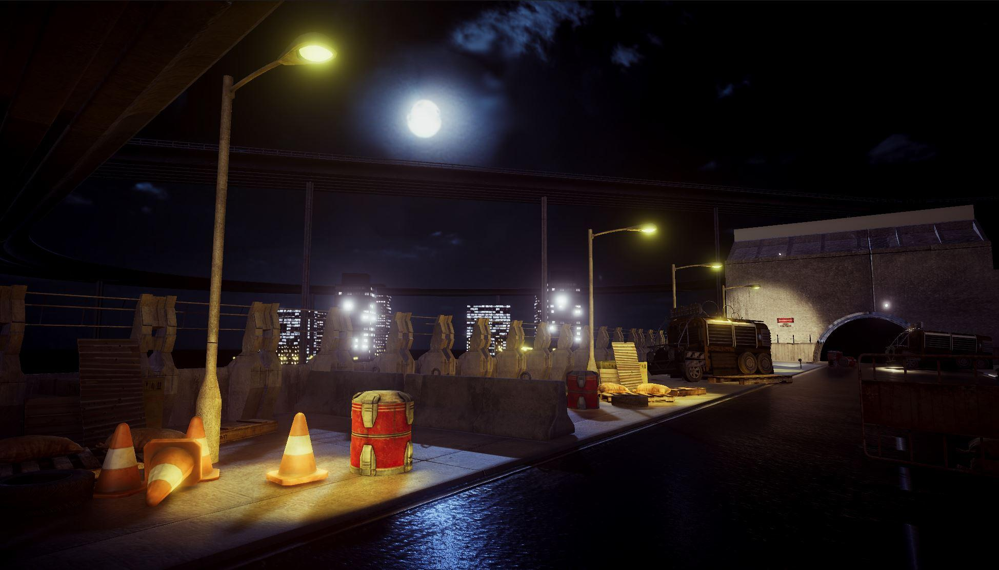
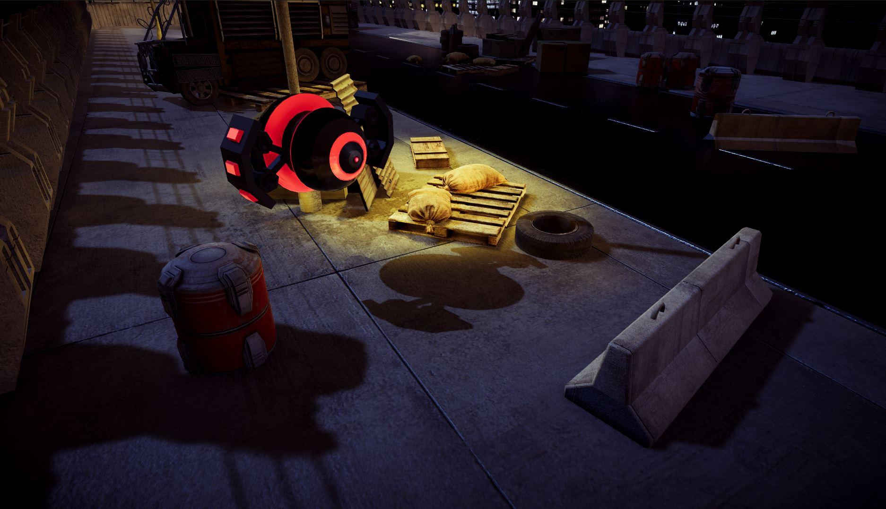
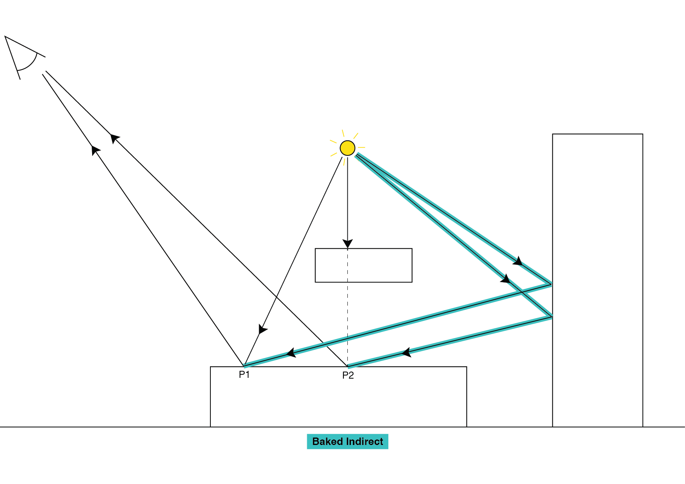
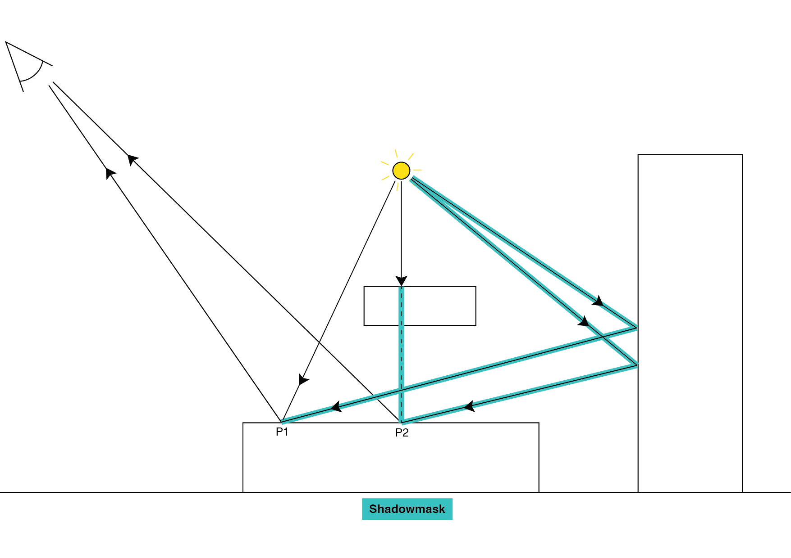
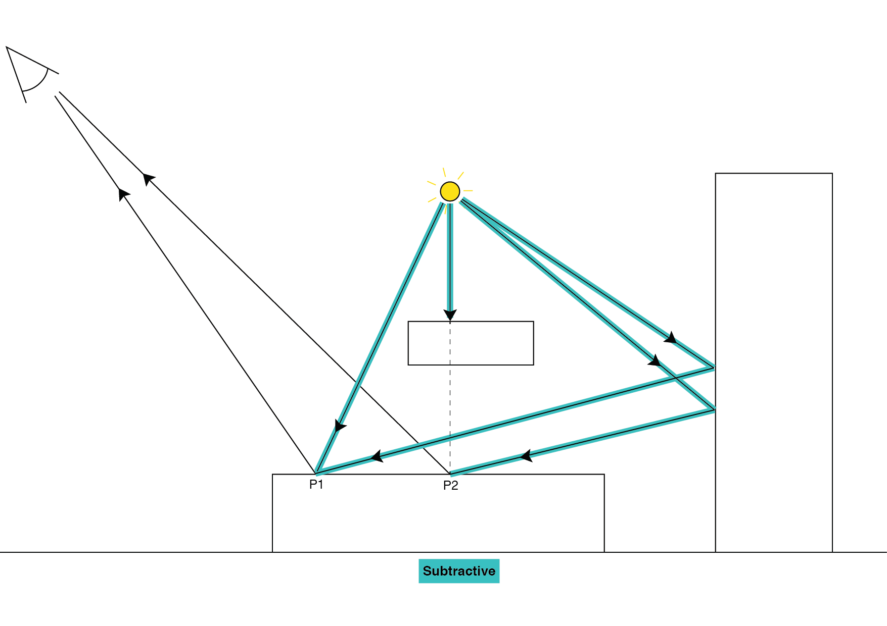

### Mixed lighting

__Mixed__ Lights are [Light components](class-Light) which have their __Mode__ property set to __Mixed__.  

__Mixed__ Lights can change their Transform and visual properties (such as colour or intensity) during run time, but only within strong limitations. They illuminate both static and dynamic GameObjects, always provide direct lighting, and can optionally provide indirect lighting. Dynamic GameObjects lit by __Mixed__ Lights always cast real-time shadows on other dynamic GameObjects.

All __Mixed__ Lights in a Scene use the same __Mixed__ __Lighting Mode__. To set the __Lighting Mode__, open the Lighting window (menu: __Window__ &gt; __Rendering__ &gt; __Lighting Settings__), click the __Scene__ tab, and navigate to the __Mixed Lighting__ section. 

The available modes are:

* [Baked Indirect](LightMode-Mixed-BakedIndirect)
* [Shadowmask](LightMode-Mixed-ShadowmaskMode)
* [Subtractive](LightMode-Mixed-Subtractive)

#### Using Mixed Lights

Mixed lighting is useful for Lights that are not part of gameplay, but which illuminate the static environment (for example, a non-moving sun in the sky). Direct lighting from Mixed Lights is still calculated at run time, so Materials on static Meshes retain their visual fidelity, including full [physically based shading (PBS)](shader-StandardShader) support.

The __Shadowmask__ mode's [Distance Shadowmask](LightMode-Mixed-DistanceShadowmask) is the most resource-intensive option, but provides the best results: it yields high-quality shadows within the __Shadow Distance__ (__Edit__ > __Project Settings__, then select the __Quality__ category, and navigate to the __Shadows__ section), and baked high-quality shadows beyond. For example, you could create large landscapes with realistic shadows right up to the horizon, as long as the sun does not travel across the sky.

__Subtractive__ mode provides the lowest-quality results: it renders shadows in real time for only one Light, and composites them with baked direct and indirect lighting. Only use this as a fallback solution for target platforms that are unable to use any of the other modes (for example, when the application needs to run on low-end mobile devices, but memory constraints prevent the use of __Shadowmask__ or __Distance Shadowmask__).

See the [Unity Lighting Modes Reference Card](https://docs.google.com/spreadsheets/d/18R663xpccuyRns1kOvGAiqj0qU9QFMbbXyrOCQMsU5w/edit#gid=1748986211) for a condensed comparison of the various modes.

All Mixed Lighting Modes are supported on all platforms. However, there are some rendering limitations:

* __Subtractive__ mode falls back to [forward rendering](RenderTech-ForwardRendering) (no deferred or light prepass support).

* __Shadowmask__ mode falls back to [forward rendering](RenderTech-ForwardRendering) (no deferred or light prepass support) on platforms which only support four render targets, such as many mobile GPUs. 

See documentation on [Rendering paths](RenderingPaths) to learn more about forward and deferred rendering.

#### Advanced use

__Mixed__ Lights can change their Transform and visual properties (such as colour or intensity) during run time, but only within strong limitations. In fact, because some lighting is baked (and therefore precomputed), changing any parameters at run time leads to inconsistent results when combining real-time and precomputed lighting. 

In the case of __Baked Indirect__ and __Shadowmask__, the direct lighting contribution behaves just like a __Realtime__ Light, so you can change parameters like the color, intensity and even the Transform of the Light. However, baked values are precomputed, and cannot change at run time. 

For example: if you bake a red __Mixed__ Light into the light map, but change its color from red to green at run time, all direct lighting switches to the green color. However, all indirect lighting is baked into the light maps, so it remains red. The same applies to moving a Mixed Light at run time - direct lighting will follow the Light, but indirect lighting will remain at the position at which the Light was baked.

If only subtle changes are introduced to direct lighting (for example, by only slightly modifying the hue or intensity of a Light), it is possible to get the benefits of indirect lighting and for the Light to appear somewhat dynamic, without the extra processing time required for a __Realtime__ Light. Indirect lighting is still incorrect, but the error might be subtle enough not to be objectionable. This works especially well for Lights without precomputed shadow information. This is achieved either by having shadows disabled for the Light, or by using Baked Indirect mode where shadows are real time. As shadowmasks are part of the direct lighting computation, moving such Lights causes visual inconsistencies with shadows not lining up correctly.

The following video shows an example of what happens when a Mixed Light is moved too far away from the spot where it was baked. Note how the indirect red light on the walls remains in place despite the object moving far away: [https://youtu.be/o6pVBqrj8-s](https://youtu.be/o6pVBqrj8-s) 

The following video shows an example of how to slightly modify a Mixed Light without causing noticeable inconsistencies with indirect lighting: [https://youtu.be/XN6ya31gm1I](https://youtu.be/XN6ya31gm1I) 

#### Technical Details

In the case of Mixed Lights, the last segment of a light path (that is, the path from the Light to the surface) becomes part of the precomputation as well. However, Unity still handles direct lighting and indirect lighting separately. It bakes indirect lighting into light maps and Light Probes, which are then sampled at run time. Indirect lighting is generally low frequency, meaning it looks smooth and doesn’t contain detailed shadows or light transitions. Therefore, shadows are handled with direct lighting where they have a high visible impact.

The difference in how shadows are precomputed and stored is reflected in the various submodes for Mixed Lights:

* [Baked Indirect](LightMode-Mixed-BakedIndirect)
* [Shadowmask](LightMode-Mixed-ShadowmaskMode)
* [Subtractive](LightMode-Mixed-Subtractive)

Shadow information can be precomputed and stored in a shadowmask. A shadowmask is a Texture which shares the same UV layout and resolution with its corresponding light map. It stores occlusion information for up to four Lights per texel (because Textures are limited to up to four channels on current GPUs). The values range from 0 to 1, with values in-between marking soft shadow areas. 

If shadowmasks are enabled, Light Probes also store occlusion information for up to four Lights. If more than four Lights intersect, the excess Lights fall back to Baked Lights. You can inspect this behavior with the [shadowmask overlap visualization](GIVis) mode. This information is precomputed, so the only shadows Unity stores in the shadowmask are shadows cast from static GameObjects onto other static GameObjects. These shadows can have smoother edges providing better quality than real-time shadow maps, depending on the light map resolution. Because each Mixed Light retains its shadowmask channel mapping at run time, shadows cast by dynamic GameObjects via shadow maps can be correctly composited with precomputed shadows from static GameObjects, avoiding inconsistencies like double shadowing. 

The only perceptible differences between shadows from static GameObjects and shadows from dynamic GameObjects are the differences in resolution and filtering of the precomputed shadowmask and the run-time shadow map, and that precomputed shadows support various forms of area Lights, so soft shadows can have more realistic penumbras.

What __Baked Indirect__ and __Shadowmask__ have in common is that direct lighting is always computed in real time and added to the indirect lighting stored in the light map, so all Material effects that require a light direction continue to work. Dynamic GameObjects always cast shadows on other dynamic GameObjects via shadow maps within the __Shadow Distance__ (__Edit__ > __Project Settings__, then select the __Quality__ category, and navigate to the __Shadows__ section), if shadows are enabled for that Light.

---

*  2017-09-18  <!-- include IncludeTextAmendPageSomeEdit -->

* Light Modes added in 5.6
