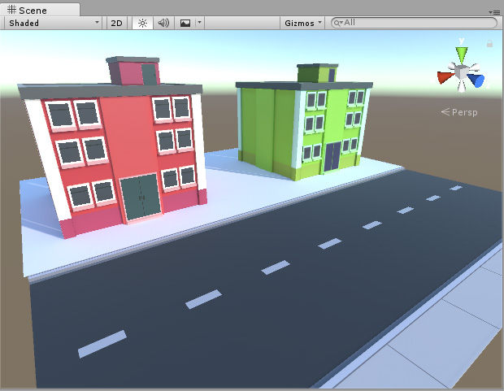
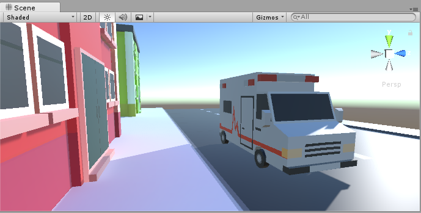
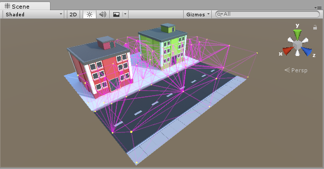
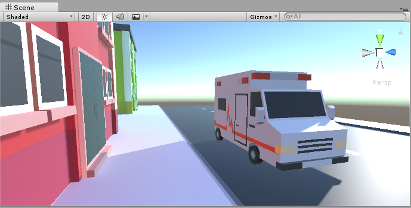
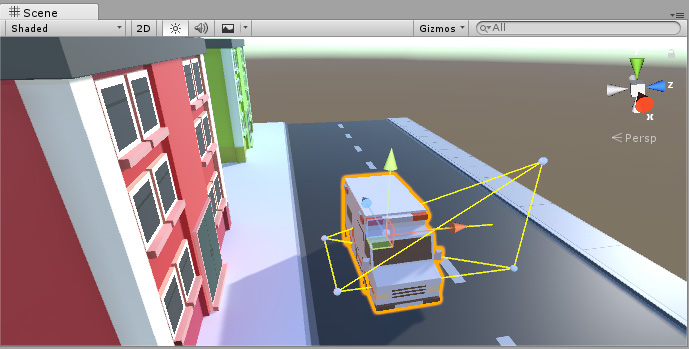
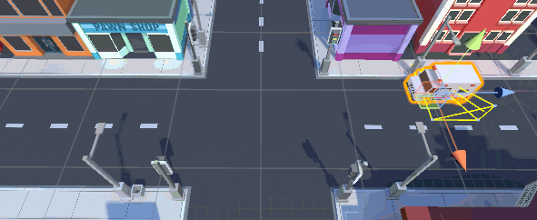

# Light Probes for moving objects

[Lightmapping](Lightmapping) adds greatly to the realism of a scene by capturing realistic bounced light as textures which are "baked" onto the surface of __static __objects. However, due to the nature of lightmapping, it can only be applied to non-moving objects marked as [Lightmap Static](StaticObjects).

While realtime and mixed mode lights can cast *direct *light on moving objects, moving objects do not receive bounced light from your static environment unless you use __light probes__. Light probes store information about how light is bouncing around in your scene. Therefore as objects move through the spaces in your game environment, they can use the information stored in your light probes to show an approximation of the bounced light at their current position.

In the above scene, as the directional light hits the red and green buildings, which are static scenery, *bounced light *is cast into the scene. The bounced light is visible as a red and green tint on the ground directly in front of each building. Because all these models are __static__, all this lighting is stored in __lightmaps__.

When you introduce moving objects into your scene, they do not automatically receive bounced light. In the below image, you can see the ambulance (a dynamic moving object) is not affected by the bounced red light coming off the building. Instead, its side is a flat grey color. This is because the ambulance is a dynamic object which can move around in the game, and therefore cannot use lightmaps, because they are static by nature. The scene needs Light Probes so that the moving ambulance can receive bounced light.

To use the light probe feature to cast bounced light onto dynamic moving objects, you must position light probes throughout your scene, so that they cover the areas of space that moving objects in your game might pass through.

The probes you place in your scene define a 3D volume. The lighting at any position within this volume is then approximated on moving objects by interpolating between the information baked into the nearest probes.

Once you have added probes, and baked the light in your scene, your dynamic moving objects will receive bounced light based on the nearest probes in the scene. Using the same example as above, the dynamic object (the ambulance) now receives bounced light from the static scenery, giving the side of the vehicle a red tint, because it is in front of the red building which is casting bounced light.

When a dynamic object is selected, the Scene view will draw a visualisation of which light probes are being used for the interpolated bounced light. The nearest probes to the dynamic object are used to form a tetrahedral volume, and the dynamic object’s light is interpolated from the four points of this tetrahedron.

As an object passes through the scene, it moves from one tetrahedral volume to another, and the lighting is calculated based on its position within the current tetrahedron.

---

*  2017-06-08  <!-- include IncludeTextNewPageNoEdit -->

* Light Probes updated in 5.6