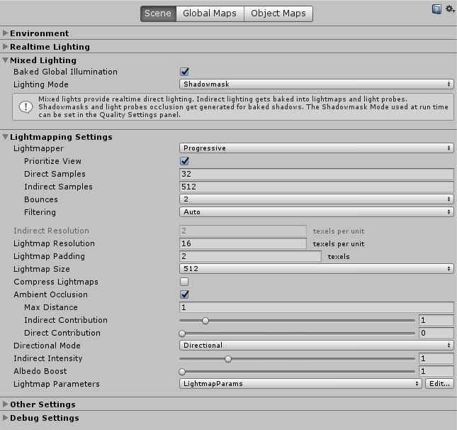

# Baked ambient occlusion

__Ambient occlusion__ (AO) approximates how much ambient lighting (lighting not coming from a specific direction) can hit a point on a surface. It darkens creases, holes and surfaces that are close to each other. These areas occlude (block out) ambient light, so they appear darker.

When using only precomputed real-time GI (see documentation on [Using precomputed lighting](UsingPrecomputedLighting)), the resolution for indirect lighting doesn’t capture fine details or dynamic objects. We recommend using a real-time ambient occlusion post effect, which has much more detail and results in higher quality lighting.

To view and enable baked AO, open the __Lighting__ window (menu: __Window__ &gt; __Rendering__ &gt; __Lighting Settings__) and navigate to the __Baked GI__ section. Tick the __Baked GI__ checkbox if it is unchecked, then tick the __Ambient Occlusion__ checkbox to enable baked AO.

To view and enable baked AO, open the __Lighting__ window (menu: __Window__ &gt; __Rendering__ &gt; __Lighting Settings__) and navigate to the __Mixed Lighting__ section. Tick the __Baked Global Illumination__ checkbox if it is unchecked, then in __Lightmapping Settings__ tick the __Ambient Occlusion__ checkbox to enable baked AO.

| **Property** | **Function** |
|:---|:---|
| __Max Distance__ | Use this to set a value for how far the rays are traced before they are terminated. |
| __Indirect__ | Use this to control how much the AO affects indirect light. The higher you set the slider value, the darker the appearance of the creases, holes, and close surfaces are when lit by indirect light.   It’s more realistic to only apply AO to indirect lighting. |
| __Direct__ | Use this to control how much the AO affects direct light. The higher you set the slider value, the darker the appearance of the Scene’s creases, holes, and close surfaces are when lit by direct light.  By default, AO does not affect direct lighting. Use this slider to enable it. It is not realistic, but it can be useful for artistic purposes.|

For a modern implementation of real-time ambient occlusion, see documentation on the [Ambient Occlusion](PostProcessing-AmbientOcclusion) post-processing effect.

To learn more about AO, see [Wikipedia: Ambient Occlusion](http://en.wikipedia.org/wiki/Ambient_occlusion).