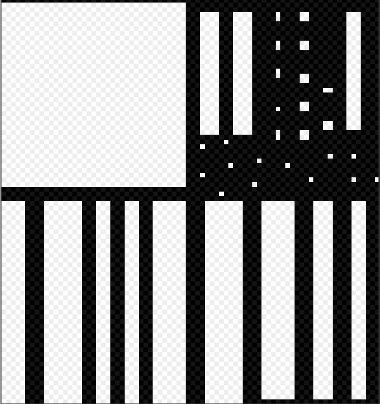
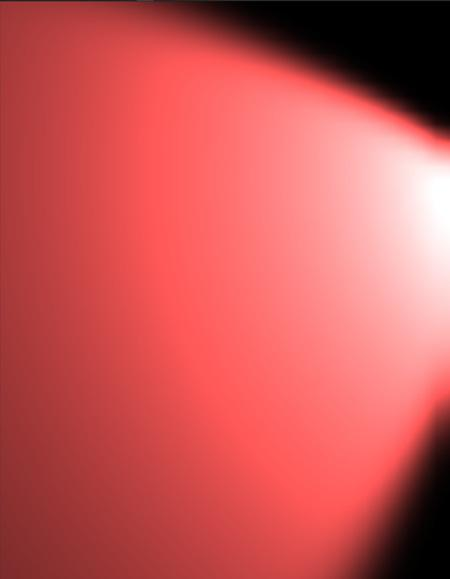
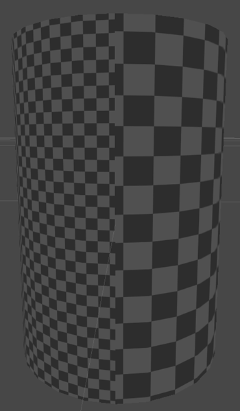
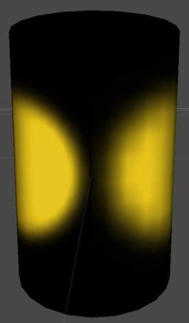

# Generating Lightmap UVs

Unity can unwrap your Mesh for you to generate lightmap UVs. To access the settings for generating lightmap UVs, open the [Model’s Import Settings](FBXImporter-Model), navigate to __Meshes__, and tick the __Generate Lightmap UVs__ checkbox. This generates your lightmap UVs into UV2, if the channel is present. If the UV2 channel is not present, Unity uses primary UVs.

Click the __Advanced__ foldout to open the settings. 

Settings for Generate Lightmap UVs:

| __Property:__| __Function:__ |
|:---|:---| 
| __Hard Angle__| The angle between neighboring triangles (in degrees) after which Unity considers it a hard edge and creates a seam. You can set this to a value between 0 and 180. This is set to 88 degrees by default.  If you set this to 180 degrees, Unity considers all edges smooth, which is realistic for organic models. The default value (88 degrees) is realistic for mechanical models. |
| __Pack Margin__| The margin between neighboring charts (in pixels), assuming the Mesh takes up the entire 1024x1024 lightmap. You can set this to a value between 1 and 64. A larger value increases the margin, but also increases the amount of space the chart needs. This is set to 4 pixels by default.  For more information, see [Pack Margin](#PackMargin), below. |
| __Angle Error__| The maximum possible deviation of UV angles from the angles in the source geometry (as a percentage from 0-100). This is set to 8% by default.  This controls how different the triangles in UV space can be to the triangles in the original geometry. Usually this should be fairly low, to avoid artifacts when applying the lightmap.  |
| __Area Error__| The maximum possible deviation of UV areas from the areas in the source geometry (as a percentage from 0-100). This is set to 15% by default.  This controls how well Unity preserves the relative triangle areas. Increasing the value allows you to create fewer charts. However, increasing the value can change the resolution of the triangles, so make sure the resulting distortion does not deteriorate the lightmap quality. |

You can also provide your own UVs for your lightmaps. A good UV set for lightmaps should adhere to the following rules:

* It should be within the [0,1] x [0,1] UV space.

* It should have a wide enough margin between individual charts. For more information, see documentation on [UV overlap feedback](ProgressiveLightmapper-UVOverlap).

* It should not have any overlapping faces.

* There should be a low difference between the angles in the UV and the angles in the original geometry. See __Angle distortion__, below.

* There should be a low difference between the relative scale of triangles in the UV and the relative scale of the triangles in the original geometry), unless you want some areas to have a bigger lightmap resolution. See __Area distortion__, below.

## Pack Margin

To allow filtering, the lightmap contains lighting information in texels near the chart border, so always include some margin between charts to avoid light bleeding when applying the lightmap. 

The lightmap resolution defines the texel resolution of your lightmaps. Lightmappers dilate some chart texels in the lightmap to avoid black edges, so the UV charts of your Mesh need to be at least two full texels apart from each other to avoid light bleeding. Use the __Pack Margin__ setting to ensure you have enough margin between the UV charts of your geometry. 

In lightmap UV space, the padding between charts need to be at least two full texels in order to avoid UV overlapping and accidental light bleeding. In this image, the black space represents the space between charts.

## Angle distortion

The following screenshots demonstrate equal resolution, but with different UVs. The first image has a high __Angle Error__, and the result contains unintended artifacts. The second image has the default __Angle Error__ (8%). In Meshes with more triangles, angle distortion can significantly distort the shape.

## Area distortion

In the image below, two spotlights with the same parameters light the sides of a cylinder. The right-hand side of the cylinder has a higher __Area Error__ value, which distorts the triangles and leads to a lower resolution, creating artifacts in the light.

---

 2018-03-28  <!-- include IncludeTextNewPageSomeEdit -->

Progressive Lightmapper added in [2018.1](https://docs.unity3d.com/2018.1/Documentation/Manual/30_search.html?q=newin20181) NewIn20181