# Importing UVs from Autodesk® Maya® to Unity

Autodesk® Maya® is a 3D computer animation software by Autodesk, with powerful modeling, rendering, simulation, texturing and animation tools for visual effects artists, modellers and animators (see [www.autodesk.co.uk](http://www.autodesk.co.uk/products/maya/overview)). It is often used by Unity developers for advanced graphics work, which is then imported into Unity. It’s important to note that when importing from Autodesk® Maya®, your UVs may not look exactly the same, even if you untick the __Optimize Realtime UVs__ checkbox. This section explains why.

Because real-time UVs are repacked by Enlighten, it is very important to understand how UV charts are detected. By default, a chart is defined by a set of connected vertices. However, the DCC or Unity Mesh importer might introduce extra vertices in places where the Mesh has hard edges. These duplicated vertices create extra islands (unconnected groups) in your UVs. However, these cuts normally go unnoticed when you bake the lightmap, because the UVs are used directly and not repacked. The image below shows an example of this. 

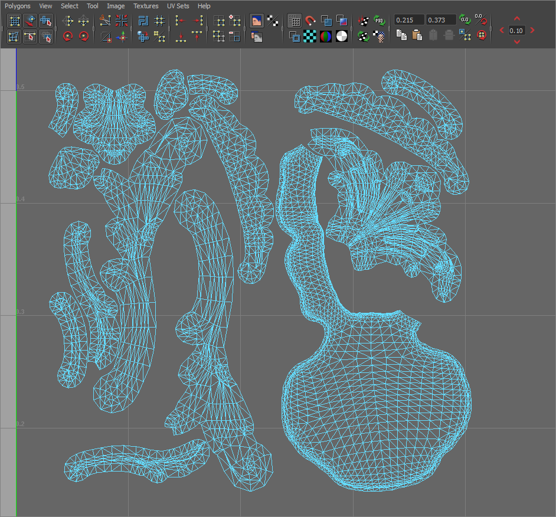

A high smoothing angle does not preserve hard cuts in the model, and both the shading and GI look different as a result.

The [Mesh Importer](class-FBXImporter) settings that relate to this are __Normals__, __Tangents__, and __Smoothing Angles__:

If you set __Normals__ to __Calculate__, breaks are made wherever the angle between adjacent triangles exceeds the __Smoothing Angle__ value.

To avoid this, you can choose to author and import normals (see documentation on [Normal maps](StandardShaderMaterialParameterNormalMap) to learn more about surface normals). In order to get good results with imported normals, you need to manually make the cuts along hard edges, and pay attention to how the DCC is inserting duplicate vertices. Otherwise, both GI and regular shading may have undesired lighting effects.

### Example

When packing with a 40-degree __Smoothing Angle__, the hard angles in the model are preserved, and extra charts are created:

](../uploads/Main/LightingGiUvs-5.jpg) 

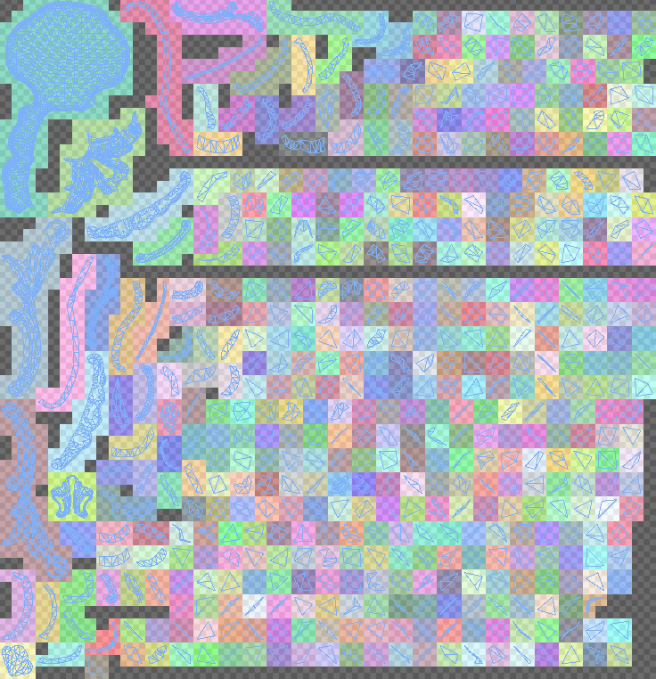

If the __Smoothing Angle__ is set to 180 degrees, no cuts are made, and the UVs are the same as they were in Autodesk® Maya®. The only difference is the chart packing:

](../uploads/Main/LightingGiUvs-7.jpg) 

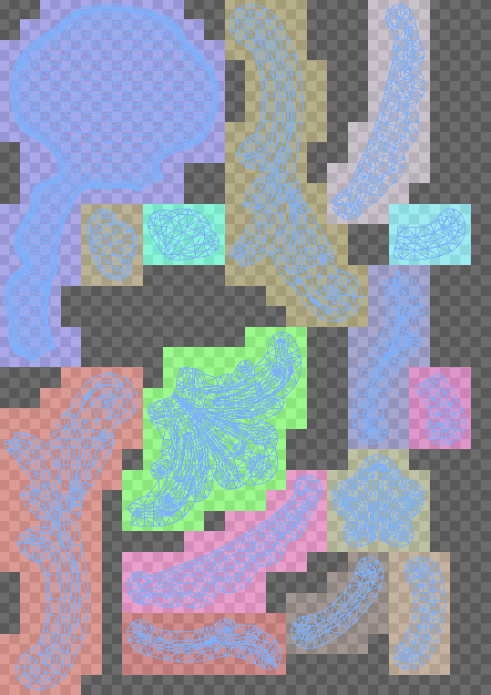

## Optimizing Realtime UVs

The [Mesh Renderer](class-MeshRenderer) contains an option called __Optimize Realtime UVs__.

__Optimize Realtime UVs__ enables Enlighten’s UV optimization feature. Note that disabling this option does not allow the authored UVs to flow straight to Enlighten; repacking is still applied.

The feature is intended to optimize charting for real-time GI only. It does not affect baked UVs. Its purpose is to simplify the UV unwrap, which reduces the chart count (and thus texel count). This makes lighting more consistent across the model, makes the texel distribution more even, and avoids wasting texels on small details. The time taken to do the precompute phase is proportional to the number of texels you feed in. For example, a detailed tiled floor with separate charts for each tile takes up an unnecessarily high number of texels, but joining them into a single chart results in far fewer texels. This works because the real-time lightmaps only store indirect lighting (meaning there are no sharp direct shadows). 

This process cannot alter the number of vertices in the model, so it cannot introduce breaks in the UVs where there already one present. This means the resulting chart layout is the same, but some of the charts might overlap or be merged in areas where it is unlikely to have a negative effect on the indirect lighting.

Use the settings to define when the charts are merged:

* __Max Distance__: Charts are simplified if the worldspace distance between the charts is smaller than this value.
* __Max Angle__: Charts are merged if the angle between the charts is smaller than this value.

These settings are intended to avoid merging charts when they are far apart or pointing in generally different directions.

### Optimizing Realtime UVs: Example

The following example uses the [Desert Ruins](https://www.assetstore.unity3d.com/en/#!/content/4162) Asset from the Asset Store:

](../uploads/Main/LightingGiUvs-10.jpg)

It uses default parameters, and the real-time lightmap resolution is 1 texel per unit. The model is approximately 9 units long. The image below shows the real-time UVs generated for this model using the Auto UV feature:

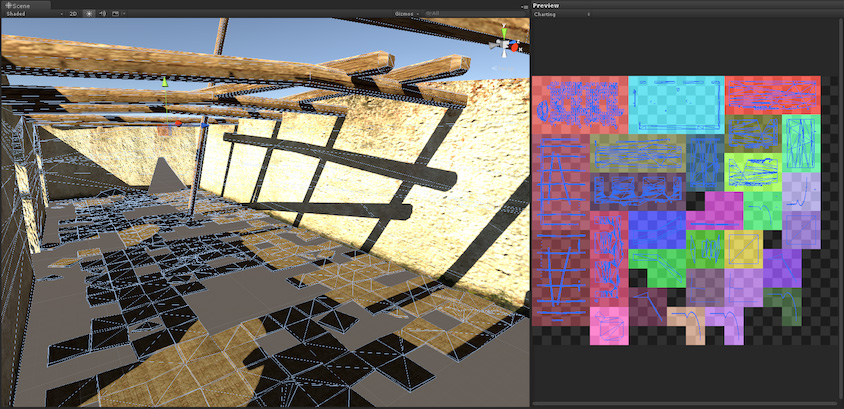

Note that the the tiles on the floor have been packed to a single chart, with an appropriate resolution for the chosen texel density and instance size:

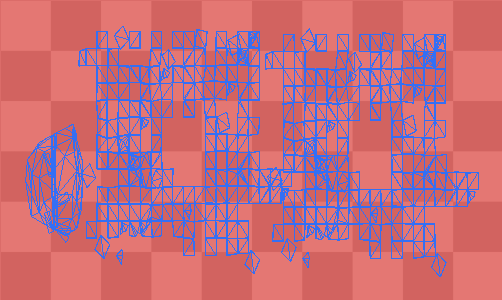

When packed without the Auto UV feature, the generated UVs look like this:

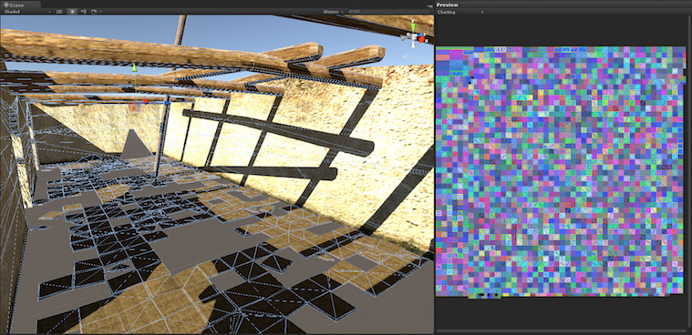

This generates a large number of small charts, because the charts are split in the authored UVs supplied by the model. Because __Auto UVs__ is not enabled, none of these charts can be merged, and each UV island is awarded a 4x4 pixel block of its own regardless of its size. The image below shows a subsection of the UVs:

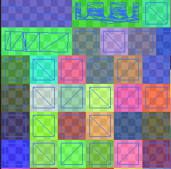

The wall sides still get a sensible resolution of 10x4 texels, but the small tiles gets a disproportionate 4x4 texels each. The reason that the minimum chart size is 4x4 is that we want to be able to stitch against the chart on all 4 sides and still get a lighting gradient across the chart.

## Further Chart Optimization

There are two additional options for further optimizing the charting the UV layout:

* __Ignore Normals__
* __Min Chart Size__

### Ignore Normals

Tick the __Ignore Normals__ checkbox to keep together any charts that have duplicated vertices due to hard normal breaks. A chart split might occur in Enlighten when the vertex position and the vertex lightmap UVs are the same, but the normals are different. For small details, multiple 4x4 texel charts to represent indirect lighting is too much, and affects precompute and baking performance. In these cases, enable __Ignore Normals__.

#### Example

In the following example, __Optimize Realtime UVs__ is disabled, to demonstrate the effect of __Ignore Normals__ in isolation.

](../uploads/Main/LightingGiUvs-16.jpg)

The image on the left shows the result without __Ignore Normals__ enabled. The image on the right shows the result with __Ignore Normals__ enabled.

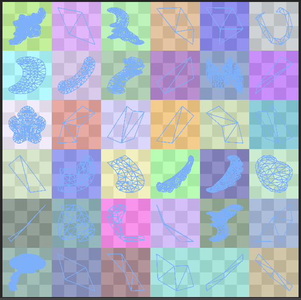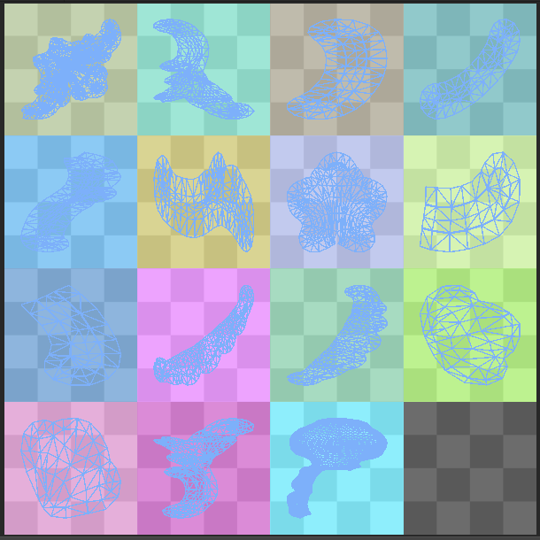

When __Ignore Normals__ is enabled, the 24x24 Enlighten unwrap is reduced to a 16x16 unwrap for this model.

### Min Chart Size

__Min Chart Size__ removes the restriction of having a 4x4 minimum chart size. The stitching does not always work well, but for small details it is usually acceptable.

#### Example

In this example, __Min Chart Size__ is set to __2 (Minimum)__.

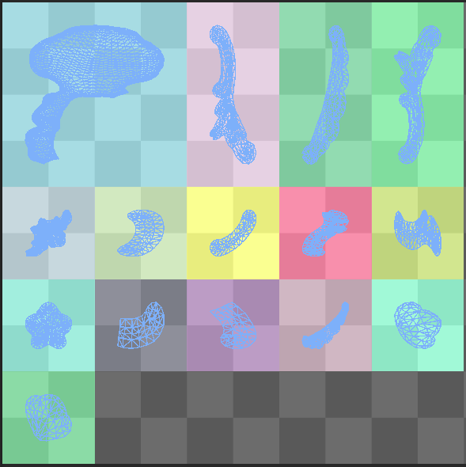

If you were to apply this __Min Chart Size__ option and __Ignore Normals__ to the model above, the unwrap reduces to 10x10. 

## Getting chart edges to stitch for realtime GI

The lightmaps that are set to __Realtime__ support chart stitching. Chart stitching ensures that the lighting on adjacent texels in different charts is consistent. This is useful to avoid visible seams along the chart boundaries. In large texel sizes, the lighting on either side of a seam may be quite different. This difference is not automatically smoothed out by filtering, because the texels are not adjacent. 

In this example, a seam is visible on the sphere on the right, even when textured, because it has not been stitched:

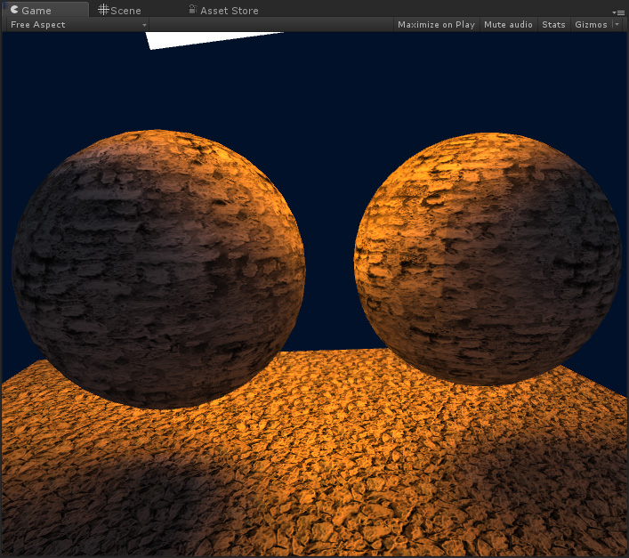

Stitching is on by default. If you think it is causing some unwanted issues, you can disable it; Apply [Lightmap Parameters](class-LightmapParameters) to the instance in question and untick the __Edge Stitching__ checkbox.

For charts to stitch smoothly, edges must adhere to the following criteria:

* __Preserve UVs__ must be enabled, so that the charts are not simplified by the Auto UV feature.
* The charts must be in the same Mesh.
* The edges must share vertices.
* The edges must be horizontal or vertical in UV space.
* The edges must have the same number of texels (this usually follows from the two preceding criteria).

This is how Unity’s built-in sphere, capsule and cylinder are authored. Notice how the charts line up:

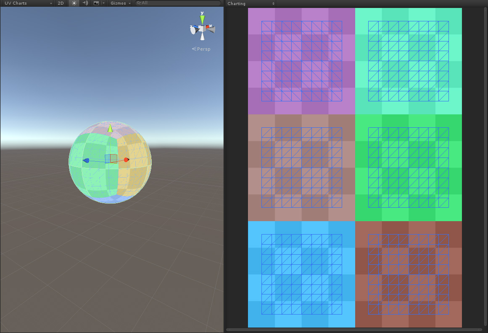

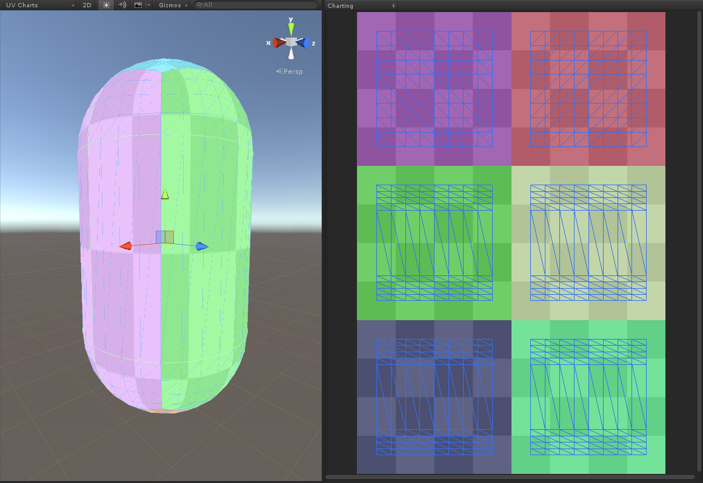

---

*  2017-07-04  <!-- include IncludeTextNewPageSomeEdit -->

*  2017-07-04 Documentation update only, no change to Unity functionality

