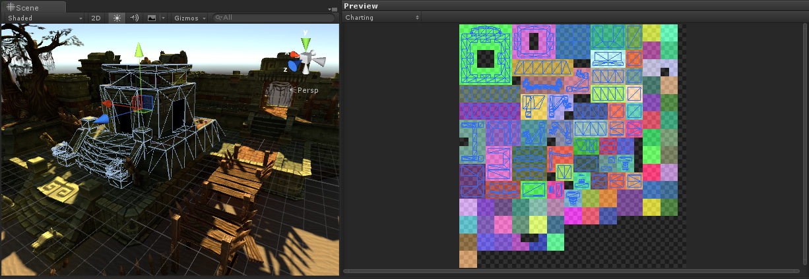
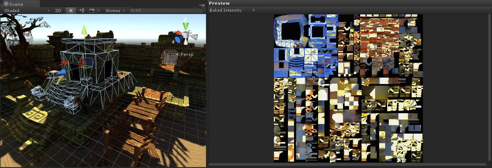
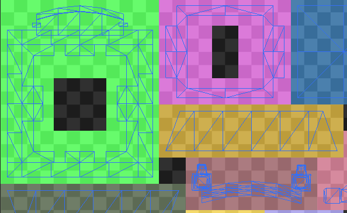

# Global Illumination UVs

There are two sets of GI lightmaps: __Baked__ and __Realtime__. How you define which set to use depends on whether you’re working with environment lighting or specific lights:

* [Global illumination](GlobalIllumination) (environment lighting) can be set to __Realtime__ or __Baked__. Go to __Window__ &gt; __Rendering__ &gt; __Lighting Settings__ and choose an option from the __Ambient GI__ drop-down menu.

* [Lights](class-Light) can be set to __Realtime__, __Baked__ or __Mixed__. Go to the Inspector window and choose an option from the __Baking __drop-down menu.

* Materials have emission controls that can be set to __Realtime__ or __Baked__. See documentation on [Standard Shader Material parameter emissions](StandardShaderMaterialParameterEmission) to learn more.

| __Lightmap__| __Properties__ |
|:---|:---| 
| __Baked__| Baked lightmaps are mainly useful for lights which do not change at all during run time (for example, a lit streetlamp), and are therefore stored as a static rendering in the lightmap. Features include direct lighting, indirect lighting, and ambient occlusion. |
| __Realtime__| Real-time lightmaps are mainly useful for lights that are animated during runtime (for example, a flickering street lamp), and therefore need to be rendered in real time. Features include indirect lighting only, and typically low resolution. Direct light is not in the lightmap, but is rendered in real time. |
| __Mixed__| When you set a light to Mixed mode, it contributes to the baked lightmaps, and also gives direct real-time lighting to non-static objects. |

You can use either one or both of these lightmap sets to light your Scenes. Your choice determines which lightmaps the light contributions and resulting GI is added to.

## Visualising your UVs

It is important to be able to view the UVs that are being used, and Unity has a visualization tool to help you with this. First, open the Lighting window (menu: __Window__ &gt; __Rendering__ &gt; __Lighting Settings__) and tick the __Auto__ checkbox at the bottom. This ensures that your bake and precompute are up-to-date, and outputs the data that is needed to view the UVs. Wait for the process to finish (this can take some time for large or complex Scenes).

### Visualising real-time UVs

To see the precomputed real-time GI UVs:

* Select a GameObject with a Mesh Renderer in your Scene
* Open the Lighting window and select the __Object__ tab
* In the __Preview__ area, select __Charting__ from the drop-down.

This displays the UV layout for the real-time lightmap of the selected instance of this Mesh. 

* The charts are indicated by the different colored areas in the Preview (show in the image above on the right-hand side). 
* The UVs of the selected instance are laid over the charts, as a wireframe representation of the GameObject’s Mesh. 
* Dark gray texels show unused areas of the lightmap. 

Multiple instances can be packed into a real-time lightmap, so some of the charts you see might actually belong to other GameObjects.

**NOTE:** There is no direct correspondence in the grouping of instances between real-time and baked lightmaps. Two instances in the same real-time lightmap may also be in two different baked lightmaps, and vice versa.

### Visualising baked UVs

To see the baked UVs:

* Select an instance.
* Open the Lighting window (menu: __Window__ &gt; __Rendering__ &gt; __Lighting Settings__) and select the __Object __tab.
* In the __Preview__ area, select __Baked Intensity__ from the dropdown.

As you can see, the baked UVs are very different to the precomputed real-time UVs. This is because the requirements for baked and precomputed real-time UVs are different.

## Real-time UVs

It is important to note that you can never get the same UVs for precomputed real-time GI as for baked GI, even if you tick __Preserve UVs__.

If you could, you would see heavy aliasing (such as light or dark edges) in unexpected places. This is because the resolution of real-time lightmaps is intentionally low, so that it is feasible to update them in real time. This doesn’t affect the graphical quality, because it only stores indirect lighting, which is generally low frequency (meaning it does not usually have sudden changes in intensity or detailed patterns). The direct light and shadows are rendered separately using the standard real-time lighting and shadowmaps. Direct light is generally higher frequency (meaning it is more likely to have sudden changes in intensity or detailed patterns, such as sharp edges to shadows) and therefore requires higher resolution lightmaps to capture this information.

Low resolution lightmaps can create bleeding issues, caused when charts share texels. This has a detrimental effect on the quality of the lighting, but is solved by repacking the UV charts to ensure a half-pixel boundary around them. This way you are never sampling *across* charts (at the most detailed mip), even with bilinear interpolation. The other benefit of charts with a guaranteed half-pixel boundary is that you can place charts right next to each other, saving lightmap space.

In summary, UVs used for precomputed realtime GI lightmaps are always repacked.

Because repacking guarantees a half-pixel boundary around the charts, the UVs are dependent on the scale and lightmap resolution of the instance. If you scale up the UVs to get a higher resolution lightmap, you are no longer guaranteed this half-pixel boundary. The UVs are packed individually, with the scale and resolution of the instance taken into account. The real-time UVs are therefore *per instance*. Note that if you have 1000 objects with the same scale and resolution, they share the UVs.

---

*  2017-07-04 <!-- include IncludeTextNewPageSomeEdit -->
 
*  2017-07-04 Documentation update only, no change to Unity functionality

