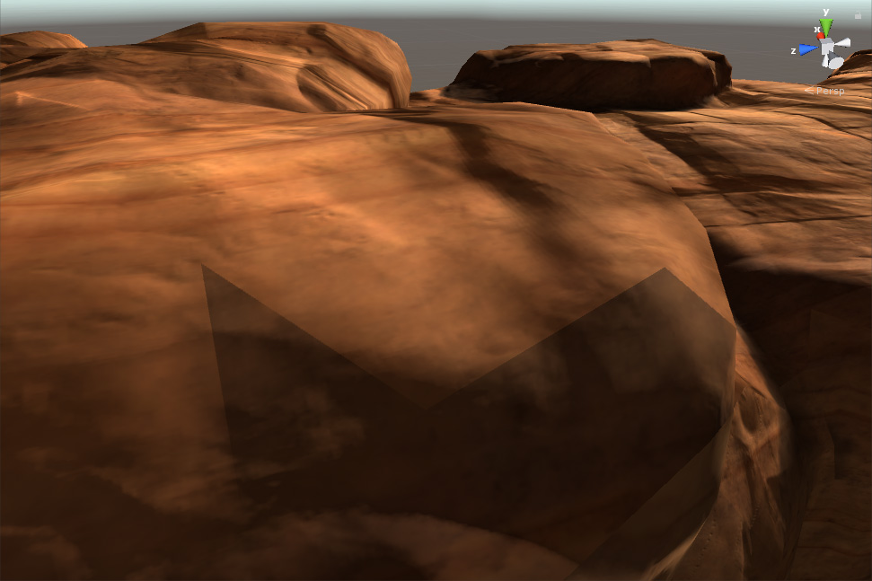
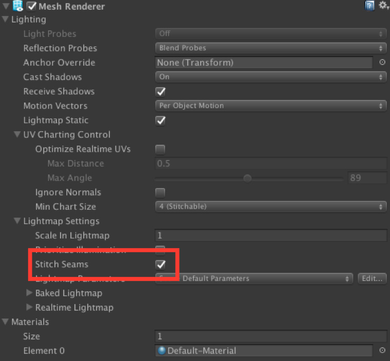

# Lightmap seam stitching

Lightmap seam stitching is a technique that smooths unwanted hard edges in GameObjects rendered with baked lightmaps. 

Seam stitching works with the [Progressive Lightmapper](ProgressiveLightmapper) for lightmap baking. Seam stitching only works on single GameObjects; multiple GameObjects cannot be smoothly stitched together. 

[Lightmapping](Lightmapping) involves Unity unwrapping 3D GameObjects onto a flat lightmap. Unity identifies mesh faces that are close together but separate from each other as being separate in lightmap space; the edges of these meshes are called "seams". Seams are ideally invisible but they can sometimes appear to have hard edges depending on the light. This is because the GPU cannot blend texel values between charts that are separated in the lightmap.

Seam stitching is a technique that fixes these issues. When you enable seam stitching, Unity does extra computations to amend the lightmap to improve each seam's appearance. Stitching is not perfect, but it often improves the final result substantially. Seam stitching takes extra time during baking due to extra calculations Unity makes, so Unity disables it by default. You enable Stitching on the GameObject's MeshRenderer.

     

To enable seam stitching on a GameObject, go to the GameObject's Mesh Renderer component, open the __Lightmap Settings__ section (only accessible if you are using the Progressive Lightmapper), and tick __Stitch Seams__.

---

* 2017-09-04  <!-- include IncludeTextNewPageSomeEdit -->

* Seam stitching added in [2017.2](https://docs.unity3d.com/2017.1/Documentation/Manual/30_search.html?q=newin20172) NewIn20172