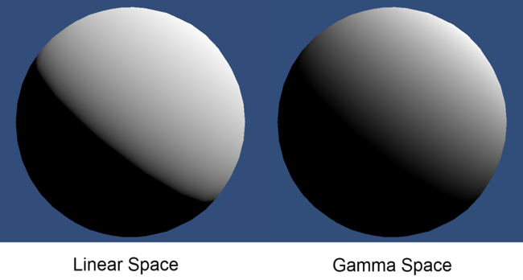
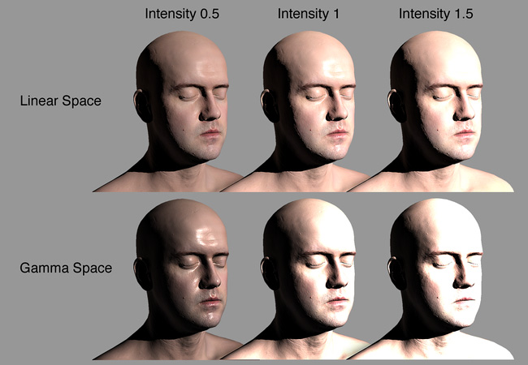
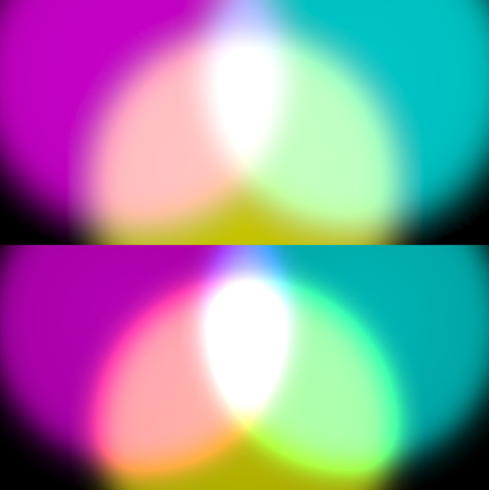

# Linear or gamma workflow

The Unity Editor offers both linear and gamma workflows. The linear workflow has a color space crossover where [Textures](Textures) that were authored in gamma color space can be correctly and precisely rendered in linear color space. See documentation on [Linear rendering overview](LinearLighting) for more information about gamma and linear color space.

For further reading, see documentation on:

* [Linear rendering overview](LinearLighting) for background information on linear and gamma color space.
* [Gamma Textures with linear rendering](LinearRendering-GammaTextures) for information on gamma Textures in a linear workflow.
* [Linear Textures](LinearRendering-LinearTextures) for information on working with linear Textures.

Textures tend to be saved in gamma color space, while Shaders expect linear color space. As such, when Textures are sampled in Shaders, the gamma-based values lead to inaccurate results. To overcome this, you can set Unity to use an RGB sampler to cross over from gamma to linear sampling. This ensures a linear workflow with all inputs and outputs of a Shader in the correct color space, resulting in a correct outcome. 

To specify a gamma or linear workflow, go to __Edit__ > __Project Settings__, then select the __Player__ category, navigate to the __Other Settings__, open the __Rendering__ section, and change the __Color Space__ to __Linear__ or __Gamma__, depending on your preference.

## Gamma color space workflow

While a linear workflow ensures more precise rendering, sometimes you may want a gamma workflow (for example, on some platforms the hardware only supports the gamma format).

To do this, set __Color Space__ to __Gamma__ in the **Player** settings (menu: __Edit__ > __Project Settings__, then select the __Player__ category). With this option selected,  the rendering pipeline uses all colors and textures in the gamma color space in which they are stored - textures do not have gamma correction removed from them when they are used in a Shader. 

Note that you can choose to bypass sRGB sampling in __Color Space: Gamma__ mode by unchecking the __sRGB (Color Texture)__ checkbox in the [Inspector window](UsingTheInspector) for the Texture.

**Note**: Even though these values are in gamma space, all the Unity Editor’s Shader calculations still treat their inputs as if they were in linear space. To ensure an acceptable final result, the Editor makes an adjustment to deal with the mismatched formats when it writes the Shader outputs to a framebuffer and does not apply gamma correction to the final result. 

## Linear color space workflow

Working in linear color space gives more accurate rendering than working in gamma color space. 

To do this, set __Color Space__ to __Linear__ in the **Player** settings (menu: __Edit__ > __Project Settings__, then select the __Player__ category).

You can work in linear color space if your Textures were created in linear or gamma color space. Gamma color space Texture inputs to the linear color space Shader program are supplied to the Shader with gamma correction removed from them. 

### Linear Textures

* Selecting __Color Space:__ __Linear__ assumes your Textures are in gamma color space. Unity uses your GPU’s sRGB sampler by default to crossover from gamma to linear color space. If your Textures are authored in linear color space, you need to bypass the sRGB sampling. See documentation on [Working with linear Textures](LinearRendering-LinearTextures) for more information.

### Gamma Textures

* Crossing over from gamma color space to linear color space requires some tweaking. See documentation on [Gamma Textures with linear rendering](LinearRendering-GammaTextures) for more information.

#### Notes

For colors, this conversion is applied implicitly, because the Unity Editor already converts the values to floating point before passing them to the GPU as constants. When sampling Textures, the GPU automatically removes the gamma correction, converting the result to linear space. 

These inputs are then passed to the Shader, with lighting calculations taking place in linear space as they normally do. When writing the resulting value to a framebuffer, it is either gamma-corrected straight away or left in linear space for later gamma correction - this depends on the current rendering configuration. For example, in high dynamic range (HDR), rendering results are left in linear space and gamma corrected later.

## Differences between linear and gamma color space

When using linear rendering, input values to the lighting equations are different to those in gamma space. This means differing results depending on the color space. For example, light striking surfaces has differing response curves, and Image Effects behave differently.

### Light fall-off

The fall-off from distance and normal-based lighting differs in two ways:

* When rendering in linear mode, the additional gamma correction that is performed makes a light’s radius appear larger. 

* Lighting edges also appear more clearly. This more correctly models lighting intensity fall-off on surfaces.

### Linear intensity response

When you are using gamma rendering, the colors and Textures that are supplied to a Shader already have gamma correction applied to them. When they are used in a Shader, the colors of high luminance are actually brighter than they should be compared to linear lighting. This means that as light intensity increases, the surface gets brighter in a nonlinear way. This leads to lighting that can be too bright in many places. It can also give models and scenes a washed-out feel. When you are using linear rendering, the response from the surface remains linear as the light intensity increases. This leads to much more realistic surface shading and a much nicer color response from the surface.

The Infinite 3D Head Scan image below demonstrates different light intensities on a human head model under linear lighting and gamma lighting.

### Linear and gamma blending

When blending into a framebuffer, the blending occurs in the color space of the framebuffer. 

When you use gamma space rendering, nonlinear colors get blended together. This is not the mathematically correct way to blend colors, and can give unexpected results, but it is the only way to do a blend on some graphics hardware. 

When you use linear space rendering, blending occurs in linear color space: This is mathematically correct and gives precise results.

The image below demonstrates the different types of blending:

