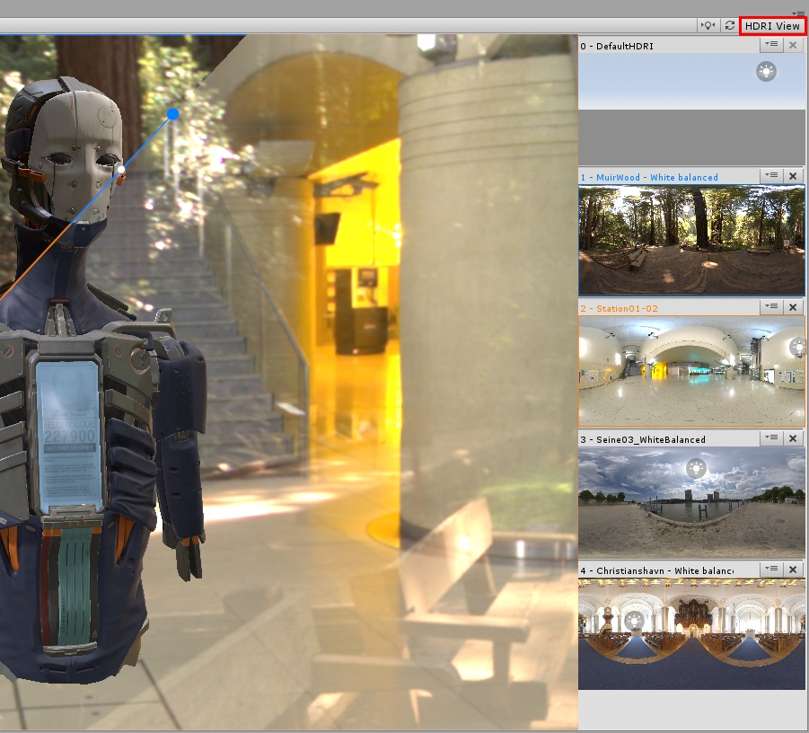
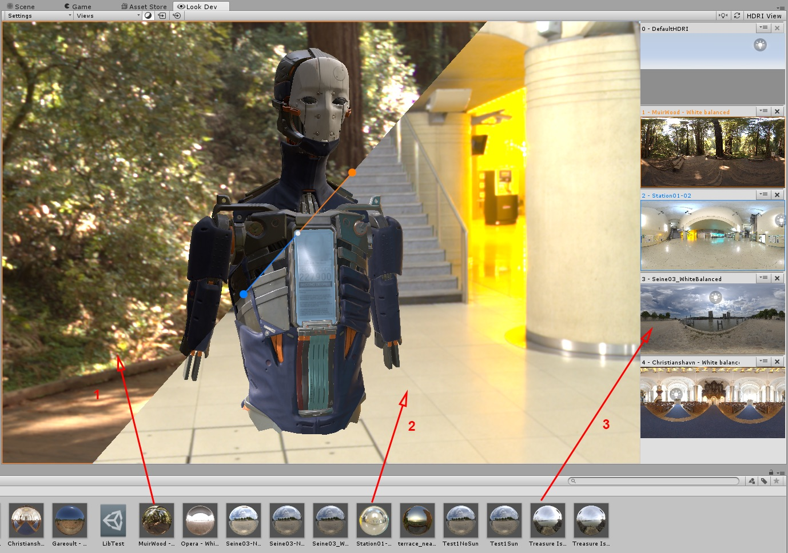
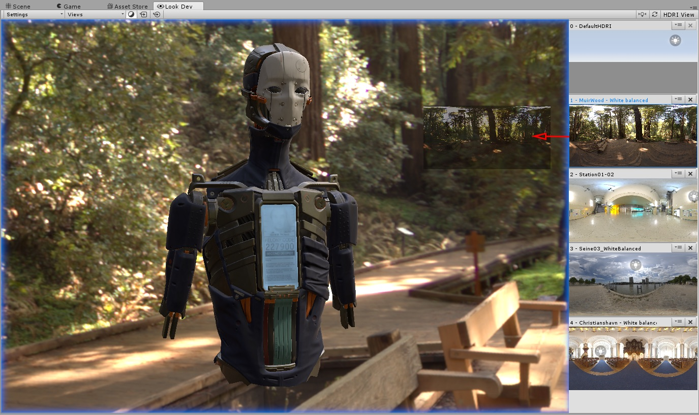
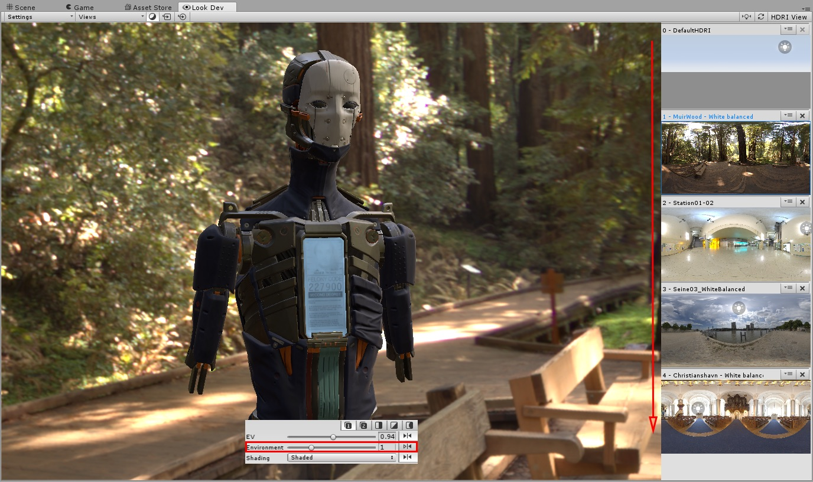
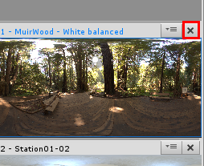
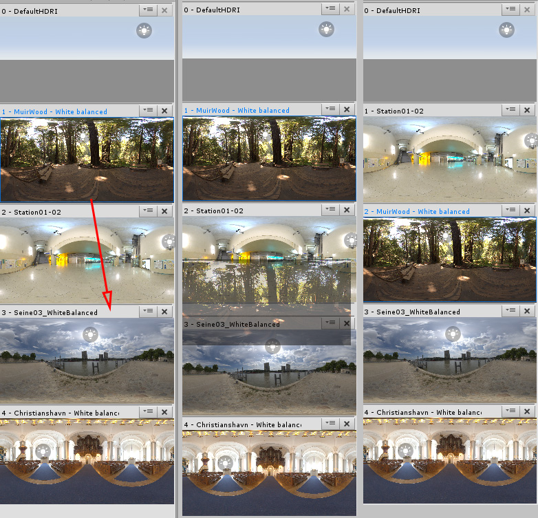

# The HDRI view

Lighting in Look Dev is represented by an HDRI (high dynamic range image). The Look Dev view allows you to manipulate and easily switch between HDRIs.

The HDRI view allows you to view and browse all HDRIs in the HDRI Library. By default, the HDRI Library is saved within the Editor. You can also save the HDRI Library as an Asset under a different name. In the Look Dev, go to __Settings__ > __HDRI Library__ > __Save As New Library__.

To import an HDRI into Unity, load a .hdr or .exr file into your Unity project like you would any other image. In the [Texture Importer](class-TextureImporter) Inspector window, set __Texture Type__ to __Default__, set __Texture Shape__ to __Cube__, and set __Convolution Type__ to __Specular (Glossy Reflection)__.

To browse the HDRI Library, select the __HDRI View__ button in the top-right corner of the Look Dev view. This opens the HDRI view, which shows everything in the HDRI Library as seen in the image below.

When you want to test a HDRI Texture Asset or a skybox cube map Material, drag and drop it into the Look Dev view or the HDRI view to use it. All HDRIs added to the Look Dev view or HDRI view are automatically saved to the HDRI Library. A blue or orange rectangle appears around the view while you do this to indicate which viewing panel it is to be assigned to when you drop it.

Image key:

1. Drag to orange view

2. Drag to blue view

3. Drag to HDRI view. To drag and drop multiple HDRIs at once, hold down __Shift__ while selecting them.

Drag and drop HDRIs straight from the HDRI view to move them into the Look Dev view.

Use the __Environment__ slider in the [Control Panel](LookDevControlPanel) to go back and forth through the HDRI list. The number displayed alongside the slider indicates which HDRI is currently being displayed, beginning at 0.

To remove an HDRI from the HDRI Library, click the __X__ in the top right next to the HDRI’s name. Note that you can’t remove __DefaultHDRI__.

To reorganize the HDRI view, drag and drop HDRIs inside the browser itself.

