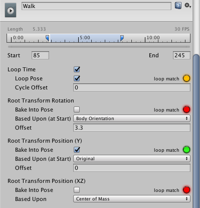
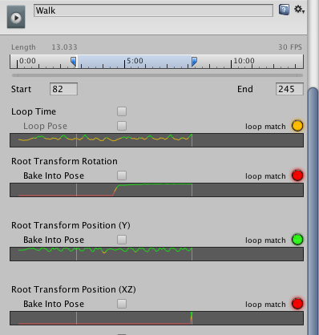
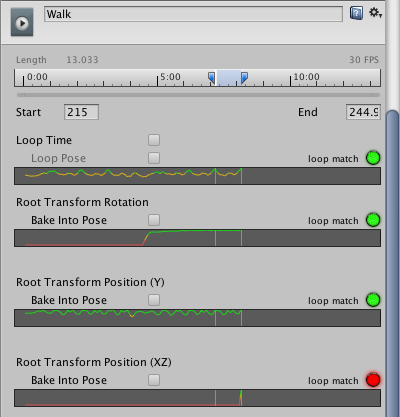

# Loop optimization on Animation clips

A common operation for people working with animations is to make sure they loop properly. For example, if a character is walking down a path, the walking motion comes from an Animation clip. The motion might last for only 10 frames but that motion plays in a continuous loop. In order to make the walking motion seamless, it must begin and end in a similar pose. This ensures there is no foot sliding or strange jerky motions. 

Animation clips can loop on pose, rotation, and position. Using the example of the walk cycle, you want the start and end points for Root Transform Rotation and Root Transform Position in Y to match. You don't want to match the start and end points for the Root Transform Position in XZ, because your character would never get anywhere if its feet keep returning to their horizontal pose.	 

Unity provides match indicators and a set of special loop optimization graphs under the clip-specific import settings on the Animation tab. These provide visual cues to help you optimize where to clip the motion for each value. 

To optimize whether the looping motion begins and ends optimally, you can [view](#ViewLoopCurves) and [edit](#EditLoopCurves) the looping match curves.

## Viewing loop optimization graphs

In this example, the looping motion displays bad matches for the clip ranges, shown by the red and yellow indicators:

 

To see the loop optimization graphs, click and hold either the start or end indicator on the timeline. The __Based Upon__ and __Offset__ values disappear and one curve for each loop basis appears:

 

## Optimizing looping matches

Click and drag the start or end point of the Animation Clip until the point appears on the graph where the property is green. Unity draws the graph in green where it is more likely that the clip can loop properly. 

 

When you let go of the mouse button, the graphs disappear but the indicators remain: 

 

---

*  2018-04-25  <!-- include IncludeTextAmendPageSomeEdit -->
