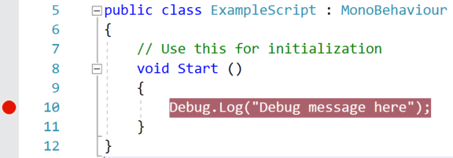
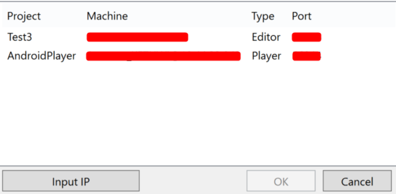
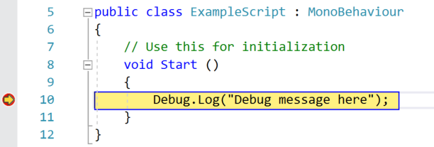
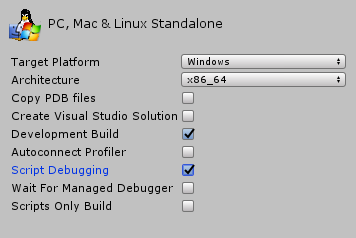
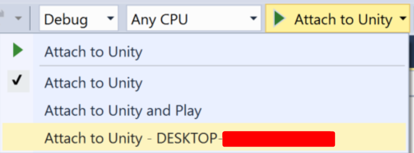
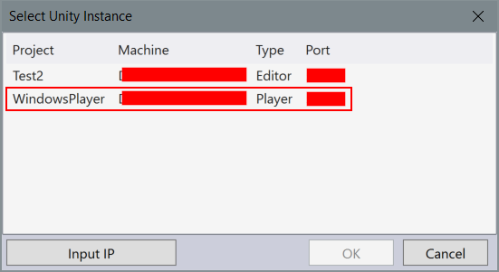
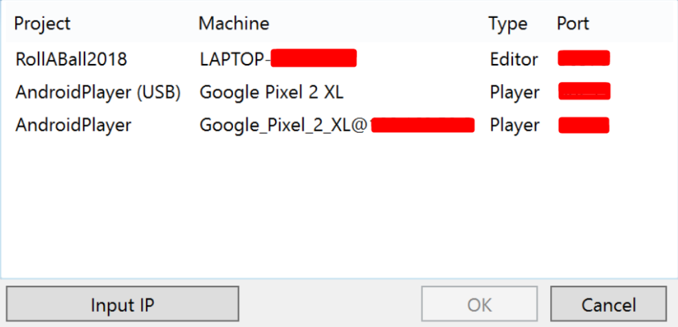
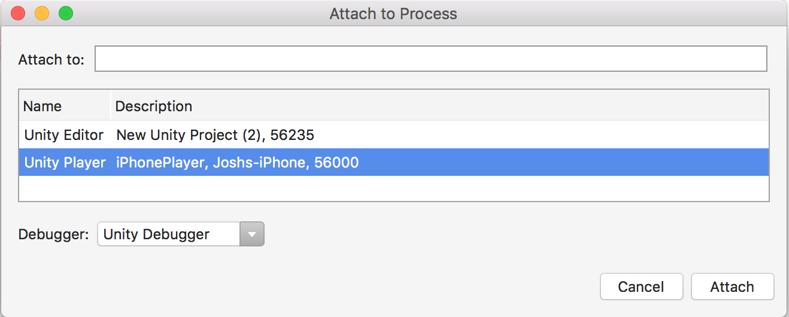

#Debugging C# code in Unity

Using a debugger allows you to inspect your source code while your application or game is running. Unity supports debugging of C# code using the following code editors:

* Visual Studio (with the Visual Studio Tools for Unity plug-in)

* Visual Studio for Mac

* Jetbrains Rider

* Visual Studio Code

Although these code editors vary slightly in the debugger features they support, all provide basic functionality like break points, single stepping, and variable inspection.

Managed code debugging in Unity works on all platforms except WebGL. It works with both the Mono and IL2CPP scripting backends.

<a name="ConfiguringTheCodeEditor"></a>
## Configuring the code editor

### Visual Studio (Windows)

The Unity Editor installer includes an option to install Visual Studio with the Visual Studio Tools for Unity plug-in. This is the recommended way to set up Visual Studio for debugging with Unity.

If Visual Studio is already installed on your computer, use its **Tools** &gt; **Extensions and Updates** menu to locate and install the Visual Studio Tools for Unity plug-in.

### Visual Studio for Mac

The Unity Editor installer includes an option to install Visual Studio for Mac. This is the recommended way to set up Visual Studio for Mac for debugging with Unity.

If Visual Studio for Mac is already installed on your computer, use its Extension Manager to locate and install the Visual Studio Tools for Unity plug-in.

### JetBrains Rider

The default installation of JetBrains Rider can debug code in Unity on Windows or Mac. Please visit the [JetBrains website](https://www.jetbrains.com/help/rider/Unity.html) to install it.

### VS Code

VS Code requires you to install an extension to debug code in Unity. Please follow the [instructions](https://code.visualstudio.com/docs/other/unity) specific to this extension to install it.

### Unity Preferences

When the code editor is installed, go to __Unity &gt; Preferences &gt; External Tools__ and set the __External Script Editor__ to your chosen code editor.


## Debugging in the Editor

You can debug script code running in the Unity Editor when the Unity Editor is in Play Mode. Before attempting to debug, ensure the __Editor Attaching__ option is enabled in the Unity Preferences. This option causes the Editor to use Just In Time (JIT) compilation to execute managed code with debugging information.

First, set a breakpoint in the code editor on a line of script code where the debugger should stop. In Visual Studio for example, click on the column to the left of your code, on the line you want to stop the debugger (as shown below). A red circle appears next to the line number and the line is highlighted.



Next, attach the code editor to the Unity Editor. This option varies depending on the code editor, and is often a different option from the code editor’s normal debugging process. In Visual Studio, the option looks like this:


Some code editors may allow you to select an instance of Unity to debug. For example, in Visual Studio, the __Debug &gt; Attach Unity Debugger__ option exposes this capability.



When you have attached the code editor to the Unity Editor, return to the Unity Editor and enter Play Mode. When the code at the breakpoint is executed, the debugger will stop, for example:



While the code editor is at a breakpoint, you can view the contents of variables step by step. The Unity Editor will be unresponsive until you choose the continue option in the debugger, or stop debugging mode.

## Debugging in the Player

To debug script code running in a Unity Player, ensure that you enable the "Development Build” and "Script Debugging” options before you build the Player (these options are located in __File &gt; Build Settings__). Enable the “Wait For Managed Debugger” option to make the Player wait for a debugger to be attached before it executes any script code.



To attach the code editor to the Unity Player, select the IP address (or machine name) and port of your Player. In Visual Studio, the drop-down menu on the "Attach To Unity" option looks like this:



The **Debug** &gt; **Attach Unity Debugger** option looks like this:



Make sure you attach the debugger to the Player, and not to the Unity Editor (if both are running). When you have attached the debugger, you can proceed with debugging normally.

## Debugging on Android and iOS devices

### Android

When debugging a Player running on an Android device, connect to the device via USB or TCP. For example, to connect to an Android device in Visual Studio (Windows), select __Debug &gt; Attach Unity Debugger__ option. A list of devices running a Player instance will appear: 

 



In this case, the phone is connected via USB and Wi-Fi on the same network as the workstation running the Unity Editor and Visual Studio.

### iOS

When debugging a Player running on an iOS device, connect to the device via TCP. For example, to connect to an iOS device in Visual Studio (Mac), select **Debug** &gt; **Attach Unity Debugger** option. A list of devices running a Player instance will appear: 



Ensure that the device only has one active network interface (Wi-Fi recommended, turn off cellular data) and that there is no firewall between the IDE and the device blocking the TCP port (port number 56000 in the above screenshot). Debugging over USB is not supported with iOS.

## Troubleshooting the debugger

Most problems with the debugger occur because the code editor is unable to locate the Unity Editor or the Player. This means that it can’t attach the debugger properly. Because the debugger uses a TCP connection to the Editor or Player, connection issues are often caused by the network. Here are a few steps you can take to troubleshoot basic connection issues.

### Ensure you attach the debugger to the correct Unity instance

You can attach code editor to any Unity Editor or Unity Player on the local network that has debugging enabled. When attaching the debugger to ensure that you are attaching to the correct instance. If you know the IP address or machine name of the device on which you are running the Unity Player, this helps to locate the correct instance.

### Verify the network connection to the Unity instance

The code editor uses the same mechanism to locate a Unity instance to debug as the Unity Profiler uses. If the code editor cannot find the Unity instance you expect it to find, try to attach the Unity Profiler to that instance. If the Unity Profiler cannot find it either, a firewall might exist on the machine which you are running the code editor on or the machine which you are running the Unity instance on (or possibly both). If a firewall is in place, see the information [about firewall settings below.](#firewall)

### Ensure the device has only one active network interface

Many devices have multiple network interfaces. For example, a mobile phone may have both an active cellular connection and an active Wi-Fi connection. To properly connect the debugger for TCP, the IDE needs to make a network connection to the correct interface on the device. If you plan to debug via Wi-Fi, for example, make sure you put the device in airplane mode to disable all other interfaces, then enable Wi-Fi.

You can determine which IP address the Unity Player is telling the IDE to use by looking in the Player Log. Look for a part of the log like this:

```

Multi-casting "[IP] 10.0.1.152 [Port] 55000 [Flags] 3 [Guid] 2575380029 [EditorId] 4264788666 [Version] 1048832 [Id] iPhonePlayer(Joshs-iPhone):56000 [Debug] 1 [PackageName] iPhonePlayer" to [225.0.0.222:54997]...

```

This message indicates the IDE will try to use the IP address 10.0.1.152 and port 56000 to connect to the device. This IP address and port must be reachable from the computer running the IDE.

<a name="firewall"></a>
### Check the firewall settings

The Unity instance communicates with the code editor via a TCP connection. On most Unity platforms, this TCP connection occurs on an arbitrarily chosen port. Normally, you should not need to know this port, as the code editor should detect it automatically. If that does not work, try to use a network analysis tool to determine which ports might be blocked either on the machine where you are running the code editor, or the machine or device where you are running the Unity instance. When you find the ports, make sure that your firewall allows access to both the port on the machine running the code editor, and the machine running the Unity instance.

### Verify the managed debugging information is available

If the debugger does attach, but breakpoints don’t load, the debugger may not be able to locate the managed debugging information for the code. Managed code debugging information is stored in files named .dll.mdb or .pdb, next to the managed assembly (.dll file) on disk.

When the correct preferences and build options are enabled ([see above](#ConfiguringTheCodeEditor), Unity will generate this debugging information automatically. However, Unity cannot generate this debugging information for managed plugins in the Project. It is possible to debug code from managed plugins if the associated .dll.mdb or .pdb files are next to the managed plugins in the Unity project on disk.


* <span class="page-edit">2018-09-06 <!-- include IncludeTextNewPageYesEdit --></span>

* <span class="page-history">Managed Code Debugging added in 2018.2</span>
