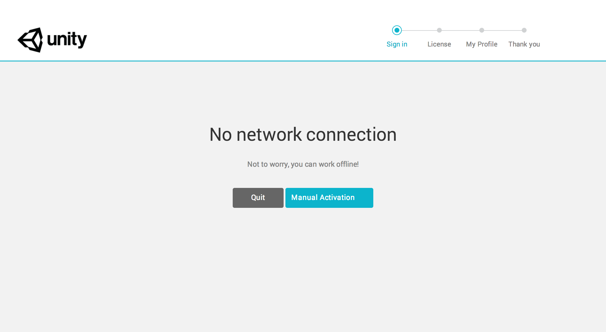
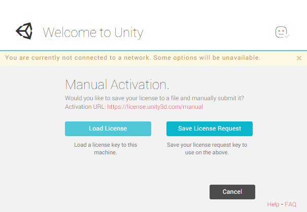
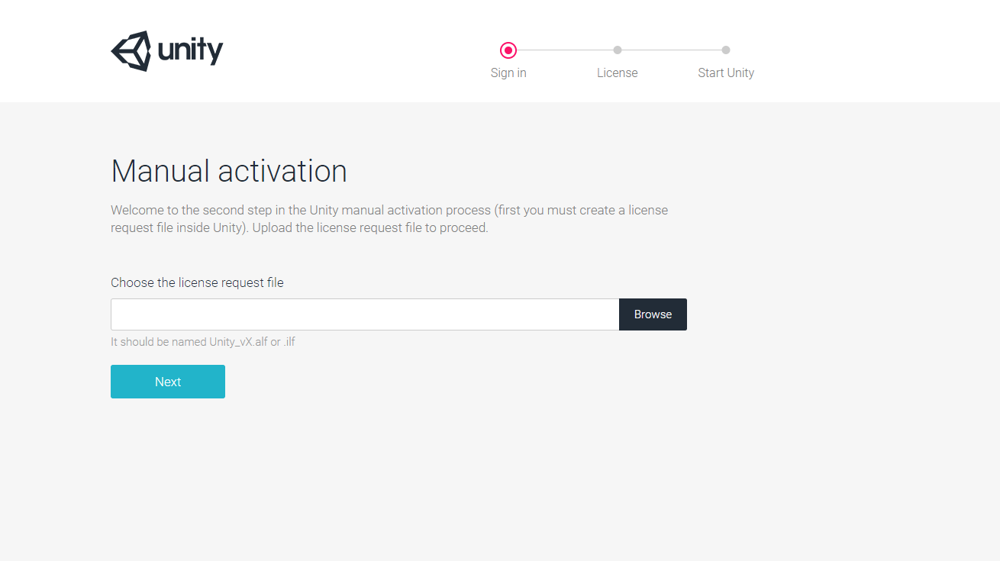
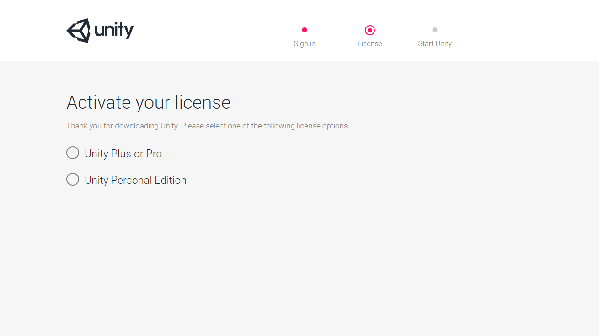
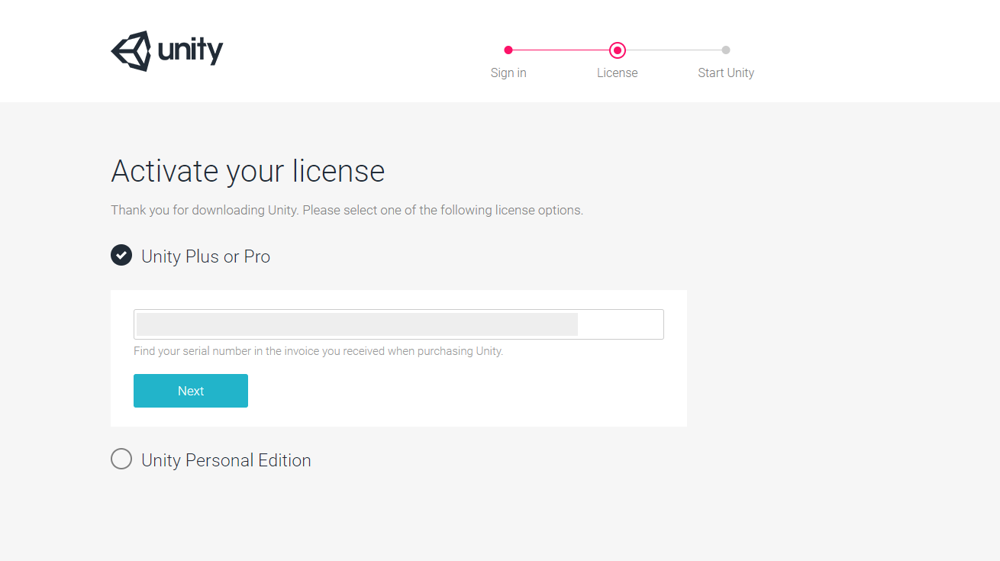
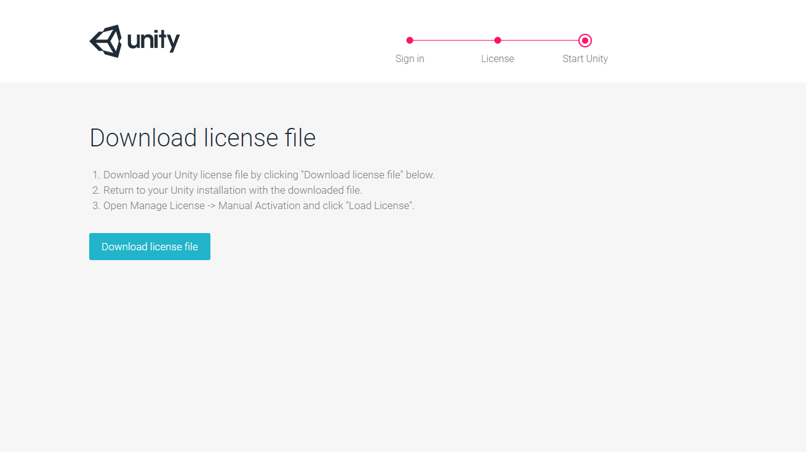
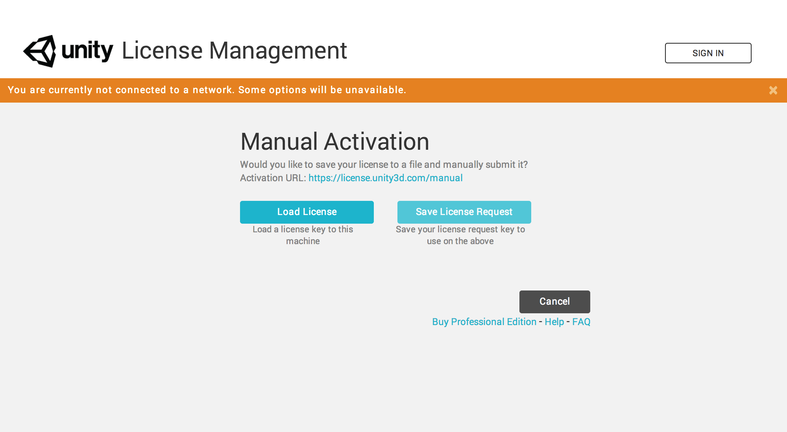

#Offline / Manual Activation

Online activation usually fails when Unity cannot contact the license server. This might be because you don't have access to the onternet, your firewall or proxy settings are blocking the connection, or the Unity license servers are down. For more information on why this can happen, see [Troubleshooting](#Troubleshooting), below. 
 
When online activation fails, the Unity Editor automatically attempts to perform a manual activation. This page provides step-by-step instructions to manually activate Unity on your machine. **You still need access to a machine with internet access**, but it does not have to be the machine on which you are trying to activate Unity.

This documentation assumes you have already downloaded and installed Unity. To download Unity, you need an internet connection. Go to [Download Unity](https://unity3d.com/get-unity/download) to get the latest version. If you're not sure which type of license you need, go to the [Unity Store](https://store.unity.com/) and view comparisons for Unity Personal, Plus and Pro. 

## Step 1: Get a license request file

1. Open Unity. When Unity cannot contact the license server, it displays a message in the License Management window that says "No network connection".

1. Click **Manual Activation**.

1. Click **Save License Request**. 

1. Save the file in a directory of your choice. Make sure you remember where you save the file. When you click **Save**, Unity displays a notification that reads "License request file saved successfully". 

This license request file is tied to the machine you used to generate it. This license file does not work on any other machine, and will not recognise the machine if you reformat it or make certain hardware changes.

## Step 2: Request a license

Now that you have your license request file, the next steps require internet access. If your machine does not have internet access, you can activate your license on a machine that does have access by copying the file to the other machine, activating the license using the following steps, and then copying the file back to your machine to use Unity.

1. Go to the [Unity license Manual Activation webpage](https://license.unity3d.com/). Click the **Browse** button, choose the license request file that you created in step 1, then click **Next**

    

1. Select the type of license you want to activate.

    

1. Enter the serial number, then click **Next**.

    

1. Click **Download license file**.

    

This downloads your license to the machine you're using to browse the website. If you're activating Unity on a different machine to the one that has internet acces, remember to transfer the license to the machine you want to activate Unity on.

Some browsers append ".xml" to the license file name. If this is the case, you need to delete this from the file name before you load the license file into Unity.

## Step 3: Activate your licence

Now that you have your licence file, you can activate your Unity account. 

Open Unity again and return to the License Management page.

Click **Load License**, and choose the license request file that you downloaded in step 2. If the license loads successfully, Unity displays a "Thank you!" message.  Click **Start Using Unity** to continue.

<!-- include UnityActivationGuide-Troubleshooting -->

---

* 2018-07-25  <!-- include IncludeTextAmendPageYesEdit -->

* 2017-09-06  <!-- include IncludeTextAmendPageSomeEdit -->

* License activation updated in Unity 2017.2
