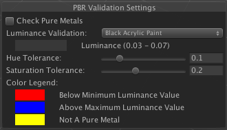
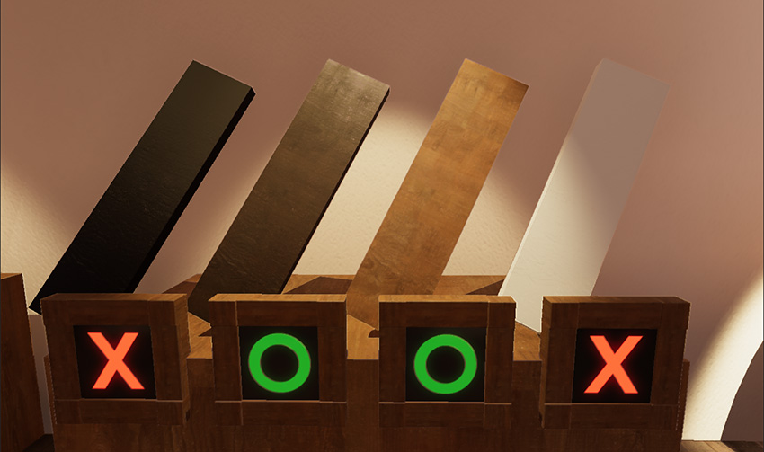
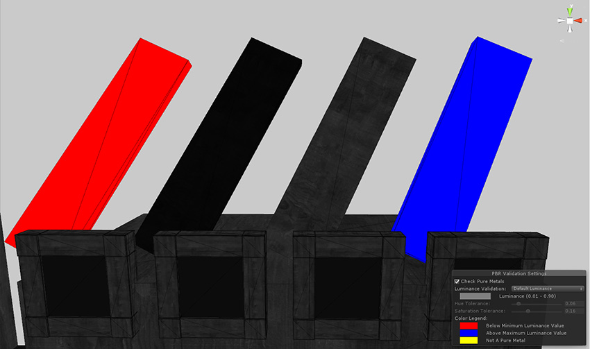
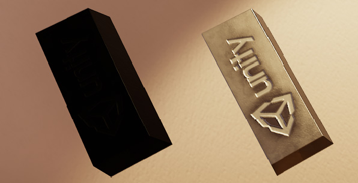
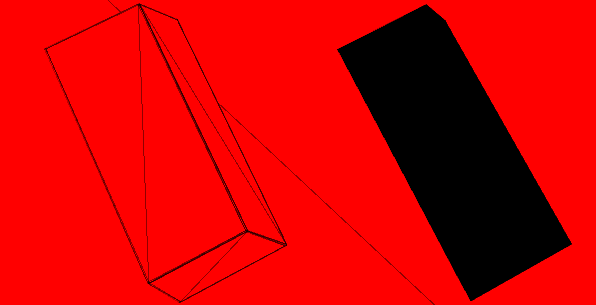
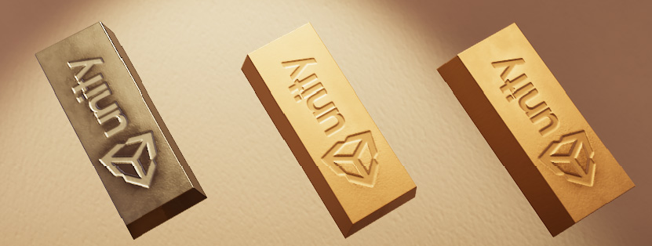
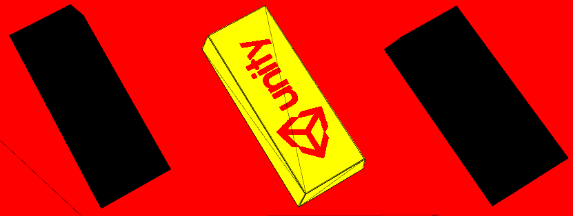

# Physically Based Rendering Material Validator

The Physically Based Rendering Material Validator is a draw mode in the Scene View. It allows you to make sure your materials use values which fall within the recommended reference values for physically-based shaders. If pixel values in a particular Material fall outside of the reference ranges, the Material Validator highlights the pixels in different colors to indicate failure.

To use the Material Validator, select the Scene View’s __draw mode__ drop-down menu, which is is usually set to __Shaded__ by default. 

 

Navigate to the __Material Validation__ section. The Material Validator has two modes: __Validate Albedo__ and __Validate Metal Specular__. 

 

**Note**: You can also check the recommended values with [Unity’s Material Charts](StandardShaderMaterialCharts). You still need to use these charts when authoring Materials to decide your __albedo__ and __metal specular__ values. However, the Material Validator provides you with a visual, in-editor way of quickly checking whether your Materials’ values are valid once your Assets are in the Scene.

**Also note**: The validator only works in Linear color space. Physically Based Rendering is not intended for use with Gamma color space, so if you are using Physically Based Rendering and the PBR Material Validator, you should also be using [Linear color space](LinearRendering-LinearOrGammaWorkflow).

##Validate Albedo mode



The PBR Validation Settings that appear in the Scene view when you set Material Validation to Validate Albedo.

|__Property:__ ||__Function:__ |
|:---|:---|:---|
|__Check Pure Metals__||Enable this checkbox if you want the Material Validator to highlight in yellow any pixels it finds which Unity defines as metallic, but which have a non-zero albedo value. See [Pure Metals](#pureMetals), below, for more details. By default, this is not enabled.|
|__Luminance Validation__||Use the drop-down to select a preset configuration for the Material Validator. If you select any option other than __Default Luminance__, you can also adjust the Hue Tolerance and Saturation Tolerance. The color bar underneath the name of the property indicates the albedo color of the configuration. The Luminance value underneath the drop-down indicates the minimum and maximum luminance value. The Material Validator highlights any pixels with a luminance value outside of these values. This is set to __Default Luminance__ by default.|
|__Hue Tolerance__||When checking the albedo color values of your material, this slider allows you to control the amount of error allowed between the hue of your material, and the hue in the validation configuration. |
|Saturation Tolerance||When checking the albedo color values of your material, this slider allows you to control the amount of error allowed between the saturation of your material, and the saturation in the validation configuration. |
|__Color Legend__||These colors correspond to the colours that the Material Validator displays in the Scene view when the pixels for that Material are outside the defined values.|
||__Red__ Below Minimum Luminance Value|The Material Validator highlights in red any pixels which are below the minimum luminance value defined in __Luminance Validation__ (meaning that they are too dark).|
||__Blue__ Above Maximum Luminance Value|The Material Validator highlights in blue any pixels which are above the maximum luminance value defined in __Luminance Validation__ (meaning that they are too bright).|
||__Yellow__ Not A Pure Metal|If you have Check Pure Metals enabled, the Material Validator highlights in yellow any pixels which Unity defines as metallic, but which have a non-zero albedo value. See Pure Metals, below, for more details.|

Unity’s [Material charts](StandardShaderMaterialCharts) define the standard luminance range as 50-243 sRGB for non-metals, and 186-255 sRGB for metals. __Validate Albedo__ mode colors any pixels outside of these ranges with different colors to indicate that the value is too low or too high.

In the example below, the first texture is below the minimum luminance value, and therefore too dark. The fourth texture is above the minimum luminance value, and therefore too bright. 





The [material charts](StandardShaderMaterialCharts) provide albedo values for common Materials. The brightness of albedo values has a dramatic impact on the amount of diffuse bounce light generated, so it is important for [Global Illumination](GIIntro) baking to make sure that your different Material types are within the correct luminance ranges, in proportion with each other. To help you get these values right, you can select from the presets in the Luminance Validation drop-down, which provides common Material albedo values to verify the luminance ranges of particular Material types.

###Overriding the default luminance values

Depending on the art style of your project, you might want the luminance values of Materials to differ from the preset luminance ranges. In this case, you can override the built-in albedo values used by the Material Validator with your own values. To override the preset luminance ranges, assign an array of [AlbedoSwatchInfo](ScriptRef:Rendering.AlbedoSwatchInfo.html) values for each desired Material type to the property [EditorGraphicsSettings.albedoSwatches](ScriptRef:Rendering.EditorGraphicsSettings-albedoSwatches.html).

## Validate Metal Specular mode

 

The PBR Validation Settings that appear in the Scene view when you set __Material Validation__ to  __Validate Metal Specular__.

|**_Property:_** ||**_Function:_** |
|:---|:---|:---|
|__Check Pure Metals__||Enable this checkbox if you want the Material Validator to highlight in yellow any pixels it finds which Unity defines as metallic, but which have a non-zero albedo value. See Pure Metals, below, for more details. By default, this is not enabled.|
|__Color Legend__||These colors correspond to the colours that the Material Validator displays in the Scene view when the pixels for that Material are invalide - meaning their specular value falls outside the valid range for that type of material (metallic or non-metallic). See below this table for the valid ranges.|
||__Blue__ Below Minimum Specular Value|The Material Validator highlights in red any pixels which are below the minimum specular value. (40 for non-metallic, or 155 for metallic).|
||__Red__ Above Maximum Specular Value|The Material Validator highlights in blue any pixels which are above the maximum specular value. (75 for non-metallic, or 255 for metallic).|
||__Yellow__ Not A Pure Metal|If you have __Check Pure Metals__ enabled, the Material Validator highlights in yellow any pixels which Unity defines as metallic, but which have a non-zero albedo value. See Pure Metals, below, for more details.|

Unity’s [Material charts](StandardShaderMaterialCharts) define two separate specular color ranges: 

* __Non-metallic materials__: 40-75 sRGB
* __Metallic materials__: 155 - 255 sRGB

In Unity, all non-metallic Materials have a constant specular color that always falls within the correct range. However, it is common for metallic Materials to have specular values that are too low. To help you identify metallic Materials with this issue, the Material Validator’s __Validate Metal Specular__ mode colors all pixels that have a specular color value that is too low. This includes all non-metallic materials by definition.

In the example below, the left material is below the minimum specular value, and therefore too dark. This also applies to the Scene’s background. The right material has specular values with in the valid range. 





<a name="pureMetals"></a>
### Pure Metals

Unity defines physically-based shading materials with a specular color greater than 155 sRGB as metallic. For Unity to define a metallic Material as a __pure metal__

If a non-metallic surface has a specular color value that is too high, but has a non-zero albedo value, this is often due to an authoring error. The Material Validator also has an option called __Check Pure Metals__. When you enable this option, the Material Validator colors in yellow any Material that Unity defines as metallic but which has a non-zero albedo value. An example of this can be seen in the images below. It shows three materials, the left and right materials are pure metals, but the middle material is not, so the Material Validator colors it yellow:





In the second image above, the background is red because the Materials in the background are below the minimum specular value for the Material Validator’s __Validate Metal Specular__ mode.

For complex materials that combine metallic and non-metallic properties, the pure metal checker is likely to pick up some invalid pixels, but if a Material is totally invalid, it’s usually a sign of an authoring error.

##Implementation

The Material Validator works with any Materials that use Unity’s [Standard shader](shader-StandardShader) or [surface shaders](SL-SurfaceShaders). However, custom shaders require a pass named `“META”`. Most custom shaders that support lightmapping already have this pass defined. See documentation on [Meta pass](MetaPass) for more details. 

Carry out the following steps to make your custom shader compatible with the Material Validator:

1. Add the following pragma to the meta pass: `#pragma shader_feature EDITOR_VISUALIZATION`
2. In the `UnityMetaInput` structure, assign the specular color of the Material to the field called `SpecularColor`, as shown in the code example below.

Here is an example of a custom meta pass:


```
Pass
{
    Name "META" 
    Tags { "LightMode"="Meta" }

    Cull Off

    CGPROGRAM
    #pragma vertex vert_meta
    #pragma fragment frag_meta

    #pragma shader_feature _EMISSION
    #pragma shader_feature _METALLICGLOSSMAP
    #pragma shader_feature _ _SMOOTHNESS_TEXTURE_ALBEDO_CHANNEL_A
    #pragma shader_feature ___ _DETAIL_MULX2
    #pragma shader_feature EDITOR_VISUALIZATION

    float4 frag_meta(v2f_meta i) : SV_TARGET
    {
        UnityMetaInput input;
        UNITY_INITIALIZE_OUTPUT(UnityMetaInput, input);
        float4 materialSpecularColor = float4(1.0f, 0.0f, 0.0f, 1.0f);
        float4 materialAlbedo = float4(0.0f, 1.0f, 0.0f, 1.0f);
        input.SpecularColor = materialSpecularColor;
        input.Albedo = materialAlbedo;

        return UnityMetaFragment(input);
    }  
}
```

---

* <span class="page-edit">2018-03-28  <!-- include IncludeTextNewPageYesEdit --></span>
* <span class="page-history">Material Validator updated in Unity 2017.3</span>
