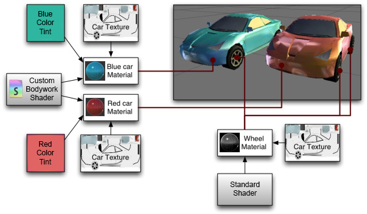

# Creating and Using Materials

To create a new Material, use __Assets-&gt;Create-&gt;Material__ from the main menu or the __Project View__ context menu. 

By default, new materials are assigned the Standard Shader, with all map properties empty, like this:

Once the Material has been created, you can apply it to an object and tweak all of its properties in the __Inspector__. To apply it to an object, just drag it from the __Project View__ to any object in the __Scene__ or __Hierarchy__.

## Setting Material Properties

You can select which Shader you want any particular Material to use. Simply expand the __Shader__ drop-down in the Inspector, and choose your new Shader. The Shader you choose will dictate the available properties to change. The properties can be colors, sliders, textures, numbers, or vectors. If you have applied the Material to an active object in the __Scene__, you will see your property changes applied to the object in real-time.

There are two ways to apply a __Texture__ to a property.

1. Drag it from the Project View on top of the Texture square
1. Click the __Select__ button, and choose the texture from the drop-down list that appears

## Built-in Shaders

In addition to the [Standard Shader](shader-StandardShader), there are a number of other categories of built-in shaders for specialised purposes:

* **FX**: Lighting and glass effects.
* **GUI** and **UI**: For user interface graphics.
* **Mobile**: Simplified high-performance shader for mobile devices.
* **Nature**: For trees and terrain.
* **Particles**: Particle system effects.
* **Skybox**: For rendering background environments behind all geometry
* **Sprites**: For use with the 2D sprite system
* **Toon**: Cartoon-style rendering.
* **Unlit**: For rendering that entirely bypasses all light & shadowing
* **Legacy**: The large collection of older shaders which were superseded by the Standard Shader

## Shader technical details

A Shader is a script which contains mathematical calculations and algorithms for how the pixels on the surface of a model should look. The standard shader performs complex and realistic lighting calculations. Other shaders may use simpler or different calculations to show different results. Within any given Shader are a number of properties which can be given values by a Material using that shader. These properties can be numbers, colours definitions or textures, which appear in the inspector when viewing a Material. Materials are then used by Renderer components attached to Game Objects, to render each Game Object's mesh.

It is possible and often desirable to have several different Materials which may reference the same textures. These materials may also use the same or different shaders, depending on the requirements.

Below is an example of a possible set-up combination using three materials, two shaders and one texture.

 

In the diagram we have a red car and a blue car. Both models use a separate material for the bodywork, "Red car material" and "Blue car material" respectively.

Both these bodywork materials use the same custom shader, "Carbody Shader". A custom shader may be used because the shader adds extra features specifically for the cars, such as metallic sparkly rendering, or perhaps has a custom damage masking feature.

Each car body material has a reference to the "Car Texture", which is a texture map containing all the details of the bodywork, without a specific paint colour.

The Carbody shader also accepts a tint colour, which is set to a different colour for the red and blue cars, giving each car a different look while using a single texture for both of them.

The car wheel models use a separate material again, but this time both cars share the same material for their wheels, as the wheels do not differ on each car. The wheel material uses the Standard Shader, and has a reference again to the Car Texture.

Notice how the car texture contains details for the bodywork *and* wheels - this is a *texture atlas*, meaning different parts of the texture image are explicitly mapped to different parts of the model.

Even though the bodywork materials are using a texture that also contains the wheel image, the wheel does not appear on the body because that part of the texture is not mapped to the bodywork geometry.

Similarly, the wheel material is using the same texture, which has bodywork detail in it. The bodywork detail does not appear on the wheel, because only the portion of the texture showing the wheel detail is mapped to the wheel geometry.

This mapping is done by the 3D artist in an external 3d application, and is called "UV mapping".

To be more specific, a Shader defines:

* The method to render an object. This includes code and mathematical calculations that may include the angles of light sources, the viewing angle, and any other relevant calculations. Shaders can also specify different methods depending on the graphics hardware of the end user.
* The parameters that can be customised in the material inspector, such as texture maps, colours and numeric values.

A Material defines:

* Which shader to use for rendering this material.
* The specific values for the shader's parameters - such as which texture maps, the colour and numeric values to use.

Custom Shaders are meant to be written by graphics programmers. They are created using the __ShaderLab__ language, which is quite simple. However, getting a shader to work well on a variety graphics cards is an involved job and requires a fairly comprehensive knowledge of how graphics cards work.

A number of shaders are built into Unity directly, and some more come in the [Standard Assets](AssetTypes#Standard) Library.

