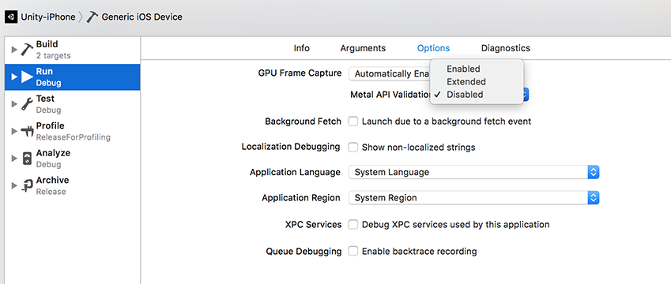
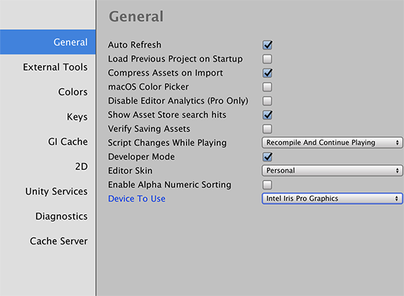
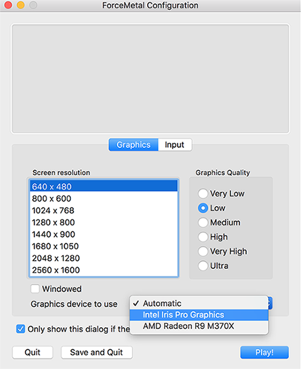

# Metal

Metal is the standard graphics API for Apple devices. Unity supports Metal on iOS, tvOS and macOS (Standalone and Editor).

Metal has a larger feature set on Apple platforms than OpenGL ES. See the advantages and disadvantages of using Metal below.

**Advantages of using Metal**

* Lower CPU overhead of graphics API calls
* API level validation layer
* Better GPU control on multi-GPU systems
* Supports memory-less render targets (on iOS/tvOS)
* New Apple standard for Apple
* Computer shaders
* Tessellation shaders

**Disadvantages of using Metal**

* No support for low-end devices
* No support for geometry shaders

## Limitations and requirements

* iOS and tvOS have Metal support for [Apple A7](https://en.wikipedia.org/wiki/Apple_A7) or newer SoC-s.

* macOS has Metal support for Intel HD and Iris Graphics from the HD 4000 series or newer, AMD GCN-based GPUs, and Nvidia Kepler-based GPUs or newer.

* Minimum [shader compilation target is 3.5](SL-ShaderCompileTargets).

* Metal does not support geometry shaders.

## Enabling Metal

To make the Unity Editor and Standalone Player use Metal as the default graphics API, do one of the following:

* In the Editor, go to menu: __Edit__ &gt; __Project Settings__, then select the __Player__ category, and enable __Metal Editor Support__.

* Or, if you are using MacOS, open **Terminal** and use the `-force-gfx-metal` [command line argument](CommandLineArguments).

Metal is enabled by default on iOS, tvOS and macOS Standalone Players.

## Validating Metal API

Xcode offers Metal API validation, which you can use to trace obscure issues. To enable Metal API validation in Xcode:

1. In Unity, build your Project for iOS. This generates an Xcode project.

2. Open the generated Xcode project in Xcode and select __Edit Scheme__. 

   

3. Select __Run__ &gt; __Options__ &gt; __Metal API Validation__ and choose __Enabled__

   

Validation errors break code execution in the XCode editor, and appear in device logs.

__Note__: Enabling validation increases CPU usage, so only enable it for debugging.

## Selecting a GPU device

Metal allows you to select a GPU device when you run your application. This enables you to test your Project on different GPU setups, or save power by using a low power GPU.

To change the Unity Editor target GPU device, select menu: __Unity__ &gt; __Preferences…__ &gt; __General__ and set the __Device To Use__:

To change the Standalone Player target GPU device, start your application (or select menu: __File__ &gt; __Build and run__) and set the __Graphics device to use__ to the relevant GPU in the dialog that appears:

## Using memoryless render targets

Metal allows you to use memory-less render targets to optimize memory on mobile devices introduced in iOS and tvOS 10.0. This enables you to render to a RenderTexture without backing it up in system memory, so contents are only temporarily stored in the on-tile memory during rendering.

For more information, see [RenderTexture.memorylessMode](ScriptRef:RenderTexture-memorylessMode.html).

---
* 2018-05-22 <!-- include IncludeTextNewPageYesEdit -->

* Added advice on using Metal in 2017.4

