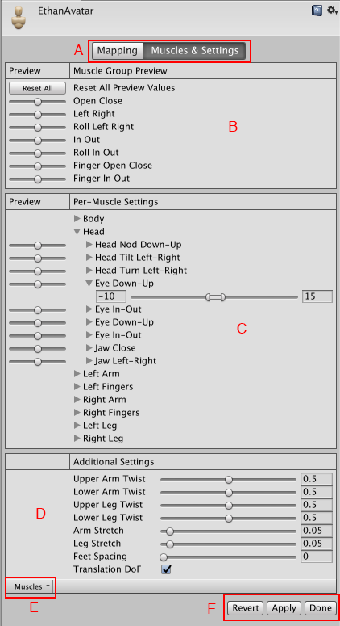
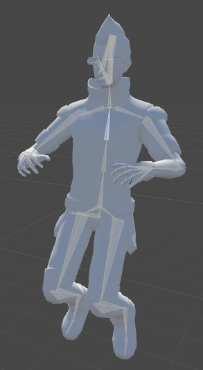

# Avatar Muscle & Settings tab

Unity's animation system allows you to control the range of motion of different bones using __Muscles__. 

Once the Avatar has been [properly configured](class-Avatar), the animation system "understands" the bone structure and allows you to start using the __Muscles & Settings__ tab of the __Avatar__'s Inspector. Use the __Muscles & Settings__ tab to tweak the character's range of motion and ensure the character deforms in a convincing way, free from visual artifacts or self-overlaps.

 

The areas of the __Muscle &amp; Settings__ tab include:

* (A) Buttons to toggle between the __Mapping__ and __Muscles &amp; Settings__ tabs. You must __Apply__ or __Revert__ any changes made before switching between tabs.
* (B) Use the __Muscle Group Preview__ area to manipulate the character using predefined deformations. These affect several bones at once. 
* (C) Use the __Per-Muscle Settings__ area to adjust individual bones in the body. You can expand the muscle settings to change the range limits of each settings. For example, by default, Unity gives the Head-Nod and Head-Tilt settings a possible range of -40 to 40 degrees but you can decrease these ranges even further to add stiffness to these movements.
* (D) Use the __Additional Settings__ to adjust specific effects in the body.
* (E) The __Muscles__ menu provides a __Reset__ tool to return all muscle settings to their default values.
* (F) Buttons to accept any changes made (__Accept__), discard any changes (__Revert__), and leave the Avatar window (__Done__). You must __Apply__ or __Revert__ any changes made before leaving the __Avatar__ window.

## Previewing changes

For the settings in the __Muscle Group Preview__ and __Per-Muscle Settings__ areas, you can preview the changes right in the __Scene__ view. You can drag the sliders left and right to see the range of movement for each setting applied to your character:

 

You can see the bones of the skeleton through the Mesh.

## Translate Degree of Freedom (DoF)

You can enable the __Translate DoF__ option in the __Additional Settings__ to enable translation animations for the humanoid. If this option is disabled, Unity animates the bones using only rotations. __Translation DoF__ is available for Chest, UpperChest, Neck, LeftUpperLeg, RightUpperLeg, LeftShoulder and RightShoulder muscles.

**Note:** Enabling __Translate DoF__ can increase performance requirements, because the animation system needs to perform an extra step to retarget humanoid animation. For this reason, you should only enable this option if you know your animation contains animated translations of some of the bones in your character.

---

*  2018-04-25  <!-- include IncludeTextAmendPageSomeEdit -->
