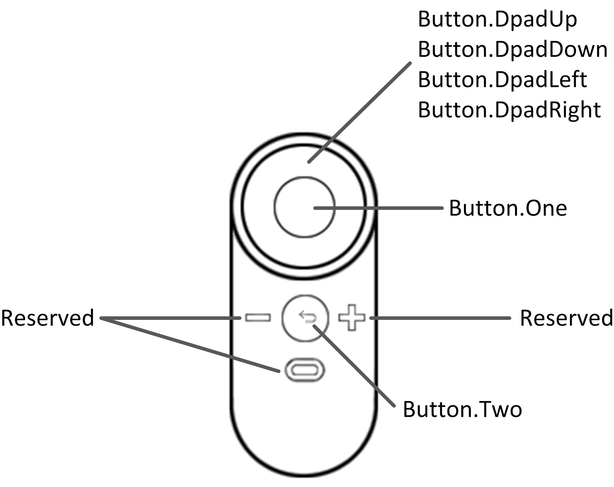
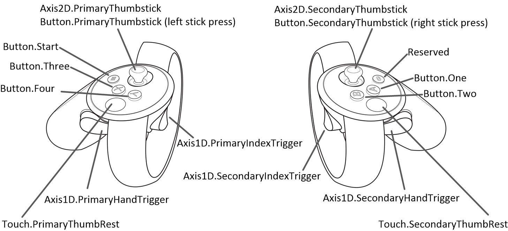

#Input for Oculus

Oculus Rift has three inputs: two Oculus Touch Controllers, and one Oculus Remote. To allow native Unity Editor support for Oculus Rift input hardware, the Unity VR subsystem presents these three inputs as separate joysticks: Use the [UnityEngine.Input](ScriptRef:Input.html) class to read the axis and button values of these inputs.

##Naming convention and detection

When properly configured and connected with your operating system, the Oculus Touch Controllers appear in the list returned by UnityEngine.Input.GetJoystickNames() as Oculus Touch - Left and Oculus Touch - Right, and the Oculus Remote appears as Oculus Remote. For information on correctly configuring and connecting the Touch Controllers and Remote, see the [Oculus Developer Center](https://developer3.oculus.com) documentation on Pairing the [Oculus Touch Controllers](https://developer3.oculus.com/documentation/pcsdk/latest/concepts/pairing-touch-controllers/) and the [Oculus Support Center guidance](https://support.oculus.com) on the [Oculus Remote](https://support.oculus.com/help/oculus/835449819935261).

Unity script code can test for the availability of the Touch Controllers by periodically checking for their presence in the list of joystick names. When the Touch Controllers are turned off, or their batteries are removed, an empty string replaces their name in the list returned by [UnityEngine.Input.GetJoystickNames()](ScriptRef:Input.GetJoystickNames.html). When the Touch Controllers are turned on again, their name re-appears in the list.

##Unity input system mappings

###Oculus Remote

|**Hardware Feature** |**Unity Button ID** |**Unity Axis ID** |**Unity Axis Value when Pressed** |**Xbox Controller Analogue** |
|:---|:---|
|Button.DpadUp| - |6 | 1.0|D-Pad Up|
|Button.DpadDown | - |6|-1.0|D-Pad Down |
| Button.DpadLeft| -|5|-1.0|D-Pad Left |
|Button.DpadRight |- |5 |1.0|D-Pad Right |
|Button.One |0|-| - |A Button |
| Button.Two|1 |-| - |B Button |

###Oculus Touch Controllers
**Note:** The two Touch Controllers have a similar set of controls to the Xbox controller, so Unity's Oculus Touch Controller mapping closely imitates those. 

| __Hardware Feature__| __Interaction Type__ | __Unity Button ID__ | __Unity Axis ID__ | __Unity Axis Range__ | __Xbox Controller Analog__ |
|:---|:---|:---|:---|:---|:---| 
| Button.One| Press | 0 |  - |  - | A Button |
| Button.One| Touch | 10 |  - |  - |  - |
| Button.Two| Press | 1 |  - |  - | B Button |
| Button.Two| Touch | 11 |  - |  - |  - |
| Button.Three| Press | 2 |  - |  - | X Button |
| Button.Three| Touch | 12 |  - |  - |  - |
| Button.Four| Press | 3 |  - |  - | Y Button |
| Button.Four| Touch | 13 |  - |  - |  - |
| Button.Start| Press | 7 |  - |  - | Start Button |
| Button.PrimaryThumbstick| Press | 8 |  - |  - | Left Stick Press |
| Button.PrimaryThumbstick| Touch | 16 |  - |  - |  - |
| Button.PrimaryThumbstick| Near Touch |  - | 15 | 1.0 When Near Touch Is Detected; 0.0 Otherwise |  - |
| Button.SecondaryThumbstick| Press | 9 |  - |  - | Right Stick Press |
| Button.SecondaryThumbstick| Touch | 17 |  - |  - |  - |
| Button.SecondaryThumbstick| Near Touch |  - | 16 | 1.0 When Near Touch Is Detected; 0.0 Otherwise |  - |
| Touch.PrimaryThumbRest| Touch | 18 | -  |  - |  - |
| Touch.PrimaryThumbRest| Near Touch |  - | 15 | 1.0 When Near Touch Is Detected; 0.0 Otherwise |  - |
| Touch.SecondaryThumbRest| Touch | 19 |  - |  - |  - |
| Touch.SecondaryThumbRest| Near Touch |  - | 16 | 1.0 When Near Touch Is Detected; 0.0 Otherwise |  - |
| Axis1D.PrimaryIndexTrigger| Touch | 14 |  - |  - |  - |
| Axis1D.PrimaryIndexTrigger| Near Touch |  - | 13 | 1.0 When Near Touch Is Detected; 0.0 Otherwise |  - |
| Axis1D.PrimaryIndexTrigger| Squeeze |  - | 9 | 0.0 to 1.0 | Squeeze Left Trigger |
| Axis1D.SecondaryIndexTrigger| Touch | 15 |  - |  - |  - |
| Axis1D.SecondaryIndexTrigger| Near Touch |  - | 14 | 1.0 When Near Touch Is Detected; 0.0 Otherwise |  - |
| Axis1D.SecondaryIndexTrigger| Squeeze |  - | 10 | 0.0 to 1.0 | Squeeze Right Trigger |
| Axis1D.PrimaryHandTrigger| Squeeze |  - | 11 | 0.0 to 1.0 |  - |
| Axis1D.SecondaryHandTrigger| Squeeze |  - | 12 | 0.0 to 1.0 |  - |
| Axis2D.PrimaryThumbstick| Horizontal Movement |  - | 1 | -1.0 to 1.0 | Move Left Stick |
| Axis2D.PrimaryThumbstick| Vertical Movement |  - | 2 | -1.0 to 1.0 | Move Left Stick |
| Axis2D.SecondaryThumbstick| Horizontal Movement |  - | 4 | -1.0 to 1.0 | Move Right Stick |
| Axis2D.SecondaryThumbstick| Vertical Movement |  - | 5 | -1.0 to 1.0 | Move Right Stick |
