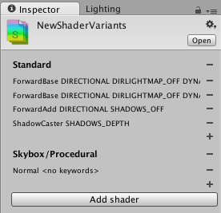
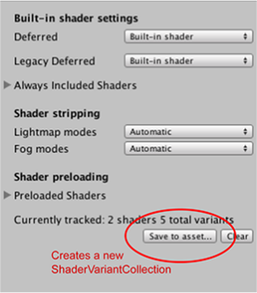

# Optimizing Shader Load Time

Shaders are small programs that execute on the GPU, and loading them can take some time. Each individual GPU program typically does not take much time to load, but shaders often have a lot of "variants" internally.

For example, the [Standard shader](shader-StandardShader), if fully compiled, ends up being many thousands of slightly different GPU programs. This creates two potential problems:

* Large numbers of these shader variants increase game build time, and game data size.
* Loading large numbers of shader variants during game is slow and takes up memory.

## Shader build time stripping

While building the game, Unity can detect that some of the internal shader variants are not used by the game, and skip them from build data. Build-time stripping is done for:

* Individual shader features, for shaders that use `#pragma shader_feature`. If none of the used materials use a particular variant, then it is not included into the build. See [internal shader variants](SL-MultipleProgramVariants) documentation. Out of built-in shaders, the [Standard shader](shader-StandardShader) uses this.
* Shader variants to handle Fog and Lightmapping modes not used by any of the scenes are not included into the game data. See the [Graphics](class-GraphicsSettings) window if you want to override this behavior.

Combination of the above often substantially cuts down on shader data size. For example, a fully compiled Standard shader would take several hundred megabytes, but in typical projects it often ends up taking just a couple megabytes (and is often compressed further by the application packaging process).

## Default Unity shader loading behavior

Under all default settings, Unity loads the [shaderlab Shader](SL-Shader) object into memory, but does not create the [internal shader variants](SL-MultipleProgramVariants) until they are actually needed.

This means that shader variants that are included into the game build can still potentially be used, but there's no memory or load time cost paid until they are needed. For example, shaders always include a variant to handle point lights with shadows, but if you never end up using a point light with shadows in your game, then there's no point in loading this particular variant.

One downside of this default behavior, however, is a possible hiccup for when some shader variant is needed for the first time - since a new GPU program code has to be loaded into the graphics driver. This is often undesirable during gameplay, so Unity has **ShaderVariantCollection** assets to help solve that.

### Shader Variant Collections

ShaderVariantCollection is an asset that is basically a list of [Shaders](class-Shader), and for each of them, a list of Pass types and shader keyword combinations to load.

To help with creating these assets based on actually used shaders and their variants, the editor can track which shaders and their variants are actually used. In the [Graphics](class-GraphicsSettings) window, there is a button to create a new ShaderVariantCollection out of currently tracked shaders, or to clear the currently tracked shader list.

 

Once you have some ShaderVariantCollection assets, you can set for these variants to be automatically preloaded while loading the application (under Preloaded Shaders list on the [Graphics](class-GraphicsSettings) window), or you can preload an individual shader variant collection from a script. 

The Preloaded Shaders list is intended for frequently used shaders. Shader variants that are listed there the are loaded into memory for entire lifetime of the application. This may use significant amount of memory for ShaderVariantCollections assets that include large number of variants. To avoid that, ShaderVariantCollection assets should be created at smaller granularity and loaded from a script. One strategy is to record used shader variants for each scene, save them into separate ShaderVariantCollections assets and load them on scene startup.

See [ShaderVariantCollection](ScriptRef:ShaderVariantCollection.html) scripting class.

## See Also

* [Optimizing Graphics Performance](OptimizingGraphicsPerformance)
* [Graphics](class-GraphicsSettings) settings
* [Shaders reference](SL-Shader)
