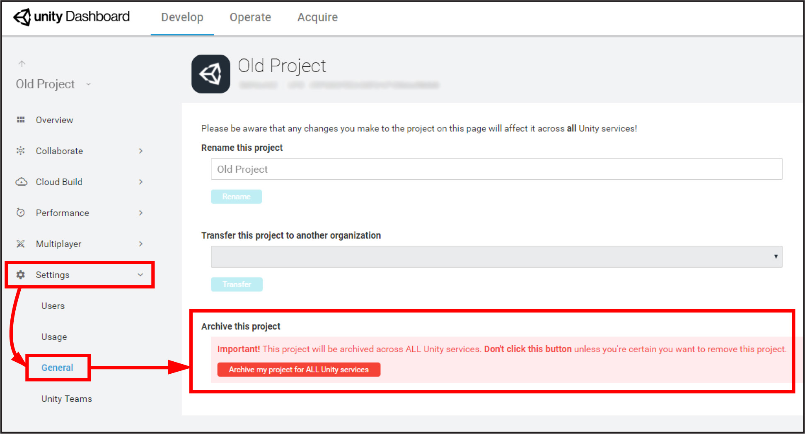
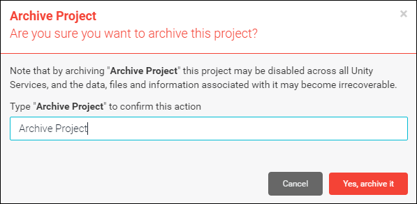

# Managing your Organization’s Projects

When you create a new Project, it is assigned to an Organization. If you have not created any additional Organizations, it is automatically assigned to your default Organization. If multiple Organizations are available to your account, you can choose which one to use. As such, Projects inherit their Organization’s role settings. However, if users need access to certain tools or information, you can give them different roles that are unique to each Project, without granting visibility across the entire Organization’s portfolio of Projects. For more information, see [Members & Groups](OrgsManagingyourOrganization#membersandgroups) in __Managing your Organization__.

As the Organization Owner, you also have the following tools to manage your Projects:

* [Archiving and restoring Projects](#archiveproject)
* [Changing Project names](#changeprojectname)
* [Transferring Projects to a new Organization](TransferringProjects)

## Archiving and restoring Projects

Projects cannot be deleted which can lead to clutter on your dashboard. To reduce clutter, you can archive Projects you no longer use. Archiving a Project prevents it from displaying in your __Projects__ list.

To archive a Project:

1. Sign in to the [Unity Dashboard](https://developer.cloud.unity3d.com/projects/).
2. Select the Project to archive.
3. In the left navigation pane, click __Settings__ > __General__.
4. In the Project pane, click the __Archive my project for ALL Unity services__ button.

    

5. In the Project archive pop-up window, enter the name of the Project to confirm that you want to archive the Project, then click the __Yes, archive it__ button.

    

To view your archived Projects and reactivate them:

1. Sign in to the [Unity Services Dashboard](https://developer.cloud.unity3d.com/projects/).
2. Click View Archived Projects on top right of the page.

    

1. Locate the Project to reactivate and the click the __Unarchive__ button.

    

## Changing the name of a Project

To change the name of a Project:

1. Sign in to the [Unity Services Dashboard](https://developer.cloud.unity3d.com).
2. Select the Project to rename.
3. In the left navigation pane, click __Settings__ > __General__.
4. In the __Rename this project__ textbox, enter a new name for the Project, then click the __Rename__ button.

---
* 2018-04-25 <!-- include IncludeTextNewPageYesEdit -->