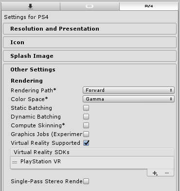
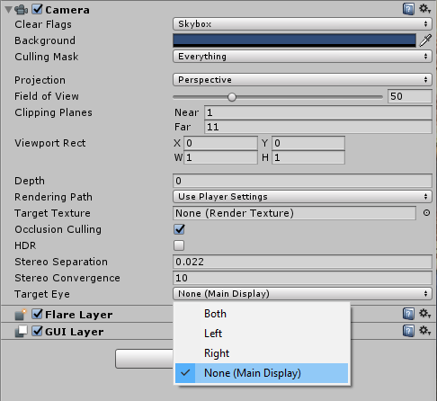
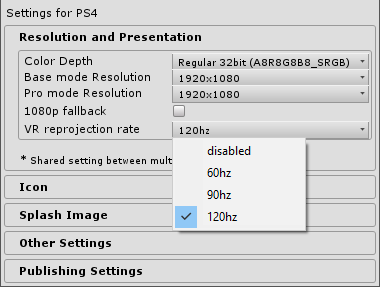

# PlayStation VR

Unity's integrated Virtual Reality (VR) support for PlayStation works very similarly to Unity's integrated support for other [VR devices](VROverview) on PC and Android platforms. To use the PlayStation VR, ensure that you are using the SDK, hardware and firmware versions as specified in the release notes.

**Example Project**

An example project based upon the VR Samples is available for PlayStation 4 from the [Unity the Asset Store](https://www.assetstore.unity3d.com/en/#!/content/51519). This example project demonstrates all the functionality detailed in this documentation including HMD Setup, **Player** settings, and Tracked Devices (DUALSHOCK™4, Move controllers and the VR aim controller). 

**Note**: This sample is **not**  TRC compliant: Do not simply copy the example scripts over without first investigating them and making any required changes relevant to your title’s unique setup.

Find the project itself and more information in the relevant thread on [SIE DevNet](https://ps4.siedev.net/forums/nodejump/849349).

## Enabling support for PlayStation VR

### Global support and devices



__Virtual Reality Supported__ must also be enabled in the __XR Settings__ section of the PS4 **Player** settings. When enabled, this gives access to an additional set of options:

#### VR SDKs

This allows you to provide a list of supported devices for the current platform and order them by priority. For PlayStation 4, you have two options: `None` and `PlayStation VR`. If the first option in your list is `PlayStation VR`, then upon startup your title will attempt to automatically enter VR mode and start the HMD device. If the first option listed is `None` then your title will start in a regular non-VR mode and will only begin VR when prompted to do so.

If you include `None` in your list of devices, you can move in and out of VR and non-VR modes, allowing your title to support a traditional play experience on a monitor as well as virtual reality.

See the section on Script Funtionality, below.

#### Single-pass stereo rendering

This enables single-pass stereo rendering support for VR devices. This can improve stereo rendering performance in the majority of cases. Please see the Unity documentation on [Single-Pass Stereo rendering](SinglePassStereoRendering) for more information.

#### Audio backend

Select the __(Playstation®VR) AudioOut3d__ option for Audio Backend in the __Configuration__ section of the PS4 **Player** settings under the __Other Settings__ panel. This enables spatial audio from headphones connected to PSVR. With __(Playstation®VR) AudioOut3d__ is enabled, Unity3D automatically handles the mixing of mono spatialized audio channels to the correct position around the headset.

#### Virtual speakers

Selecting __(Playstation®VR) AudioOut3d__ exposes __Virtual Speakers__ which sets up a number of 3D audio positions around the headset (8,12 or 14). The number of 3D audio positions determines the precision of the final 3D panned audio, however higher numbers have a higher CPU processing cost.

#### Social screen support

By default the VR display is mirrored on the TV. However, it is possible to have one (or more) cameras render to the main monitor attached to the PlayStation 4 and not the VR device. To do this: 

1. Enable the __Social Screen Supported__ option in the __Configuration__ section of **Player** settings under the __Other Settings__ panel.  
2. Select at least one camera and change the __Target Eye__ property to __None (Main Display)__.
  

With social screen support enabled, video recording via the PS4 operating system sharing system is not possible because it is limited by the system software. 

You can  disable the VR display from being mirrored on the TV by setting [VRSettings.showDeviceView](ScriptRef:VR.VRSettings-showDeviceView.html) to false.

### Resolution and refresh rate



To enable integrated support for PlayStation VR, in the Unity Editor's PS4 **Player** settings, select a compatible refresh rate from the __VR reprojection rate__ dropdown menu under the __Resolution and Presentation__ section. The refresh rate you choose should be the one you are going to run your game at. 

Notes:
* ‘disabled’ is a deprecated. Do not use it. 
* When  60hz is selected the headset will run at 120hz but every other frame will be an interpolated re-projection of the previous frame - note 60hz interpolation can cause issues for example when a user strafes their head quickly they may see smearing of nearby objects.
* When targeting PlayStation 4 Pro at a resolution above 1080p, enable __Resolution and Presentation__ &gt; __1080p fallback__.

All of the VR resolutions support asynchronous re-projection. This attempts to warp rendered content to account for the rotation of the PlayStation VR headset in the time since it was rendered. 

For more details on reprojection please see the [PlayStation VR in Unity](https://ps4.siedev.net/projects/devcon_2016/dl/dl/1773/9555/17-Unity_Tips_Techniques_And_Optimisations.pdf) presentation slides from DevCon 2016.

## Script functionality

This is the minimal code you need to enter VR mode. If you set `Playstation VR` as the first option in the list of `Virtual Reality SDKs` (as described above), your app will start in VR mode without needing any script code. Note that you might want to change the default `renderscale` of `1.0`).

```
using UnityEngine;

using UnityEngine.XR;

using System.Collections;

public class ExampleClass : MonoBehaviour {

    IEnumerator Start() {

        VRSettings.LoadDeviceByName("PlayStationVR");

		

        yield return null;

		

//Controls the texel to pixel ratio before lens correction, 

//trading performance for sharpness 

VRSettings.renderScale = 1.4f;

VRSettings.enabled = true;

    }

}

```

**Notes**:

* Due to an issue where the [VR Device](ScriptRef:VR.VRDevice.html) is not accessible in the same frame it is created. The example above yields for a frame before then continuing to change the [VRSettings](ScriptRef:VR.VRSettings.html), and set the renderscale to Sony’s recommended value of 1.4.

* There is likely to be escalating memory usage with higher renderscale values and the AntiAliasing option in [Quality](class-QualitySettings) settings. Due to the size of the single allocation you can get from using 8x Multi Sampling, it’s possible the GPU wil run out of memory resulting in a program crash.

## Useful links and articles

* DevCon 2016: [PlayStation VR in Unity presentation slides](https://ps4.siedev.net/projects/devcon_2016/dl/dl/1773/9555/17-Unity_Tips_Techniques_And_Optimisations.pdf) - includes information regarding post-reprojection

* Owlchemy Labs (Job Simulator developers): Player height/playspace floor position calibration <br/>
[jobsimulatorgame.com psvrfaq](http://jobsimulatorgame.com/psvrfaq/) - [ps4.siedev.net forum thread](https://ps4.siedev.net/forums/thread/129201/)

* Post-reprojection and ‘hall of mirrors’ effect:  [ps4.siedev.net forum thread](https://ps4.siedev.net/forums/thread/200978/)

* Displaying PlayStation Camera output whilst in VR: [ps4.siedev.net forum thread](https://ps4.siedev.net/forums/thread/202447/)

---

* <span class="page-edit">2017-05-17  <!-- include IncludeTextAmendPageSomeEdit --></span>

* <span class="page-history">New feature in 5.5</span>
