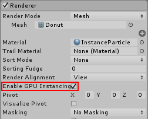
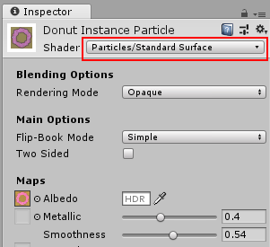

# Particle System GPU Instancing

GPU instancing offers a large performance boost compared with CPU rendering. You can use it if you want your particle system to render __Mesh__ particles (as opposed to the default [rendering mode](PartSysRendererModule) of rendering __billboard__ particles).

To be able to use GPU instancing with your particle systems:

* Set your Particle System’s [renderer](PartSysRendererModule) mode to __Mesh__

* Use a shader for the [renderer](PartSysRendererModule) material that supports GPU Instancing

* Run your project on a platform that supports GPU instancing

To enable GPU instancing for a particle system, you must enable the __Enable GPU Instancing__ checkbox in the __Renderer__ module of your particle system.



Unity comes with a built-in particle shader that supports GPU instancing, but the default particle material does not use it, so you must change this to use GPU instancing. The particle shader that supports GPU instancing is called __Particles/Standard Surface__. To use it, you must create your own new __material__, and set the material’s shader to __Particles/Standard Surface__. You must then assign this new material to the material field in the Particle System [renderer](PartSysRendererModule) module.



If you are using a different shader for your particles, it must use ‘#pragma target 4.5’ or higher. See [Shader Compile Targets](SL-ShaderCompileTargets) for more details. This requirement is higher than regular GPU Instancing in Unity because the Particle System writes all its instance data to a single large buffer, rather than breaking up the instancing into multiple draw calls.

## Custom shader examples

You can also write custom shaders that make use of GPU Instancing. See the following sections for more information:

* [Particle system GPU Instancing in a Surface Shader](#SurfaceShader)
* [Particle system GPU Instancing in a Custom Shader](#CustomShader)
* [Customising instance data used by the Particle System](#CustomVertexStreams) (to work alongside Custom Vertex Streams)

<a name="SurfaceShader"></a>

### Particle system GPU Instancing in a Surface Shader

Here is a complete working example of Surface Shader using Particle System GPU Instancing:

````

Shader "Instanced/ParticleMeshesSurface" {
	Properties {
		_Color ("Color", Color) = (1,1,1,1)
		_MainTex ("Albedo (RGB)", 2D) = "white" {}
		_Glossiness ("Smoothness", Range(0,1)) = 0.5
		_Metallic ("Metallic", Range(0,1)) = 0.0
	}
	SubShader {
		Tags { "RenderType"="Opaque" }
		LOD 200

		CGPROGRAM
		// Physically based Standard lighting model, and enable shadows on all light types
		// And generate the shadow pass with instancing support
		#pragma surface surf Standard nolightmap nometa noforwardadd keepalpha fullforwardshadows addshadow vertex:vert
		// Enable instancing for this shader
		#pragma multi_compile_instancing
		#pragma instancing_options procedural:vertInstancingSetup
		#pragma exclude_renderers gles
		#include "UnityStandardParticleInstancing.cginc"
		sampler2D _MainTex;
		struct Input {
			float2 uv_MainTex;
			fixed4 vertexColor;
		};
		fixed4 _Color;
		half _Glossiness;
		half _Metallic;
		void vert (inout appdata_full v, out Input o)
		{
			UNITY_INITIALIZE_OUTPUT(Input, o);
            vertInstancingColor(o.vertexColor);
            vertInstancingUVs(v.texcoord, o.uv_MainTex);
		}

		void surf (Input IN, inout SurfaceOutputStandard o) {
			// Albedo comes from a texture tinted by color
			fixed4 c = tex2D (_MainTex, IN.uv_MainTex) * IN.vertexColor * _Color;
			o.Albedo = c.rgb;
			// Metallic and smoothness come from slider variables
			o.Metallic = _Metallic;
			o.Smoothness = _Glossiness;
			o.Alpha = c.a;
		}
		ENDCG
	}
	FallBack "Diffuse"
}
````

There are a number of small differences to a regular [Surface Shader](SL-SurfaceShaders) in the above example, which make it work with particle instancing.

Firstly, you must add the following two lines to enable Procedural Instancing, and specify the built-in vertex setup function. This function lives in UnityStandardParticleInstancing.cginc, and loads the per-instance (per-particle) positional data:

````
		#pragma instancing_options procedural:vertInstancingSetup
		#include "UnityStandardParticleInstancing.cginc"
````

The other modification in the example is to the Vertex function, which has two extra lines that apply per-instance attributes, specifically, particle colors and [Texture Sheet Animation](PartSysTexSheetAnimModule) texture coordinates:

````
            vertInstancingColor(o.vertexColor);
            vertInstancingUVs(v.texcoord, o.uv_MainTex);
````

<a name="CustomShader"></a>

### Particle System GPU Instancing in a Custom Shader

Here is a complete working example of a Custom Shader using particle system GPU instancing. This custom shader adds a feature which the standard particle shader does not have - a fade between the individual frames of a [texture sheet animation](PartSysTexSheetAnimModule).

````
Shader "Instanced/ParticleMeshesCustom"
{
    Properties
    {
        _MainTex("Albedo", 2D) = "white" {}
        [Toggle(_TSANIM_BLENDING)] _TSAnimBlending("Texture Sheet Animation Blending", Int) = 0
    }
    SubShader
    {
        Tags{ "RenderType" = "Opaque" }
        LOD 100
        Pass
        {
            CGPROGRAM
            #pragma vertex vert
            #pragma fragment frag
            #pragma multi_compile __ _TSANIM_BLENDING
            #pragma multi_compile_instancing
            #pragma instancing_options procedural:vertInstancingSetup
            #include "UnityCG.cginc"
            #include "UnityStandardParticleInstancing.cginc"
            struct appdata
            {
                float4 vertex : POSITION;
                fixed4 color : COLOR;
                float2 texcoord : TEXCOORD0;
                UNITY_VERTEX_INPUT_INSTANCE_ID
            };
            struct v2f
            {
                float4 vertex : SV_POSITION;
                fixed4 color : COLOR;
                float2 texcoord : TEXCOORD0;
#ifdef _TSANIM_BLENDING
                float3 texcoord2AndBlend : TEXCOORD1;   
#endif
            };
            sampler2D _MainTex;
            float4 _MainTex_ST;
            fixed4 readTexture(sampler2D tex, v2f IN)
            {
                fixed4 color = tex2D(tex, IN.texcoord);
#ifdef _TSANIM_BLENDING
                fixed4 color2 = tex2D(tex, IN.texcoord2AndBlend.xy);
                color = lerp(color, color2, IN.texcoord2AndBlend.z);
#endif
                return color;
            }
            v2f vert(appdata v)
            {
                v2f o;
                UNITY_SETUP_INSTANCE_ID(v);
                o.color = v.color;
                o.texcoord = v.texcoord;
                vertInstancingColor(o.color);
#ifdef _TSANIM_BLENDING
                vertInstancingUVs(v.texcoord, o.texcoord, o.texcoord2AndBlend);
#else
                vertInstancingUVs(v.texcoord, o.texcoord);
#endif
                o.vertex = UnityObjectToClipPos(v.vertex);
                return o;
            }
            fixed4 frag(v2f i) : SV_Target
            {
                half4 albedo = readTexture(_MainTex, i);
                return i.color * albedo;
            }
            ENDCG
        }
    }
}
````

This example contains the same set-up code as the Surface Shader for loading the positional data:

````
		#pragma instancing_options procedural:vertInstancingSetup
		#include "UnityStandardParticleInstancing.cginc"
````

The modification to the vertex function is very similar to the Surface Shader too:

````
                vertInstancingColor(o.color);
#ifdef _TSANIM_BLENDING
                vertInstancingUVs(v.texcoord, o.texcoord, o.texcoord2AndBlend);
#else
                vertInstancingUVs(v.texcoord, o.texcoord);
#endif
````

The only difference here, compared with the first example above, is the texture sheet animation blending. This means that the shader requires an extra set of texture coordinates to read two frames of the texture sheet animation instead of just one, and blends them together.

Finally, the fragment shader reads the textures and calculates the final color.

<a name="CustomVertexStreams"></a>

### Particle system GPU Instancing with custom vertex streams

The examples above only use the default vertex stream setup for particles. This includes a position, a normal, a color, and one UV. However, by using [custom vertex streams](PartSysVertexStreams), you can send other data to the shader, such as velocities, rotations and sizes. 

In this next example, the shader is designed to display a special effect, which makes faster particles appear brighter, and slower particles dimmer. There is some extra code that brightens particles according to their speed, using the Speed Vertex Stream. Also, because this shader assumes the effect will not be using texture sheet animation, it is omitted from the custom stream struct.

Here is the full Shader:

````
Shader "Instanced/ParticleMeshesCustomStreams"
{
    Properties
    {
        _MainTex("Albedo", 2D) = "white" {}
    }
    SubShader
    {
        Tags{ "RenderType" = "Opaque" }
        LOD 100
        Pass
        {
            CGPROGRAM
#pragma exclude_renderers gles
            #pragma vertex vert
            #pragma fragment frag
            #pragma multi_compile_instancing
            #pragma instancing_options procedural:vertInstancingSetup
            #define UNITY_PARTICLE_INSTANCE_DATA MyParticleInstanceData
            #define UNITY_PARTICLE_INSTANCE_DATA_NO_ANIM_FRAME
            struct MyParticleInstanceData
            {
                float3x4 transform;
                uint color;
                float speed;
            };
            #include "UnityCG.cginc"
            #include "UnityStandardParticleInstancing.cginc"
            struct appdata
            {
                float4 vertex : POSITION;
                fixed4 color : COLOR;
                float2 texcoord : TEXCOORD0;
                UNITY_VERTEX_INPUT_INSTANCE_ID
            };
            struct v2f
            {
                float4 vertex : SV_POSITION;
                fixed4 color : COLOR;
                float2 texcoord : TEXCOORD0;
            };
            sampler2D _MainTex;
            float4 _MainTex_ST;
            v2f vert(appdata v)
            {
                v2f o;
                UNITY_SETUP_INSTANCE_ID(v);
                o.color = v.color;
                o.texcoord = v.texcoord;
                vertInstancingColor(o.color);
                vertInstancingUVs(v.texcoord, o.texcoord);
#if defined(UNITY_PARTICLE_INSTANCING_ENABLED)
                UNITY_PARTICLE_INSTANCE_DATA data = unity_ParticleInstanceData[unity_InstanceID];
                o.color.rgb += data.speed;
#endif
                o.vertex = UnityObjectToClipPos(v.vertex);
                return o;
            }
            fixed4 frag(v2f i) : SV_Target
            {
                half4 albedo = tex2D(_MainTex, i.texcoord);
                return i.color * albedo;
            }
            ENDCG
        }
    }
}

````


The shader includes `UnityStandardParticleInstancing.cginc`, which contains the default instancing data layout for when Custom Vertex Streams are not being used. So, when using custom streams, you must override some of the defaults defined in that header. These overrides must come **before** the include. The example above sets the following custom overrides:

Firstly, there is a line that tells Unity to use a custom struct called ‘MyParticleInstanceData’ for the custom stream data, using the UNITY_PARTICLE_INSTANCE_DATA macro:

````
            #define UNITY_PARTICLE_INSTANCE_DATA MyParticleInstanceData
````

Next, another define tells the instancing system that the Anim Frame Stream is not required in this shader, because the effect in this example is not intended for use with texture sheet animation:

````
            #define UNITY_PARTICLE_INSTANCE_DATA_NO_ANIM_FRAME
````

Thirdly, the struct for the custom stream data is declared:

````
            struct MyParticleInstanceData
            {
                float3x4 transform;
                uint color;
                float speed;
            };
````

These overrides all come before `UnityStandardParticleInstancing.cginc` is included, so the shader does not use its own defaults for those defines.

When writing your struct, the variables must match the vertex streams listed in the Inspector in the Particle System renderer module. This means you must choose the streams you want to use in the Renderer module UI, and add them to variable definitions in your custom stream data struct in the same order, so that they match:


The first item (Position) is mandatory, so you cannot remove it. You can freely add/remove other entries using the plus and minus buttons to customize your vertex stream data.

Entries in the list that are followed by __INSTANCED__ contain instance data, so you must include them in your particle instance data struct. The number directly appended to the word __INSTANCED__ (for example zero in __INSTANCED0__ and one in __INSTANCED1__) indicates the order in which the variables must appear in your struct, *after* the initial "transform" variable. The trailing letters (.x .xy .xyz or .xyzw) indicate the variable’s type and map to float, float2, float3 and float4 variable types in your shader code.

You can omit any other vertex stream data that appears in the list, but that does *_not_ *have the word __INSTANCED__ after it, from the particle instance data struct, because it is not instanced data to be processed by the shader. This data belongs to the source mesh, for example UV’s, Normals and Tangents.

The final step to complete our example is to apply the speed to the particle color inside the Vertex Shader:

````
#if defined(UNITY_PARTICLE_INSTANCING_ENABLED)
                UNITY_PARTICLE_INSTANCE_DATA data = unity_ParticleInstanceData[unity_InstanceID];
                o.color.rgb += data.speed;
#endif
````

You must wrap all the instancing code inside the check for UNITY_PARTICLE_INSTANCING_ENABLED, so that it can compile when instancing is not being used.

At this point, if you want to pass the data to the Fragment Shader instead, you can write the data into the v2f struct, like you would with any other shader data.

This example describes how to modify a Custom Shader for use with Custom Vertex Streams, but you can apply exactly the same approach to a Surface Shader to achieve the same functionality.


---
* <span class="page-edit">2018-03-28  <!-- include IncludeTextNewPageYesEdit --></span>

* <span class="page-history">Particle System GPU instancing added in Unity  [2018.1](../Manual/30_search.html?q=newin20181) <span class="search-words">NewIn20181</span></span>


