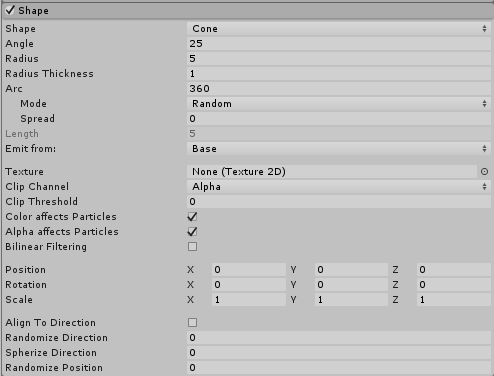
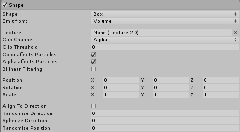
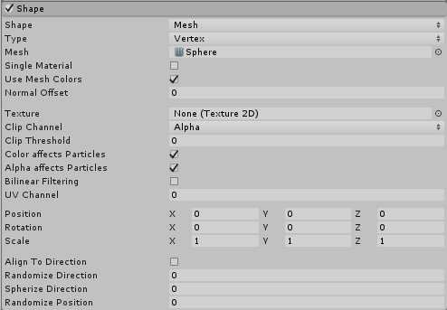
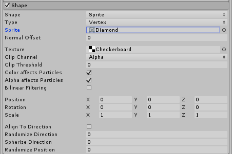
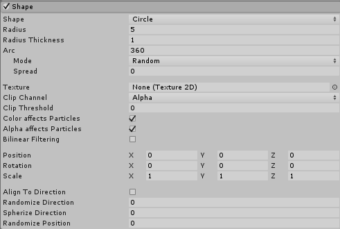
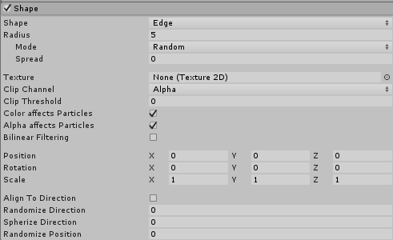
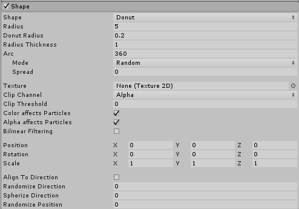
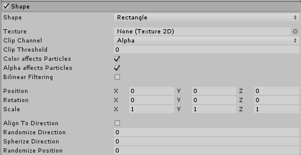

#Shape Module

This module defines the the volume or surface from which [particles](PartSysWhatIs) can be emitted, and the direction of the start velocity. The __Shape__ property defines the shape of the emission volume, and the rest of the module properties vary depending on the Shape you choose.

All shapes (except [Mesh](class-Mesh)) have properties that define their dimensions, such as the __Radius__ property. To edit these, drag the handles on the wireframe emitter shape in the Scene view. The choice of shape affects the region from which particles can be launched, but also the initial direction of the particles. For example, a __Sphere__ emits particles outward in all directions, a __Cone__ emits a diverging stream of particles, and a __Mesh__ emits particles in directions that are normal to the surface.

The section below details the properties for each __Shape__.

##Shapes in the Shape module

###Sphere, Hemisphere

**Note**: Sphere and Hemisphere have the same properties.

| __Property__| __Function__ |
|:---|:---|
| __Shape__| The shape of the emission volume. |
|     __Sphere__| Uniform particle emission in all directions. |
|     __Hemisphere__| Uniform particle emission in all directions on one side of a plane. |
| __Radius__| The radius of the circular aspect of the shape. |
| __Radius Thickness__| The proportion of the volume that emits particles. A value of 0 emits particles from the outer surface of the shape. A value of 1 emits particles from the entire volume. Values in between will use a proportion of the volume. |
| __Texture__| A texture to use for tinting and discarding particles. |
| __Clip Channel__| A channel from the texture to use for discarding particles. |
| __Clip Threshold__| When mapping particles to positions on the texture, discard any whose pixel color falls below this threshold. |
| __Color affects Particles__| Multiply particle colors by the texture color. |
| __Alpha affects Particles__| Multiply particle alphas by the texture alpha. |
| __Bilinear Filtering__| When reading the texture, combine 4 neighboring samples for smoother changes in particle color, regardless of the texture dimensions. |
| __Position__| Apply an offset to the emitter shape used for spawning particles. |
| __Rotation__| Rotate the emitter shape used for spawning particles. |
| __Scale__| Change the size of the emitter shape used for spawning particles. |
| __Align to Direction__| Orient particles based on their initial direction of travel. This can be useful if you want to simulate, for example, chunks of car paint flying off a car’s bodywork during a collision. If the orientation is not satisfactory, you can also override it by applying a __Start Rotation__ value in the __Main__ module. |
| __Randomize Direction__| Blend particle directions towards a random direction. When set to 0, this setting has no effect. When set to 1, the particle direction is completely random. |
| __Spherize Direction__| Blend particle directions towards a spherical direction, where they travel outwards from the center of their [Transform](http://mdeditor.infra.hq.unity3d.com/#class-Transform). When set to 0, this setting has no effect. When set to 1, the particle direction points outwards from the center (behaving identically to when the Shape is set to Sphere). |
| __Randomize Position__| Move particles by a random amount, up to the specified value. When this is set to 0, this setting has no effect. Any other value will apply some randomness to the spawning positions of the particles. |

###Cone

| __Property__| __Function__ |
|:---|:---|
| __Shape__| The shape of the emission volume. |
|     __Cone__| Emit particles from the base or body of a cone. The particles diverge in proportion to their distance from the cone’s center line. |
| __Angle__| The angle of the cone at its point. An angle of 0 produces a cylinder while an angle of 90 gives a flat disc. |
| __Radius__| The radius of the circular aspect of the shape. |
| __Radius Thickness__| The proportion of the volume that emits particles.A value of 0 emits particles from the outer surface of the shape. A value of 1 emits particles from the entire volume. Values in between will use a proportion of the volume. |
| __Arc__| The angular portion of a full circle that forms the emitter’s shape. |
|     __Mode__| Define how Unity generates particles around the arc of the shape. When set to __Random__, Unity generates particles randomly around the arc. If using __Loop__, Unity generates particles sequentially around the arc of the shape, and loops back to the start at the end of each cycle. __Ping-Pong__ is the same as __Loop__, except each consecutive loop happens in the opposite direction to the last. Finally, __Burst Spread__ mode distributes particle generation evenly around the shape. This can give you an even spread of particles, compared to the default randomized behavior, where particles may clump together unevenly. __Burst Spread__ is best used with burst emissions. |
|     __Spread__| The discrete intervals around the arc where particles may be generated. For example, a value of 0 allows particles to spawn anywhere around the arc, and a value of 0.1 only spawns particles at 10% intervals around the shape. |
|     __Speed__| The speed the emission position moves around the arc. Using the small black drop-down menu next to the value field, set this to __Constant__ for the value to always remain the same, or __Curve__ for the value to change over time. This option is only available if __Mode__ is set to something other than __Random__ |
| __Length__| The length of the cone. This only applies when the __Emit from:__ property is set to __Volume__. |
| __Emit from:__| The part of the cone to emit particles from: __Base__ or __Volume__. |
| __Texture__| A texture to be used for tinting and discarding particles. |
| __Clip Channel__| A channel from the texture to be used for discarding particles. |
| __Clip Threshold__| When mapping particles to positions on the texture, discard any whose pixel color falls below this threshold. |
| __Color affects Particles__| Multiply particle colors by the texture color. |
| __Alpha affects Particles__| Multiply particle alphas by the texture alpha. |
| __Bilinear Filtering__| When reading the texture, combine 4 neighboring samples for smoother changes in particle color, regardless of the texture dimensions. |
| __Position__| Apply an offset to the emitter shape used for spawning particles. |
| __Rotation__| Rotate the emitter shape used for spawning particles. |
| __Scale__| Change the size of the emitter shape used for spawning particles. |
| __Align to Direction__| Orient particles based on their initial direction of travel. This can be useful if you want to simulate, for example, chunks of car paint flying off a car’s bodywork during a collision. If the orientation is not satisfactory, you can also override it by applying a Start Rotation value in the Main module. |
| __Randomize Direction__| Blend particle directions towards a random direction. When set to 0, this setting has no effect. When set to 1, the particle direction is completely random. |
| __Spherize Direction__| Blend particle directions towards a spherical direction, where they travel outwards from the center of their Transform. When set to 0, this setting has no effect. When set to 1, the particle direction points outwards from the center (behaving identically to when the Shape is set to Sphere). |
| __Randomize Position__| Move particles by a random amount, up to the specified value. When this is set to 0, this setting has no effect. Any other value will apply some randomness to the spawning positions of the particles. |

###Box

| __Property__| __Function__ |
|:---|:---|
| __Shape__| The shape of the emission volume. |
|     __Box__| Emit particles from the edge, surface, or body of a box shape. The particles move in the emitter object’s forward (Z) direction. |
| __Emit from:__| Select the part of the box to emit from: __Edge__, __Shell__, or __Volume__. |
| __Texture__| A texture to be used for tinting and discarding particles. |
| __Clip Channel__| A channel from the texture to be used for discarding particles. |
| __Clip Threshold__| When mapping particles to positions on the texture, discard any whose pixel color falls below this threshold. |
| __Color affects Particles__| Multiply particle colors by the texture color. |
| __Alpha affects Particles__| Multiply particle alphas by the texture alpha. |
| __Bilinear Filtering__| When reading the texture, combine 4 neighboring samples for smoother changes in particle color, regardless of the texture dimensions. |
| __Position__| Apply an offset to the emitter shape used for spawning particles. |
| __Rotation__| Rotate the emitter shape used for spawning particles. |
| __Scale__| Change the size of the emitter shape used for spawning particles. |
| __Align to Direction__| Orient particles based on their initial direction of travel. This can be useful if you want to simulate, for example, chunks of car paint flying off a car’s bodywork during a collision. If the orientation is not satisfactory, you can also override it by applying a Start Rotation value in the Main module. |
| __Randomize Direction__| Blend particle directions towards a random direction. When set to 0, this setting has no effect. When set to 1, the particle direction is completely random. |
| __Spherize Direction__| Blend particle directions towards a spherical direction, where they travel outwards from the center of their Transform. When set to 0, this setting has no effect. When set to 1, the particle direction points outwards from the center (behaving identically to when the Shape is set to Sphere). |
| __Randomize Position__| Move particles by a random amount, up to the specified value. When this is set to 0, this setting has no effect. Any other value will apply some randomness to the spawning positions of the particles. |

###Mesh, MeshRenderer, SkinnedMeshRenderer

Mesh, MeshRenderer and SkinnedMeshRenderer have the same properties.

| __Property__| __Function__ |
|:---|:---|
| __Shape__| The shape of the emission volume. |
|     __Mesh__| Emits particles from any arbitrary Mesh shape supplied via the Inspector. |
|     __MeshRenderer__| Emits particles from a reference to a GameObject’s Mesh Renderer. |
|     __SkinnedMeshRenderer__| Emits particles from a reference to a GameObject’s Skinned Mesh Renderer. |
| __Type__| Where particles are emitted from. Select __Vertex__ for the particles to emit from the vertices, __Edge__ for the particles to emit from the edges, or __Triangle__ for the particles to emit from the triangles. This is set to __Vertex__ by default. |
| __Mode__| How the position on the mesh is chosen for each new particle. Select __Random__ for the particles to choose a random position __Loop__ for each new particle to be emitted from the next vertex in the mesh, or __Ping-Pong__ to behave similarly to Loop mode, but to alternate the direction along the mesh vertices after each cycle. This is set to __Random__ by default. |
| __Mesh__| The Mesh that provides the emitter’s shape. |
| __Single Material__| Specify whether to emit particles from a particular sub-Mesh (identified by the material index number). If enabled, a numeric field appears, which allows you to specify the material index number. |
| __Use Mesh Colors__| Modulate particle color with Mesh vertex colors, or, if they don't exist, use the shader color property "_Color" or "_TintColor" from the material. |
| __Normal Offset__| Distance away from the surface of the Mesh to emit particles (in the direction of the surface normal) |
| __Texture__| A texture to be used for tinting and discarding particles. |
| __Clip Channel__| A channel from the texture to be used for discarding particles. |
| __Clip Threshold__| When mapping particles to positions on the texture, discard any whose pixel color falls below this threshold. |
| __Color Affects Particles__| Multiply particle colors by the texture color. |
| __Alpha Affects Particles__| Multiply particle alphas by the texture alpha. |
| __Bilinear Filtering__| When reading the texture, combine 4 neighboring samples for smoother changes in particle color, regardless of the texture dimensions. |
| __UV Channel__| Choose which UV channel on the source mesh to use for sampling the texture. |
| __Position__| Apply an offset to the emitter shape used for spawning particles. |
| __Rotation__| Rotate the emitter shape used for spawning particles. |
| __Scale__| Change the size of the emitter shape used for spawning particles. |
| __Align to Direction__| Orient particles based on their initial direction of travel. This can be useful if you want to simulate, for example, chunks of car paint flying off a car’s bodywork during a collision. If the orientation is not satisfactory, you can also override it by applying a Start Rotation value in the Main module. |
| __Randomize Direction__| Blend particle directions towards a random direction. When set to 0, this setting has no effect. When set to 1, the particle direction is completely random. |
| __Spherize Direction__| Blend particle directions towards a spherical direction, where they travel outwards from the center of their Transform. When set to 0, this setting has no effect. When set to 1, the particle direction points outwards from the center (behaving identically to when the Shape is set to Sphere). |
| __Randomize Position__| Move particles by a random amount, up to the specified value. When this is set to 0, this setting has no effect. Any other value will apply some randomness to the spawning positions of the particles. |

####Mesh details

You can choose to only emit particles from a particular material (sub-Mesh) by checking the __Single Material__ property and you can offset the emission position along the Mesh’s normals by checking the __Normal Offset__ property. 

To ignore the color of the Mesh, check the __Use Mesh Colors__ property. To read the texture colors from a mesh, assign the Texture you wish to read to the __Texture__ property.

Meshes must be read/write enabled to work on the Particle System. If you assign them in the Editor, Unity handles this for you. But if you want to assign different meshes at run time, you need to check the __Read/Write Enabled__ setting in the [Import Settings](FBXImporter-Model).

The __Mode__ property allows the Particle System to emit particles in a predictable order on the surface of a Mesh. When emitting from Vertices, this property allows you to emit each new particle from the next vertex in the array of vertices in the Mesh. When emitting from Edges, the Particle System can emit particles smoothly along the edges of the Mesh’s triangles/lines. 

###Sprite and Sprite Renderer

Sprite and SpriteRenderer have the same properties.

| __Property__| __Function__ |
|:---|:---|
| __Shape__| The shape of the emission volume. |
|     __Sprite__| Emits particles from a Sprite shape supplied via the Inspector. |
|     __SpriteRenderer__| Emits particles from a reference to a GameObject’s Sprite Renderer. |
| __Type__| Where particles are emitted from. Select __Vertex__ to emit particles from the vertices, __Edge__ to emit particles from the edges, or __Triangle__ to emit particles from the triangles. This is set to __Vertex__ by default. |
| __Sprite__| The Sprite that defines the particle emitter’s shape. |
| __Normal Offset__| Distance away from the surface of the Sprite to emit particles (in the direction of the surface normal) |
| __Texture__| A texture to be used for tinting and discarding particles. |
| __Clip Channel__| A channel from the texture to be used for discarding particles. |
| __Clip Threshold__| When mapping particles to positions on the texture, discard any whose pixel color falls below this threshold. |
| __Color Affects Particles__| Multiply particle colors by the texture color. |
| __Alpha Affects Particles__| Multiply particle alphas by the texture alpha. |
| __Bilinear Filtering__| When reading the texture, combine 4 neighboring samples for smoother changes in particle color, regardless of the texture dimensions. |
| __Position__| Apply an offset to the emitter shape used for spawning particles. |
| __Rotation__| Rotate the emitter shape used for spawning particles. |
| __Scale__| Change the size of the emitter shape used for spawning particles. |
| __Align to Direction__| Orient particles based on their initial direction of travel. This can be useful if you want to simulate, for example, chunks of car paint flying off a car’s bodywork during a collision. If the orientation is not satisfactory, you can also override it by applying a Start Rotation value in the Main module. |
| __Randomize Direction__| Blend particle directions towards a random direction. When set to 0, this setting has no effect. When set to 1, the particle direction is completely random. |
| __Spherize Direction__| Blend particle directions towards a spherical direction, where they travel outwards from the center of their Transform. When set to 0, this setting has no effect. When set to 1, the particle direction points outwards from the center (behaving identically to when the Shape is set to Sphere). |
| __Randomize Position__| Move particles by a random amount, up to the specified value. When this is set to 0, this setting has no effect. Any other value will apply some randomness to the spawning positions of the particles. |

###Circle

| __Property__| __Function__ |
|:---|:---|
| __Shape__| The shape of the emission volume. |
|     __Circle__| Uniform particle emission from the center or edge of a circle. The particles move only in the plane of the circle. |
| __Radius__| The radius of the circular aspect of the shape. |
| __Radius Thickness__| The proportion of the volume that emits particles. A value of 0 emits particles from the outer edge of the circle. A value of 1 emits particles from the entire area. Values in between will use a proportion of the area. |
| __Arc__| The angular portion of a full circle that forms the emitter’s shape. |
|     __Mode__| Define how Unity generates particles around the arc of the shape. When set to __Random__, Unity generates particles randomly around the arc. If using __Loop__, Unity generates particles sequentially around the arc of the shape, and loops back to the start at the end of each cycle. __Ping-Pong__ is the same as __Loop__, except each consecutive loop happens in the opposite direction to the last. Finally, __Burst Spread__ mode distributes particle generation evenly around the shape. This can be used to give you an even spread of particles, compared to the default randomized behavior, where particles may clump together unevenly. Burst Spread is best used with burst emissions. |
|     __Spread__| Control the discrete intervals around the arc where particles may be generated. For example, a value of 0 will allow particles to spawn anywhere around the arc, and a value of 0.1 will only spawn particles at 10% intervals around the shape. |
|     __Speed__| Set a value for the speed the emission position moves around the arc. Using the small black drop-down next to the value field, set this to __Constant__ for the value to always remain the same, or __Curve__ for the value to change over time. |
| __Texture__| Choose a texture to be used for tinting and discarding particles. |
| __Clip Channel__| Select a channel from the texture to be used for discarding particles. |
| __Clip Threshold__| When mapping particles to positions on the texture, discard any whose pixel color falls below this threshold. |
| __Color Affects Particles__| Multiply particle colors by the texture color. |
| __Alpha Affects Particles__| Multiply particle alphas by the texture alpha. |
| __Bilinear Filtering__| When reading the texture, combine 4 neighboring samples, for smoother changes in particle color, regardless of the texture dimensions. |
| __Position__| Apply an offset to the emitter shape used for spawning particles. |
| __Rotation__| Rotate the emitter shape used for spawning particles. |
| __Scale__| Change the size of the emitter shape used for spawning particles. |
| __Align to Direction__| Use this checkbox to orient particles based on their initial direction of travel. This can be useful if you want to simulate, for example, chunks of car paint flying off a car’s bodywork during a collision. If the orientation is not satisfactory, you can also override it by applying a Start Rotation value in the Main module. |
| __Randomize Direction__| Blend particle directions towards a random direction. When set to 0, this setting has no effect. When set to 1, the particle direction is completely random. |
| __Spherize Direction__| Blend particle directions towards a spherical direction, where they travel outwards from the center of their Transform. When set to 0, this setting has no effect. When set to 1, the particle direction points outwards from the center (behaving identically to when the Shape is set to Sphere). |
| __Randomize Position__| Move particles by a random amount, up to the specified value. When this is set to 0, this setting has no effect. Any other value will apply some randomness to the spawning positions of the particles. |

###Edge

| __Property__| __Function__ |
|:---|:---|
| __Shape__| The shape of the emission volume. |
|     __Edge__| Emit particles from a line segment. The particles move in the emitter object’s upward (Y) direction. |
| __Radius__| The radius property is used to define the length of the edge. |
|     __Mode__| Define how Unity generates particles along the radius of the shape. When set to __Random__, Unity generates particles randomly along the radius. If using __Loop__, Unity generates particles sequentially along the radius of the shape, and loops back to the start at the end of each cycle. __Ping-Pong__ is the same as __Loop__, except each consecutive loop happens in the opposite direction to the last. Finally, __Burst Spread__ mode distributes particle generation evenly along the radius. This can be used to give you an even spread of particles, compared to the default randomized behavior, where particles may clump together unevenly. Burst Spread is best used with burst emissions. |
|     __Spread__| T the discrete intervals along the radius where particles may be generated. For example, a value of 0 will allow particles to spawn anywhere along the radius, and a value of 0.1 will only spawn particles at 10% intervals along the radius. |
|     __Speed__| The speed the emission position moves along the radius. Using the small black drop-down next to the value field, set this to __Constant__ for the value to always remain the same, or __Curve__ for the value to change over time. |
| __Texture__| A texture to be used for tinting and discarding particles. |
| __Clip Channel__| A channel from the texture to be used for discarding particles. |
| __Clip Threshold__| When mapping particles to positions on the texture, discard any whose pixel color falls below this threshold. |
| __Color Affects Particles__| Multiply particle colors by the texture color. |
| __Alpha Affects Particles__| Multiply particle alphas by the texture alpha. |
| __Bilinear Filtering__| When reading the texture, combine 4 neighboring samples for smoother changes in particle color, regardless of the texture dimensions. |
| __Position__| Apply an offset to the emitter shape used for spawning particles. |
| __Rotation__| Rotate the emitter shape used for spawning particles. |
| __Scale__| Change the size of the emitter shape used for spawning particles. |
| __Align to Direction__| Orient particles based on their initial direction of travel. This can be useful if you want to simulate, for example, chunks of car paint flying off a car’s bodywork during a collision. If the orientation is not satisfactory, you can also override it by applying a __Start Rotation__ value in the Main module. |
| __Randomize Direction__| Blend particle directions towards a random direction. When set to 0, this setting has no effect. When set to 1, the particle direction is completely random. |
| __Spherize Direction__| Blend particle directions towards a spherical direction, where they travel outwards from the center of their Transform. When set to 0, this setting has no effect. When set to 1, the particle direction points outwards from the center (behaving identically to when the Shape is set to Sphere). |
| __Randomize Position__| Move particles by a random amount, up to the specified value. When this is set to 0, this setting has no effect. Any other value will apply some randomness to the spawning positions of the particles. |

###Donut

| __Property__| Function |
|:---|:---|
| __Shape__| The shape of the emission volume. |
|     __Donut__| Emit particles from a torus. The particles move outwards from the ring of the Torus. |
| __Radius__| The radius of the main donut ring. |
| __Donus Radius__| The thickness of the outer donut ring. |
| __Radius Thickness__| The proportion of the volume that emits particles. A value of 0 emits particles from the outer edge of the circle. A value of 1 emits particles from the entire area. Values in between will use a proportion of the area. |
| __Arc__| The angular portion of a full circle that forms the emitter’s shape. |
|     Mode| Define how Unity generates particles around the arc of the shape. When set to __Random__, Unity generates particles randomly around the arc. If using __Loop__, Unity generates particles sequentially around the arc of the shape, and loops back to the start at the end of each cycle. __Ping-Pong__ is the same as __Loop__, except each consecutive loop happens in the opposite direction to the last. Finally, __Burst Spread__ mode distributes particle generation evenly around the shape. This can be used to give you an even spread of particles, compared to the default randomized behavior, where particles may clump together unevenly. Burst Spread is best used with burst emissions. |
|     Spread| The discrete intervals around the arc where particles may be generated. For example, a value of 0 will allow particles to spawn anywhere around the arc, and a value of 0.1 will only spawn particles at 10% intervals around the shape. |
|     Speed| The speed the emission position moves around the arc. Using the small black drop-down next to the value field, set this to __Constant__ for the value to always remain the same, or __Curve__ for the value to change over time. |
| __Texture__| A texture to be used for tinting and discarding particles. |
| __Clip Channel__| A channel from the texture to be used for discarding particles. |
| __Clip Threshold__| When mapping particles to positions on the texture, discard any whose pixel color falls below this threshold. |
| __Color Affects Particles__| Multiply particle colors by the texture color. |
| __Alpha Affects Particles__| Multiply particle alphas by the texture alpha. |
| __Bilinear Filtering__| When reading the texture, combine 4 neighboring samples for smoother changes in particle color, regardless of the texture dimensions. |
| __Position__| Apply an offset to the emitter shape used for spawning particles. |
| __Rotation__| Rotate the emitter shape used for spawning particles. |
| __Scale__| Change the size of the emitter shape used for spawning particles. |
| __Align To Direction__| Orient particles based on their initial direction of travel. This can be useful if you want to simulate, for example, chunks of car paint flying off a car’s bodywork during a collision. If the orientation is not satisfactory, you can also override it by applying a __Start Rotation__ value in the Main module. |
| __Randomize Direction__| Blend particle directions towards a random direction. When set to 0, this setting has no effect. When set to 1, the particle direction is completely random. |
| __Spherize Direction__| Blend particle directions towards a spherical direction, where they travel outwards from the center of their Transform. When set to 0, this setting has no effect. When set to 1, the particle direction points outwards from the center (behaving identically to when the Shape is set to Sphere). |
| __Randomize Position__| Move particles by a random amount, up to the specified value. When this is set to 0, this setting has no effect. Any other value will apply some randomness to the spawning positions of the particles. |

###Rectangle

| __Property__| Function |
|:---|:---|
| __Shape__| The shape of the emission volume. |
|     __Rectangle__| Emits particles from a rectangle. The particles move up from the rectangle. |
| __Texture__| A texture to be used for tinting and discarding particles. |
| __Clip Channel__| A channel from the texture to be used for discarding particles. |
| __Clip Threshold__| When mapping particles to positions on the texture, discard any whose pixel color falls below this threshold. |
| __Color Affects Particles__| Multiply particle colors by the texture color. |
| __Alpha Affects Particles__| Multiply particle alphas by the texture alpha. |
| __Bilinear Filtering__| When reading the texture, combine 4 neighboring samples for smoother changes in particle color, regardless of the texture dimensions. |
| __Position__| Apply an offset to the emitter shape used for spawning particles. |
| __Rotation__| Rotate the emitter shape used for spawning particles. |
| __Scale__| Change the size of the emitter shape used for spawning particles. |
| __Align To Direction__| Orient particles based on their initial direction of travel. This can be useful if you want to simulate, for example, chunks of car paint flying off a car’s bodywork during a collision. If the orientation is not satisfactory, you can also override it by applying a __Start Rotation__ value in the Main module. |
| __Randomize Direction__| Blend particle directions towards a random direction. When set to 0, this setting has no effect. When set to 1, the particle direction is completely random. |
| __Spherize Direction__| Blend particle directions towards a spherical direction, where they travel outwards from the center of their Transform. When set to 0, this setting has no effect. When set to 1, the particle direction points outwards from the center (behaving identically to when the Shape is set to Sphere). |
| __Randomize Position__| Move particles by a random amount, up to the specified value. When this is set to 0, this setting has no effect. Any other value will apply some randomness to the spawning positions of the particles. |

 

 

* 2018-11-02  <!-- include IncludeTextAmendPageNoEdit -->

* Functionality of Shape Module updated in Unity [2017.1](../Manual/30_search.html?q=newin20171) NewIn20171

* Texture tinting and selective discarding features (Clip Channel, Clip Threshold, Color affects particles, Alpha affects particles, Bilinear filtering) added to Shape Module in [2018.1](https://docs.unity3d.com/2018.1/Documentation/Manual/30_search.html?q=newin20181) NewIn20181

* Rectangle emission shape added to Shape Module in [2018.1](https://docs.unity3d.com/2018.1/Documentation/Manual/30_search.html?q=newin20181) NewIn20181

* Sprite and Sprite Renderer emission shape added to Particle System Shape Module in [2018.3](https://docs.unity3d.com/2018.3/Documentation/Manual/30_search.html?q=newin20183) NewIn20183

