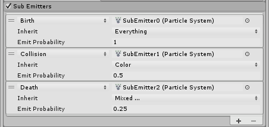

#Sub Emitters module

This module allows you to set up sub-emitters. These are additional particle emitters that are created at a particle's position at certain stages of its lifetime.

##Properties

|**_Property_** |**_Function_** |
|:---|:---|
|__Sub Emitters__|Configure a list of sub-emitters and select their trigger condition as well as what properties they inherit from their parent particles. |

##Details

Many types of particles produce effects at different stages of their lifetimes that can also be implemented using Particle Systems. For example, a bullet might be accompanied by a puff of smoke powder as it leaves the gun barrel, and a fireball might explode on impact. You can use sub-emitters to create effects like these. 

Sub-emitters are ordinary Particle System objects created in the Scene or from [Prefabs](Prefabs). This means that sub-emitters can have sub-emitters of their own (this type of arrangement can be useful for complex effects like fireworks). However, it is very easy to generate an enormous number of particles using sub-emitters, which can be resource intensive.

To trigger a sub-emitter, you can use these are the conditions:

* __Birth__: When the particles are created.
* __Collision__: When the particles collide with an object.
* __Death__:  When the particles are destroyed.
* __Trigger__:  When the particles interact with a Trigger collider.
* __Manual__:  Only triggered when requested via script. See [ParticleSystem.TriggerSubEmitter](ScriptRef:ParticleSystem.TriggerSubEmitter).

Note that the __Collision__, __Trigger__, __Death__ and __Manual__ events can only use burst emission in the [Emission](PartSysEmissionModule) module.

Additionally, you can transfer properties from the parent particle to each newly created particle using the __Inherit__ options. The transferrable properties are size, rotation, color and lifetime. To control how velocity is inherited, configure the [Inherit Velocity](PartSysInheritVelocity) module on the sub-emitter system.

It is also possible to configure a probability that a sub-emitter event will trigger, by setting the __Emit Probability__ property. A value of 1 guarantees that the event will trigger, whereas lower values reduce the probability.

* 2018-03-28  <!-- include IncludeTextAmendPageSomeEdit -->

* "Trigger” and "Manual” conditions added to conditions list in Sub Emitters Module in [2018.1](https://docs.unity3d.com/2018.1/Documentation/Manual/30_search.html?q=newin20181) NewIn20181

* Emit Probabilily property added to particle Sub Emitters Module in [2018.3](https://docs.unity3d.com/2018.3/Documentation/Manual/30_search.html?q=newin20183) NewIn20183

