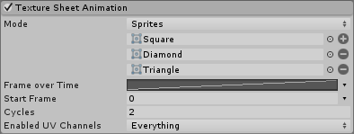

# Texture Sheet Animation module

A particle’s graphic need not be a still image. This module lets you treat the Texture as a grid of separate sub-images that can be played back as frames of animation.

## Grid mode properties

| __Property__| __Function__ |
|:---|:---| 
| __Mode popup__| Select __Grid__ mode. |
| __Tiles__| The number of tiles the Texture is divided into in the X (horizontal) and Y (vertical) directions. |
| __Animation__| The Animation mode can be set to __Whole Sheet__ or __Single Row__ (that is, each row of the sheet represents a separate Animation sequence). |
| __Time Mode__| Choose how the Particle System samples frames in the animation. |
|&nbsp;&nbsp;&nbsp;&nbsp;Lifetime| Sample frames using an Animation Curve over the lifetime of the particle. |
|&nbsp;&nbsp;&nbsp;&nbsp;Speed| Sample frames based on the speed of the particle. A speed range specifies the minimum and maximum speed range for the frame selection. |
|&nbsp;&nbsp;&nbsp;&nbsp;FPS| Sample frames based on the specified frames-per-second value. |
| __Random Row__| Chooses a row from the sheet at random to produce the animation. This option is only available when __Single Row__ is selected as the __Animation__ mode. |
| __Row__| Selects a particular row from the sheet to produce the animation This option is only available when __Single Row__ mode is selected and __Random Row__ is disabled. |
| __Frame over Time__| A curve that specifies how the frame of animation increases as time progresses. |
| __Start Frame__| Allows you to specify which frame the particle animation should start on (useful for randomly phasing the animation on each particle). |
| __Cycles__| The number of times the animation sequence repeats over the particle’s lifetime. |
| __Affected UV Channels__| Allows you to specify exactly which UV streams are affected by the Particle System. |

## Sprite mode properties

| __Property__| __Function__ |
|:---|:---| 
| __Mode popup__| Select __Sprites__ mode. |
| __Frame over Time__| A curve that specifies how the frame of animation increases as time progresses. |
| __Start Frame__| Allows you to specify which frame the particle animation should start on (useful for randomly phasing the animation on each particle). |
| __Cycles__| The number of times the animation sequence repeats over the particle’s lifetime. |
| __Enabled UV Channels__| Allows you to specify exactly which UV streams are affected by the Particle System. |

## Details

Particle animations are typically simpler and less detailed than character animations. In systems where the particles are visible individually, animations can be used to convey actions or movements. For example, flames may flicker and insects in a swarm might vibrate or shudder as if flapping their wings. In cases where the particles form a single, continuous entity like a cloud, animated particles can help add to the impression of energy and movement.

You can use the __Single Row__ mode to create separate animation sequences for particles and switch between animations from a script. This can be useful for creating variation or switching to a different animation after a collision. The __Random Row__ option is highly effective as a way to break up conspicuous regularity in a particle system (for example, a group of flame objects that are all repeating the exact same flickering animation over and over again). This option can also be used with a single frame per row as a way to generate particles with random graphics. This can be used to break up regularity in a object like a cloud or to produce different types of debris or other objects from a single system. For example, a blunderbuss might fire out a cluster of nails, bolts, balls and other projectiles, or a car crash effect may result in springs, car paint, screws and other bits of metal being emitted.

UV flipping is a great way to add more visual variety to your effects without needing to author additional textures.

Selecting the __Sprites__ option from the Mode dropdown allows you to define a list of Sprites to be displayed for each particle, instead of using a regular grid of frames on a texture. Using this mode allows you to take advantage of many of the features of Sprites, such as the Sprite Packer, custom pivots and different sizes per Sprite frame. The Sprite Packer can help you share materials between different Particle Systems, by atlasing your textures, which in turn can improve performance via Dynamic Batching. There are some limitations to be aware of with this mode. Most importantly, all Sprites attached to a Particle System must share the same texture. This can be achieved by using a Multiple Mode Sprite, or by using the Sprite Packer. If using custom pivot points for each Sprite, please note that you cannot blend between their frames, because the geometry will be different between each frame. Only simple Sprites are supported, not 9 slice. Also be aware that Mesh particles do not support custom pivots or varying Sprite sizes.
  

---

*  2018-10-19  <!-- include IncludeTextAmendPageSomeEdit -->

* Functionality of Texture Sheet Animation module changed in Unity  [2017.1](../Manual/30_search.html?q=newin20171) NewIn20171
* Time Mode added to Particle System in Unity  [2018.3](../Manual/30_search.html?q=newin20183) NewIn20183