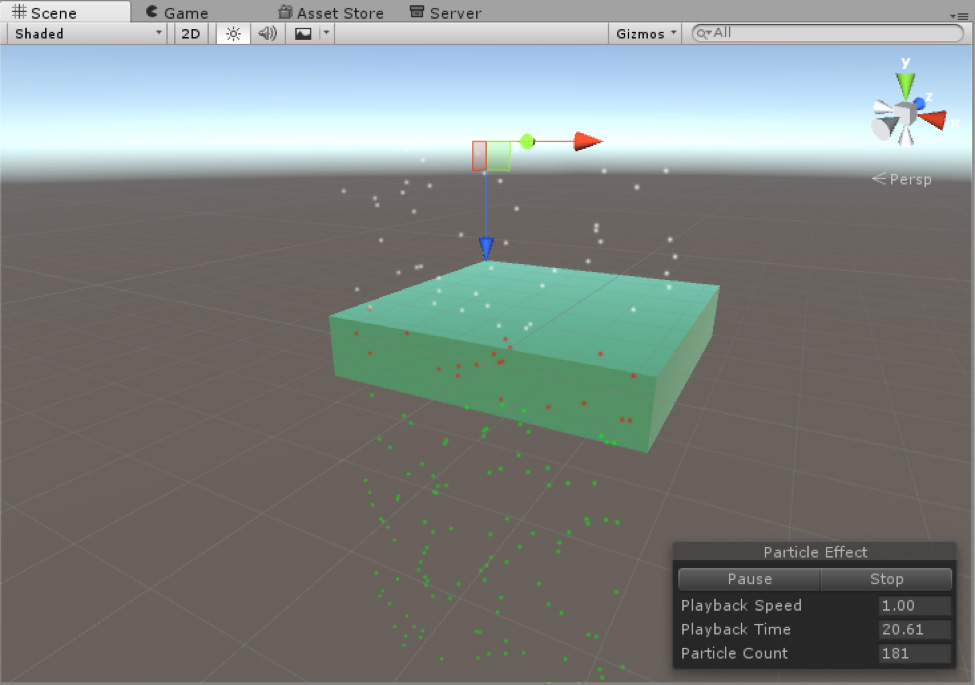
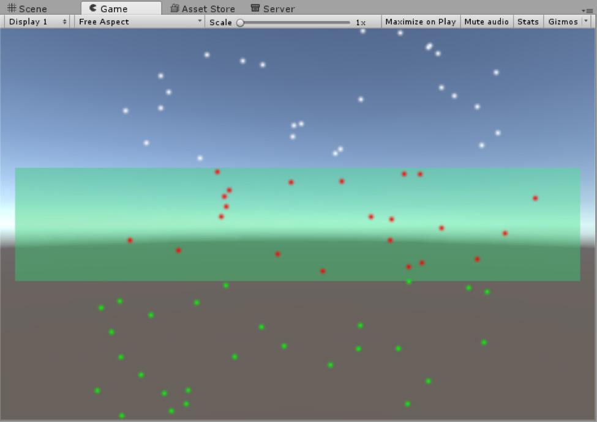

# Triggers module

Particle Systems have the ability to trigger a Callback whenever they interact with one or more Colliders in the Scene. The Callback can be triggered when a particle enters or exits a Collider, or during the time that a particle is inside or outside of the Collider.

You can use the Callback as a simple way to destroy a particle when it enters the Collider (for example, to prevent raindrops from penetrating a rooftop), or it can be used to modify any or all particles’ properties.

The Triggers module also offers the __Kill__ option to remove particles automatically, and the __Ignore__ option to ignore collision events, shown below. 


To use the module, first add the Colliders you wish to create triggers for, then select which events to use. 

You can elect to trigger an event whenever the particle is:

* Inside a Collider’s bounds 
* Outside a Collider’s bounds
* Entering a Collider’s bounds
* Exiting a Collider’s bounds  

|**_Property:_** |**_Function:_** |
|:---|:---|
|__Inside__ |Select Callback if you want the event to trigger when the particle is inside the Collider. Select Ignore for the event **not** to trigger when the particle is inside the Collider. Select Kill to destroy particles inside the Collider. |
|__Outside__ |Select Callback if you want the event to trigger when the particle is outside the Collider. Select Ignore for the event **not** to trigger when the particle is outside the Collider. Select Kill to destroy particles outside the Collider. |
|__Enter__ |Select Callback if you want the event to trigger when the particle enters the Collider. Select Ignore for the event **not** to trigger when the particle enters the Collider. Select Kill to destroy particles when they enter the Collider. |
|__Exit__ |Select Callback if you want the event to trigger when the particle exits the Collider. Select Ignore for the event **not** to trigger when the particle exits the Collider. Select Kill to destroy particles when they exit the Collider. |
|__Radius Scale__| This parameter sets the particle’s Collider bounds, allowing an event to appear to happen before or after the particle touches the Collider. For example, you may want a particle to appear to penetrate a Collider object’s surface a little before bouncing off, in which case you would set the Radius Scale to be a little less than 1. Note that this setting does not change when the event actually triggers, but can delay or advance the visual effect of the trigger. <br/>- Enter 1 for the event to appear to happen as a Particle touches the Collider <br/>- Enter a value less than 1 for the trigger to appear to happen after a Particle penetrates the Collider <br/>- Enter a value greater than 1 for the trigger to appear to happen after a Particle penetrates the Collider|
|__Visualize Bounds__ | This allows you to display the Particle’s Collider bounds in the Editor window.|

Inside the Callback, use [ParticlePhysicsExtensions.GetTriggerParticles()](ScriptRef:ParticlePhysicsExtensions.GetTriggerParticles.html) (along with the [ParticleSystemTriggerEventType](ScriptRef:ParticleSystemTriggerEventType.html) you want to specify) to determine which particles meet which criteria.

The example below causes particles to turn red as they enter the Collider, then turn green as they leave the Collider’s bounds.

````
using UnityEngine;
using System.Collections;
using System.Collections.Generic;

[ExecuteInEditMode]
public class TriggerScript : MonoBehaviour
{
	ParticleSystem ps;

	// these lists are used to contain the particles which match
	// the trigger conditions each frame.
	List<ParticleSystem.Particle> enter = new List<ParticleSystem.Particle>();
	List<ParticleSystem.Particle> exit = new List<ParticleSystem.Particle>();

	void OnEnable()
	{
    	ps = GetComponent<ParticleSystem>();
	}

	void OnParticleTrigger()
	{
    	// get the particles which matched the trigger conditions this frame
    	int numEnter = ps.GetTriggerParticles(ParticleSystemTriggerEventType.Enter, enter);
    	int numExit = ps.GetTriggerParticles(ParticleSystemTriggerEventType.Exit, exit);

    	// iterate through the particles which entered the trigger and make them red
    	for (int i = 0; i < numEnter; i++)
    	{
        	ParticleSystem.Particle p = enter[i];
        	p.startColor = new Color32(255, 0, 0, 255);
        	enter[i] = p;
    	}

    	// iterate through the particles which exited the trigger and make them green
    	for (int i = 0; i < numExit; i++)
    	{
        	ParticleSystem.Particle p = exit[i];
        	p.startColor = new Color32(0, 255, 0, 255);
        	exit[i] = p;
    	}

    	// re-assign the modified particles back into the particle system
    	ps.SetTriggerParticles(ParticleSystemTriggerEventType.Enter, enter);
    	ps.SetTriggerParticles(ParticleSystemTriggerEventType.Exit, exit);
	}
}

````

The result of this is demonstrated in the images below:





