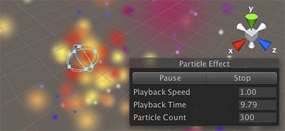
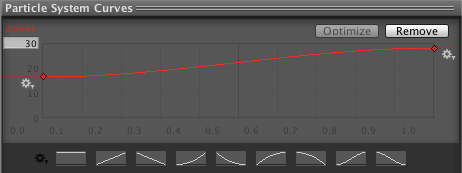
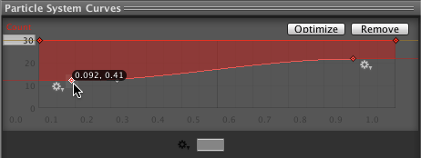
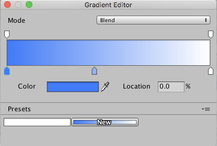
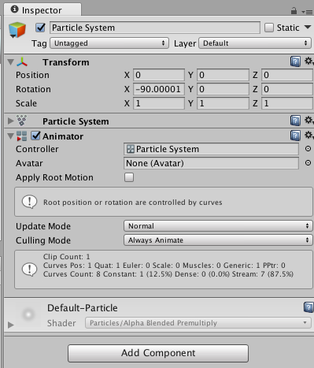
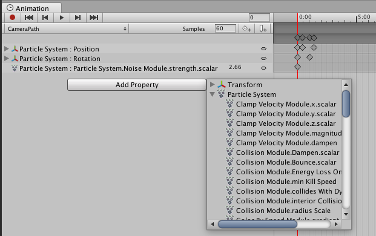
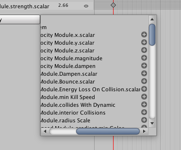

#Using Particle Systems in Unity

Unity implements Particle Systems with a component, so placing a Particle System in a Scene is a matter of adding a pre-made GameObject (menu: __GameObject__ &gt; __Effects__ &gt; __Particle System__) or adding the component to an existing GameObject (menu: __Component__ &gt; __Effects__ &gt; __Particle System__). Because the component is quite complicated, the Inspector is divided into a number of collapsible sub-sections or __modules__ that each contain a group of related properties. Additionally, you can edit one or more systems at the same time using a separate Editor window accessed via the __Open Window__ button in the Inspector. See  documentation on the [Particle System component](class-ParticleSystem) and individual [Particle System modules](ParticleSystemModules) to learn more.

When a GameObject with a Particle System is selected, the Scene view contains a small __Particle Effect__ panel, with some simple controls that are useful for visualising changes you make to the system's settings.

The __Playback Speed__ allows you to speed up or slow down the particle simulation, so you can quickly see how it looks at an advanced state. The __Playback Time__ indicates the time elapsed since the system was started; this may be faster or slower than real time depending on the playback speed. The __Particle Count__ indicates how many particles are currently in the system. The playback time can be moved backwards and forwards by clicking on the __Playback Time__ label and dragging the mouse left and right. The buttons at the top of the panel can be used to pause and resume the simulation, or to stop it and reset to the initial state.

##Varying properties over time

Many of the numeric properties of particles or even the whole Particle System can vary over time. Unity provides several different methods of specifying how this variation happens:

* __Constant:__ The property's value is fixed throughout its lifetime.
* __Curve:__ The value is specified by a curve/graph.
* __Random Between Two Constants:__ Two constant values define the upper and lower bounds for the value; the actual value varies randomly over time between those bounds.
* __Random Between Two Curves:__ Two curves define the upper and lower bounds of the value at a given point in its lifetime; the current value varies randomly between those bounds.

When you set a property to __Curve__ or __Random Between Two Curves__, the Particle System Curves editor appears at the bottom of the Inspector:

To edit a curve, click and drag an end point or key to reshape the curve:

Particle System curves are similar to [Animation curves](AnimationCurves.html). For information on using curves, see the documentation on [Editing Curves](EditingCurves).

The Particle System Curves editor has the following buttons:

* __Optimize__: Fits the curve into four or fewer keys to build a fast evaluator called a Polynomial, which is more efficient than reading the unoptimized curve.
* __Remove__: Deletes the selected curve.

To edit the way in which the Particle System plays curves, click the cog next to a selected key and choose one of the following options: 

* __Loop__: Plays the curve the specified number times over a particle's life. For example, if you make a curve that scales a particle's size up and down, you can tell it to loop multiple times, which causes the "up and down" animation to happen multiple times before the particle dies, instead of just once. 
* __Ping Pong__: Similar to __Loop__, but plays the curve forwards then backwards in a continuous oscillation.
* __Clamp__: Limits particle queries that fall outside the curve time range to the first or last value of the curve.

Similarly, the __Start Color__ property in the main module has the following options:

* __Color:__ The particle start color is fixed throughout the system's lifetime.
* __Gradient:__ Particles are emitted with a start color specified by a gradient, with the gradient representing the lifetime of the Particle System.
* __Random Between Two Colors:__ The starting particle color is chosen as a random linear interpolation between the two given colors.
* __Random Between Two Gradients:__ Two colors are picked from the given Gradients at the point corresponding to the current age of the Particle System; the starting particle color is chosen as a random linear interpolation between these colors.
* __Random Color__: Picks any point at random from the Gradient for every newly spawned particle. 

When you set the __Gradient__ color for particles, the Gradient Editor appears:

* __Mode:__ Determines whether the particle color settings are blended or not. 
* __Color:__ Displays the color of the currently selected key in the Gradient. Use this to edit the color at that position of the Gradient.
* __Location:__ Shows how far along on the Gradient the currently selected key is.
* __Presets:__ Allows you to save Gradient settings. Click New to make the current set of values a Gradient preset.

Color properties in various modules are multiplied together per channel to calculate the final particle color result.

##Animation bindings

All particle properties are accessible by the Animation system, meaning you can keyframe them in and control them from your animations.

To access the Particle System’s properties, there must be an Animator component attached to the Particle System’s GameObject. An Animation Controller and an Animation are also required.

To animate a Particle System property, open the __Animation Window__ with the GameObject containing the Animator and Particle System selected. Click __Add Property__ to add properties.

Scroll to the right to reveal the __add controls__.

Note that for curves, you can only keyframe the overall __curve multiplier__, which can be found next to the curve editor in the __Inspector__.

---

* 2018-11-27  <!-- include IncludeTextAmendPageSomeEdit -->

* GameObject menu changed in Unity 4.6
* Particle System loop/ping-pong curve playing added in [2018.3] (https://docs.unity3d.com/2018.3/Documentation/Manual/30_search.html?q=newin20183) NewIn20183X