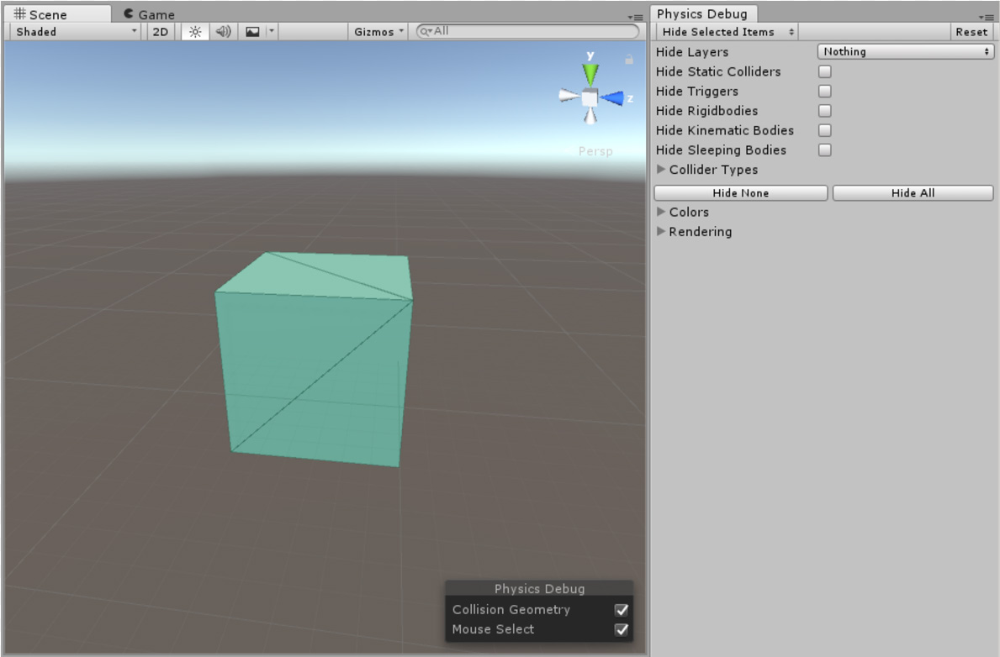
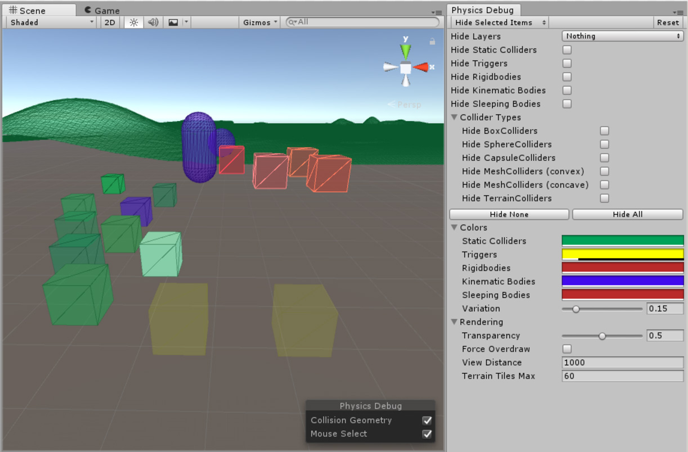

#Physics Debug Visualization

Physics Debug Visualiser allows you to quickly inspect the [Collider](CollidersOverview) geometry in your [Scene](CreatingScenes), and profile common physics-based scenarios. It provides a visualisation of which GameObjects should and should not collide with each other. This is particularly useful when there are many Colliders in your Scene, or if the [Render](class-MeshRenderer) and [Collision Meshes](class-MeshCollider) are out of sync.

For further guidance on improving physics performance in your project, see documentation on the [Physics Profiler](ProfilerPhysics).

To open the Physics Debug window in the Unity Editor, go to __Window __&gt; __Analysis__ &gt; __Physics Debugger__. 

From this window, you can customize visual settings and specify the types of GameObjects you want to see or hide in the visualizer.

__Hide Selected Items__ is the default mode. This means that every item appears in the visualizer, and you need to tick the checkbox for each item to hide it. To change this to __Show Selected Items__, use the drop-down at the top of the window. This means that no items appear in the visualizer, and you need to tick the checkbox for each item to display it.

| __Property__| __Function__ |
|:---|:---| 
| __Reset__| Click this button to reset the Physics Debug window back to default settings. |
| __Hide Layers__| Use the dropdown menu to determine whether or not to display Colliders from the selected [Layers](Layers). |
| __Hide Static Colliders__| Tick this checkbox to remove static Colliders (Colliders with no Rigidbody component) from the visualization. |
| __Hide Triggers__| Tick this checkbox to remove Colliders that are also Triggers from the visualization. |
| __Hide Rigidbodies__| Tick this checkbox to remove [Rigidbody components](class-Rigidbody) from the visualization. |
| __Hide Kinematic Bodies__| Tick this checkbox to remove Colliders with __Kinematic __Rigidbody components (which are not controlled by the physics engine) from the visualization. See documentation on [Rigidbody components](RigidbodiesOverview) for more details. |
| __Hide Sleeping Bodies__| Tick this checkbox to remove Colliders with __Sleeping__ Rigidbody components (which are not currently engaging with the physics engine) from the visualization. See documentation on [Rigidbody components: Sleeping](RigidbodiesOverview) for more details. |
| __Collider Types__| Use these options to remove specific Collider types from the physics visualization. |
|&#160;&#160;&#160;&#160;Hide   &#160;&#160;&#160;&#160;BoxColliders| Tick this checkbox to remove [Box Colliders](class-BoxCollider) from the visualization. |
|&#160;&#160;&#160;&#160;Hide  &#160;&#160;&#160;&#160;SphereColliders| Tick this checkbox to remove [Sphere Colliders](class-SphereCollider) from the visualization. |
|&#160;&#160;&#160;&#160;Hide  &#160;&#160;&#160;&#160;CapsuleColliders| Tick this checkbox to remove [Capsule Colliders](class-CapsuleCollider) from the visualization. |
|&#160;&#160;&#160;&#160;Hide  &#160;&#160;&#160;&#160;MeshColliders  &#160;&#160;&#160;&#160;(convex)| Tick this checkbox to remove **convex** [Mesh Colliders](class-MeshCollider) from the visualization. |
|&#160;&#160;&#160;&#160;Hide  &#160;&#160;&#160;&#160;MeshColliders  &#160;&#160;&#160;&#160;(concave)| Tick this checkbox to remove **concave** [Mesh Colliders](class-MeshCollider) from the visualization. |
|&#160;&#160;&#160;&#160;Hide  &#160;&#160;&#160;&#160;TerrainColliders| Tick this checkbox to remove [Terrain Colliders](class-TerrainCollider) from the visualization. |
| __Hide None__| Click __Hide None__ to clear all filtering criteria and display all Collider types in the visualization. |
| __Hide All__| Click __Hide All__ to enable all filters and remove all Collider types from the visualization. |
| __Colors__| Use these settings to define how Unity displays physics components in the visualization. |
|&#160;&#160;&#160;&#160;Static  &#160;&#160;&#160;&#160;Colliders| Use this color selector to define which color indicates static Colliders (Colliders with no Rigidbody component) in the visualization. |
|&#160;&#160;&#160;&#160;Triggers| Use this color selector to define which color indicates Colliders that are also Triggers in the visualization. |
|&#160;&#160;&#160;&#160;Rigidbodies| Use this color selector to define which color indicates Rigidbody components in the visualization. |
|&#160;&#160;&#160;&#160;Kinematic  &#160;&#160;&#160;&#160;Bodies| Use this color selector to define which color indicates __Kinematic __Rigidbody components (which are not controlled by the physics engine) from the visualization. See documentation on [Rigidbody components](RigidbodiesOverview) for more details. |
|&#160;&#160;&#160;&#160;Sleeping  &#160;&#160;&#160;&#160;Bodies| Use this color selector to define which color indicates __Sleeping __Rigidbody components (which are not currently engaging with the physics engine) from the visualization. See documentation on [Rigidbody components: Sleeping](RigidbodiesOverview) for more details. |
|&#160;&#160;&#160;&#160;Variation| Use the slider to set a value between 0 and 1. This defines how much of your chose color blends with a random color. Use this to visually separate Colliders by color, and to see the structure of the GameObjects.  |
| __Rendering__| Use these settings to define how Unity renders and displays the physics visualization. |
|&#160;&#160;&#160;&#160;Transparency| Use the slider to set the value between 0 and 1. This defines the transparency of drawn collision geometry in the visualization. |
|&#160;&#160;&#160;&#160;Force  &#160;&#160;&#160;&#160;Overdraw| Normal render geometry can sometimes obscure Colliders (for example, a Mesh Collider plane underneath a floor).Tick the __Force Overdraw__ checkbox to make the visualization renderer draw Collider geometry on top of render geometry. |
|&#160;&#160;&#160;&#160;View  &#160;&#160;&#160;&#160;Distance| Use this to set the view distance of the visualization. |
|&#160;&#160;&#160;&#160;Terrain  &#160;&#160;&#160;&#160;Tiles Max| Use this to set the maximum number of Terrain tiles in the visualization. |

The overlay panel has further options:

| __Property__| __Function__ |
|:---|:---| 
| __Collision Geometry__| Tick this checkbox to enable collision geometry visualization. |
| __Mouse Select__| Tick this checkbox to enable mouse-over highlighting and mouse selection. This can be useful if you have large GameObjects obstructing each other in the visualizer. |

### Profiling

You can use Physics Debug to profile and troubleshoot physics activity in your game. You can customize which types of Colliders or Rigidbody components you can see in the visualiser, to help you find the source of activity. The two most helpful are:

**To see active Rigidbody components only**: To see only the Rigidbody components that are active and therefore using CPU/GPU resources, tick __Hide Static Colliders__ and __Hide Sleeping Bodies__.

**To see non-convex Mesh Colliders only:** Non-convex (triangle-based) Mesh Colliders tend to generate the most contacts when their attached Rigidbody components are very near a collision with another Rigidbody or Collider. To visualize only the non-convex Mesh Colliders, set the window to __Show Selected Items__ mode, click the __Select None__ button, then tick the __Show MeshColliders (concave)__ checkbox.

### Scripting API Reference

See Unity Scripting API Reference for: 

* [PhysicsDebugWindow](ScriptRef:PhysicsDebugWindow.html)

* [PhysicsVisualizationSettings](ScriptRef:PhysicsVisualizationSettings.html)

 

---------

*  2017-06-01  <!-- include IncludeTextAmendPageYesEdit -->

*  Physics Debug Visualization is a new feature in Unity 5.6
