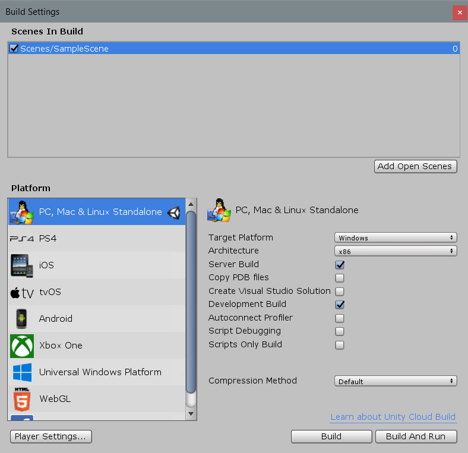
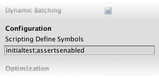

#Platform dependent compilation


Unity includes a feature called __Platform Dependent Compilation__. This consists of some preprocessor directives that let you partition your scripts to compile and execute a section of code exclusively for one of the supported platforms.

You can run this code within the Unity Editor, so you can compile the code specifically for your target platform and test it in the Editor!


##Platform #define directives 


The platform #define directives that Unity supports for your scripts are as follows:


|__Property:__ |__Function:__ |
|:---|:---|
|__UNITY\_EDITOR__ |#define directive for calling Unity Editor scripts from your game code.|
|__UNITY\_EDITOR\_WIN__ |#define directive for Editor code on Windows. |
|__UNITY\_EDITOR\_OSX__ |#define directive for Editor code on Mac OS X. |
|__UNITY\_STANDALONE\_OSX__ |#define directive for compiling/executing code specifically for Mac OS X (including Universal, PPC and Intel architectures).|
|__UNITY\_STANDALONE\_WIN__ |#define directive for compiling/executing code specifically for Windows standalone applications.|
|__UNITY\_STANDALONE\_LINUX__ |#define directive for compiling/executing code specifically for Linux standalone applications. |
|__UNITY\_STANDALONE__ |#define directive for compiling/executing code for any standalone platform (Mac OS X, Windows or Linux). |
|__UNITY\_WII__ |#define directive for compiling/executing code for the Wii console.|
|__UNITY\_IOS__ |#define directive for compiling/executing code for the iOS platform.|
|__UNITY\_IPHONE__ |Deprecated. Use __UNITY\_IOS__ instead. |
|__UNITY\_ANDROID__ |#define directive for the Android platform.|
|__UNITY\_PS4__ |#define directive for running PlayStation 4 code.|
|__UNITY\_XBOXONE__ |#define directive for executing Xbox One code.|
|__UNITY\_TIZEN__ |#define directive for the Tizen platform.|
|__UNITY\_TVOS__ |#define directive for the Apple TV platform.|
|__UNITY\_WSA__ |#define directive for Universal Windows Platform. Additionally, __NETFX\_CORE__ is defined when compiling C# files against .NET Core and using .NET scripting backend.|
|__UNITY\_WSA_10_0__ |#define directive for Universal Windows Platform. Additionally __WINDOWS_UWP__ is defined when compiling C# files against .NET Core.|
|__UNITY\_WINRT__ | Same as __UNITY\_WSA__. |
|__UNITY\_WINRT_10_0__ |Equivalent to __UNITY\_WSA_10_0__ |
|__UNITY\_WEBGL__ |#define directive for WebGL.|
|__UNITY\_FACEBOOK__ |#define directive for the Facebook platform (WebGL or Windows standalone).|
|__UNITY\_ADS__ |#define directive for calling Unity Ads methods from your game code. Version 5.2 and above.|
|__UNITY\_ANALYTICS__ |#define directive for calling Unity Analytics methods from your game code. Version 5.2 and above.|
|__UNITY\_ASSERTIONS__ |#define directive for assertions control process.|


From Unity 2.6.0 onwards, you can compile code selectively. The options available depend on the version of the Editor that you are working on.
Given a version number __X.Y.Z__ (for example, 2.6.0), Unity exposes three global #define directives in the following formats: __UNITY\_X__, __UNITY\_X\_Y__ and __UNITY\_X\_Y\_Z__.

Here is an example of #define directives exposed in Unity 5.0.1:

| | |
|:---|:---|
|__UNITY\_5__ |#define directive for the release version of Unity 5, exposed in every 5.X.Y release.|
|__UNITY\_5\_0__ |#define directive for the major version of Unity 5.0, exposed in every 5.0.Z release.|
|__UNITY\_5\_0\_1__ |#define directive for the minor version of Unity 5.0.1.|


Starting from Unity 5.3.4, you can compile code selectively based on the earliest version of Unity required to compile or execute a given portion of code. Given the same version format as above (__X.Y.Z__), Unity exposes one global #define in the format __UNITY\_X\_Y\_OR\_NEWER__, that can be used for this purpose.

The supported #define directives are:

| | |
|:---|:---|
|__CSHARP\_7\_3\_OR\_NEWER__|Defined when building scripts with support for C# 7.3 or newer.|
|__ENABLE\_MONO__ |Scripting backend #define for Mono.|
|__ENABLE\_IL2CPP__ |Scripting backend #define for IL2CPP.|
|__ENABLE\_DOTNET__ |Scripting backend #define for .NET.|
|__NETFX\_CORE__ |Defined when building scripts against .NET Core class libraries on .NET.|
|__NET\_2\_0__ |Defined when building scripts against .NET 2.0 API compatibility level on Mono and IL2CPP.|
|__NET\_2\_0\_SUBSET__ |Defined when building scripts against .NET 2.0 Subset API compatibility level on Mono and IL2CPP.|
|__NET\_LEGACY__ | Defined when building scripts against .NET 2.0 or .NET 2.0 Subset API compatibility level on Mono and IL2CPP.|
|__NET\_4\_6__ |Defined when building scripts against .NET 4.x API compatibility level on Mono and IL2CPP.|
|__NET_STANDARD_2_0__ |Defined when building scripts against .NET Standard 2.0 API compatibility level on Mono and IL2CPP.|
|__ENABLE\_WINMD\_SUPPORT__ |Defined when Windows Runtime support is enabled on IL2CPP and .NET. See [Windows Runtime Support](IL2CPP-WindowsRuntimeSupport) for more details.|


You use the DEVELOPMENT_BUILD #define to identify whether your script is running in a player which was built with the "Development Build" option enabled.

You can also compile code selectively depending on the scripting back-end.

##Testing precompiled code


Below is an example of how to use the precompiled code. It prints a message that depends on the platform you have selected for your target build.

First of all, select the platform you want to test your code against by going to __File &gt; Build Settings__. This displays the __Build Settings__ window; select your target platform from here.

 

Select the platform you want to test your precompiled code against and click __Switch Platform__ to tell Unity which platform you are targeting.

Create a script and copy/paste the following code:


````
// JS
function Awake() {
  #if UNITY_EDITOR
    Debug.Log("Unity Editor");
  #endif
	
  #if UNITY_IPHONE
    Debug.Log("Iphone");
  #endif

  #if UNITY_STANDALONE_OSX
    Debug.Log("Stand Alone OSX");
  #endif

  #if UNITY_STANDALONE_WIN
    Debug.Log("Stand Alone Windows");
  #endif	
}


// C#
using UnityEngine;
using System.Collections;

public class PlatformDefines : MonoBehaviour {
  void Start () {

    #if UNITY_EDITOR
      Debug.Log("Unity Editor");
    #endif
    
    #if UNITY_IOS
      Debug.Log("Iphone");
    #endif

    #if UNITY_STANDALONE_OSX
	Debug.Log("Stand Alone OSX");
    #endif

    #if UNITY_STANDALONE_WIN
      Debug.Log("Stand Alone Windows");
    #endif

  }			 
}


````

To test the code, click __Play Mode__. Confirm that the code works by checking for the relevant message in the Unity console, depending on which platform you selected - for example, if you choose __iOS__, the message "Iphone" is set to appear in the console.

In C# you can use a `CONDITIONAL` attribute which is a more clean, less error-prone way of stripping out functions. See [ConditionalAttribute Class](https://msdn.microsoft.com/en-us/library/system.diagnostics.conditionalattribute(v=vs.110).aspx) for more information.
Note that common Unity callbacks (ex. Start(), Update(), LateUpdate(), FixedUpdate(), Awake()) are not affected by this attribute because they are called directly from the engine and, for performance reasons, it does not take them into account.

In addition to the basic `#if` compiler directive, you can also use a multiway test in C#:


````

#if UNITY_EDITOR
    Debug.Log("Unity Editor");

#elif UNITY_IOS
    Debug.Log("Unity iPhone");

#else
    Debug.Log("Any other platform");

#endif


````


##Platform custom #defines


It is also possible to add to the built-in selection of #define directives by supplying your own. Open the __Other Settings__ panel of the [Player Settings](class-PlayerSettings) and navigate to the __Scripting Define Symbols__ text box.


 

Enter the names of the symbols you want to define for that particular platform, separated by semicolons. These symbols can then be used as the conditions for `#if` directives, just like the built-in ones.

##Global custom #defines


You can define your own preprocessor directives to control which code gets included when compiling. To do this you must add a text file with the extra directives to the __Assets__ folder. The name of the file depends on the language you are using. The extension is __.rsp__:


| | |
|:---|:---|
|C# (player and editor scripts)|&lt;Project Path&gt;/Assets/mcs.rsp |


As an example, if you include the single line ``-define:UNITY_DEBUG`` in your __mcs.rsp__ file, the #define directive `UNITY_DEBUG` exists as a global #define for C# scripts, except for Editor scripts.

Every time you make changes to __.rsp__ files, you need to recompile in order for them to be effective. You can do this by updating or reimporting a single script (.js or .cs) file.

__NOTE__

If you want to modify only global #define directives, use __Scripting Define Symbols__ in [Player Settings](class-PlayerSettings), as this covers all the compilers. If you choose the __.rsp__ files instead, you need to provide one file for every compiler Unity uses, and you don't know when one or another compiler is used.

The use of __.rsp__ files is described in the 'Help' section of the __mcs__ application which is included in the Editor installation folder. You can get more information by running `mcs -help`. 

Note that the __.rsp__ file needs to match the compiler being invoked. For example:

* when targeting any players or the editor, __mcs__ is used with `mcs.rsp`, and
* when targeting MS compiler, __csc__ is used with `csc.rsp`, etc.

---

* <span class="page-edit">2018-03-16  <!-- include IncludeTextAmendPageNoEdit --></span><br/>

* <span class="page-history">Removed Samsung TV support.</span>
