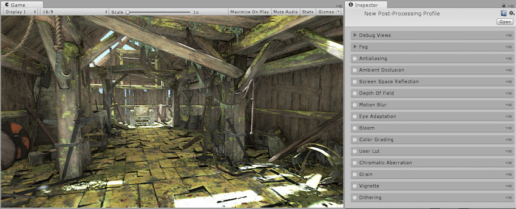
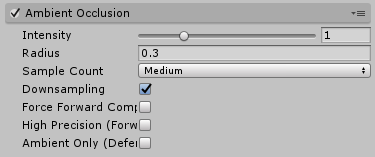

## Ambient Occlusion

The effect descriptions on this page refer to the default effects found within the post-processing stack.

The Ambient Occlusion post-processing effect approximates [Ambient Occlusion](http://en.wikipedia.org/wiki/Ambient_occlusion) in real time as a full-screen post-processing effect. It darkens creases, holes, intersections and surfaces that are close to each other. In real life, such areas tend to block out or occlude ambient light, hence they appear darker.

Note that the Ambient Occlusion effect is quite expensive in terms of processing time and generally should only be used on desktop or console hardware. Its cost depends purely on screen resolution and the effects parameters and does not depend on scene complexity as true Ambient Occlusion would.

### Properties

| __Property:__| __Function:__ |
|:---|:---| 
| __Intensity__| Degree of darkness produced by the effect. |
| __Radius__| Radius of sample points, which affects extent of darkened areas. |
| __Sample Count__| Number of sample points, which affects quality and performance. |
| __Downsampling__| Halves the resolution of the effect to increase performance at the cost of visual quality. |
| __Force Forward Compatibility__| Forces compatibility with Forward rendered objects when working with the Deferred rendering path. |
| __High Precision (Forward)__| Toggles the use of a higher precision depth texture with the forward rendering path (may impact performances). Has no effect with the deferred rendering path. |
| __Ambient Only__| Enables the ambient-only mode in that the effect only affects ambient lighting. This mode is only available with the Deferred rendering path and HDR rendering. |

### Optimisation

* Reduce Radius size

* Reduce Sample Count

* Enable Downsampling

* If using deferred rendering, disable Force Forward Compatibility (will cause forward rendered object to not be used when calculating Ambient Occlusion

* If using forward rendering, disable High Precision (will cause the effect to use a lower precision depth texture, impacting visual quality)

### Details

Beware that this effect can be quite expensive, especially when viewed very close to the camera. For that reason it is recommended to always enable Downsampling and favor a low radius setting. With a low radius the Ambient Occlusion effect will only sample pixels that are close, in clip space, to the source pixel, which is good for performance as they can be cached efficiently. With higher radiuses, the generated samples will be further away from the source pixel and won't benefit from caching thus slowing down the effect. Because of the camera’s perspective, objects near the front plane will use larger radiuses than those far away, so computing the Ambient Occlusion pass for an object close to the camera will be slower than for an object further away that only occupies a few pixels on screen.

When working with the Deferred rendering path, you have the possibility to render the ambient occlusion straight to the ambient G-Buffer so that it's taken into account by Unity during the lighting pass. Note that this setting requires the camera to have HDR enabled.

When working with the Forward rendering path you may experience some quality issues in regards to depth precision. You can overcome these issues by toggling High Precision but only do it if you actually need it as it will lower performances.

### Requirements

* Depth & Normals texture

* Shader model 3

See the [Graphics Hardware Capabilities and Emulation](GraphicsEmulation) page for further details and a list of compliant hardware.

---

*  2017-05-24  <!-- include IncludeTextNewPageNoEdit -->

* New feature in 5.6