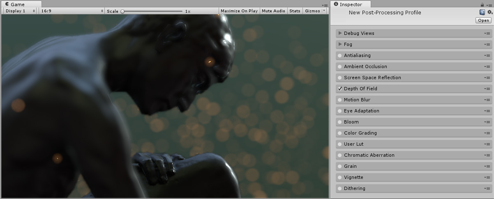
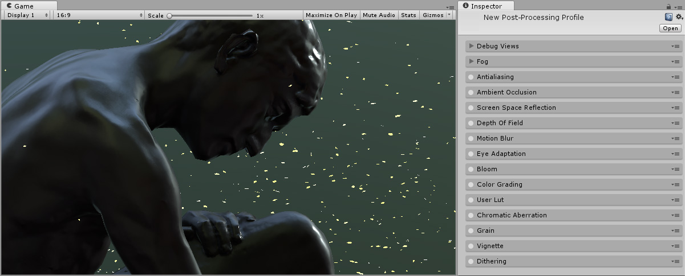

## Depth of Field

The effect descriptions on this page refer to the default effects found within the post-processing stack.

Depth of Field is a common post-processing effect that simulates the focus properties of a camera lens. In real life, a camera can only focus sharply on an object at a specific distance; objects nearer or farther from the camera will be somewhat out of focus. The blurring not only gives a visual cue about an object’s distance but also introduces Bokeh which is the term for pleasing visual artifacts that appear around bright areas of the image as they fall out of focus.

An example of Depth of Field effect can be seen in the following images, displaying the results of a focused midground but a defocused background and foreground.

### Properties

| __Property:__| __Function:__ |
|:---|:---| 
| __Focus Distance__| Distance to the point of focus. |
| __Aperture__| Ratio of the aperture (known as f-stop or f-number). The smaller the value is, the shallower the depth of field is. |
| __Focal Length__| Distance between the lens and the film. The larger the value is, the shallower the depth of field is. |
| __Use Camera FOV__| Calculate the focal length automatically from the field-of-view value set on the camera. |
| __Kernel Size__| Convolution kernel size of the bokeh filter, which determines the maximum radius of bokeh. It also affects the performance (the larger the kernel is, the longer the GPU time is required). |

### Optimisation

* Reduce Kernel Size

### Requirements

* [Depth texture](SL-DepthTextures)

* Shader model 3

See the [Graphics Hardware Capabilities and Emulation](GraphicsEmulation) page for further details and a list of compliant hardware.

---

*  2017-05-24  <!-- include IncludeTextNewPageNoEdit -->

* New feature in 5.6