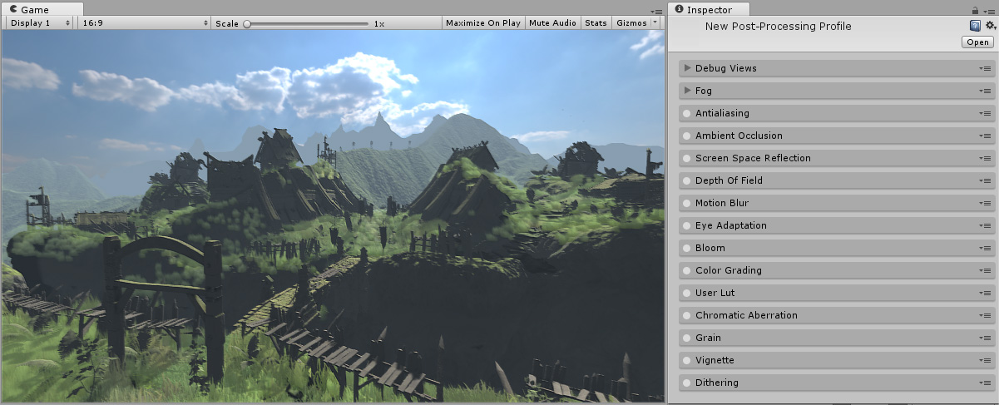
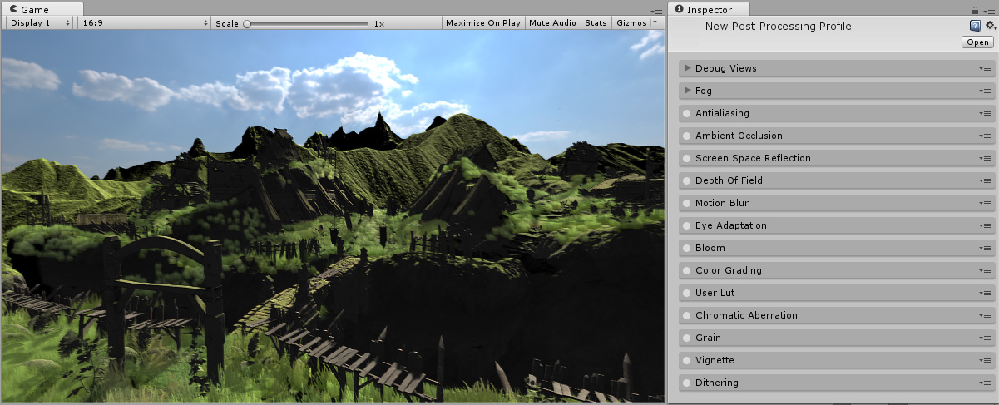

## Fog

The effect descriptions on this page refer to the default effects found within the post-processing stack.

Fog is the effect of overlaying a color onto objects dependant on the distance from the camera. This is used to simulate fog or mist in outdoor environments and is also typically used to hide clipping of objects when a camera’s far clip plane has been moved forward for performance.

The Fog effect creates a screen-space fog based on the camera’s [depth texture](SL-DepthTextures). It supports Linear, Exponential and Exponential Squared fog types. Fog settings should be set in the __Scene __tab of the __Lighting __window.

### Properties

| __Property:__| __Function:__ |
|:---|:---| 
| __Exclude Skybox__| Should the fog affect the skybox? |

### Details

This effect is only applied in the deferred rendering path. When using either rendering path fog should be applied to forward rendered objects using the Fog found in Scene Settings. The parameters for the Post-processing fog are mirrored from the Fog parameters set in the __Scene __tab of the __Lighting__ window. This ensures forward rendered objects will always receive the same fog when rendering in deferred.

### Requirements

* [Depth texture](SL-DepthTextures)

* Shader model 3

See the [Graphics Hardware Capabilities and Emulation](GraphicsEmulation) page for further details and a list of compliant hardware.

---

*  2017-05-24  <!-- include IncludeTextNewPageNoEdit -->

* New feature in 5.6