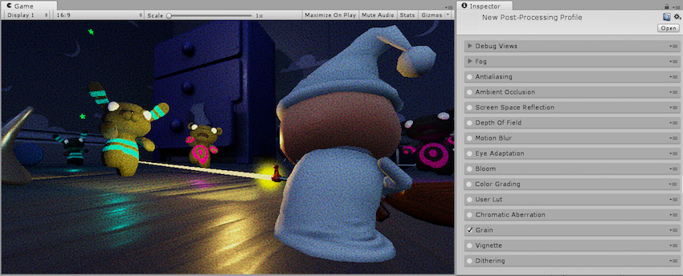

## Grain

The effect descriptions on this page refer to the default effects found within the post-processing stack.

Film grain is the random optical texture of photographic film due to the presence of small particles in the metallic silver of the film stock.

The Grain effect in the [post-processing stack](PostProcessing-Stack) is based on a coherent gradient noise. It is commonly used to emulate the apparent imperfections of film and often exaggerated in horror themed games.

### Properties

| __Property:__| __Function:__ |
|:---|:---| 
| __Intensity__| Grain strength. Higher means more visible grain. |
| __Luminance Contribution__| Controls the noisiness response curve based on scene luminance. Lower values mean less noise in dark areas. |
| __Size__| Grain particle size. |
| __Colored__| Enable the use of colored grain. |

### Optimisation

* Disabled Colored

### Requirements

* Shader model 3

See the [Graphics Hardware Capabilities and Emulation](GraphicsEmulation) page for further details and a list of compliant hardware.

---

*  2017-05-24  <!-- include IncludeTextNewPageNoEdit -->

* New feature in 5.6