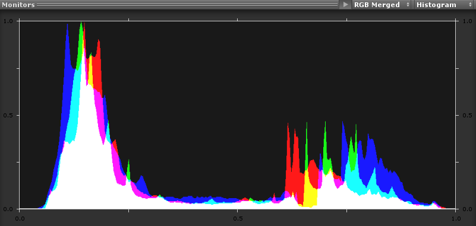
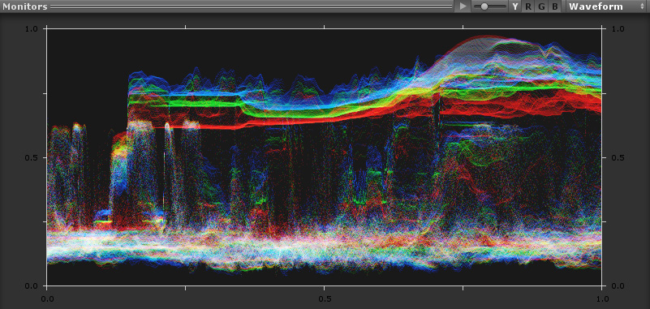
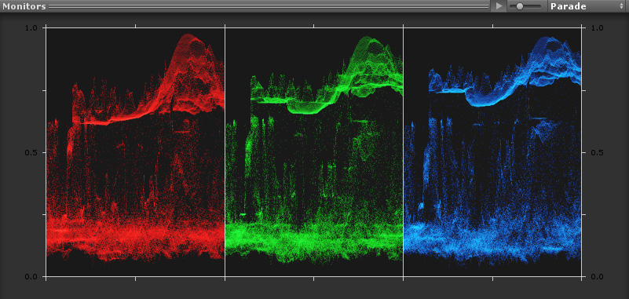
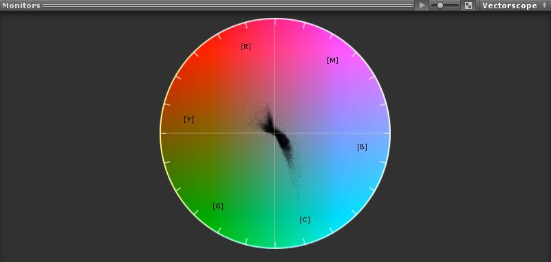

## Monitors

To help artists control the overall look and exposure of a scene, the [post-processing stack](PostProcessing-Stack) comes with a set of industry-standard monitors. You can find them in the preview area of the __Inspector__. Like with any other preview area in the __Inspector__, you can show/hide it by clicking it and undock it by right-clicking its title.

Each monitor can be enabled in play mode for real-time update by clicking the button with the play icon in the titlebar. Note that this can greatly affect performance of your scene in the editor, so use with caution. This feature is only available on [compute-shader](ComputeShaders) enabled platforms.

### Histogram

A standard gamma histogram, similar to the one found in common graphics editing software. A histogram illustrates how pixels in an image are distributed by graphing the number of pixels at each color intensity level. It can help you determine whether an image is properly exposed or not.

### Waveform

This monitors displays the full range of luma information in the render. The horizontal axis of the graph corresponds to the render (from left to right) and the vertical axis is the luminance. You can think of it as an advanced histogram, with one vertical histogram for each column of your image.

### Parade

The Parade monitor is similar to the Waveform only it splits the image into red, green and blue separately.

It is useful in seeing the overall RGB balance in your image, for instance, if there is an obvious offset in one particular channel, and in making sure objects and elements in the shot that should be black, or white are true black or true white. Something that is true black, white (or grey for that matter) will have equal values across all channels.

### Vectorscope

This monitor measures the overall range of hue (marked at yellow, red, magenta, blue, cyan and green) and saturation within the image. Measurements are relative to the center of the scope.

More saturated colors in the frame stretch those parts of the graph farther toward the edge, while less saturated colors remain closer to the center of the Vectorscope which represents absolute zero saturation. By judging how many parts of the Vectorscope graph stick out at different angles, you can see how many hues there are in the image. Furthermore, by judging how well centered the middle of the Vectorscope graph is relative to the absolute center, you can get an idea of whether there's a color imbalance in the image. If the Vectorscope graph is off-centered, the direction in which it leans lets you know that there's a color cast (tint) in the render.

### Requirements

* [Compute shader](ComputeShaders)

* Shader model 3

See the [Graphics Hardware Capabilities and Emulation](GraphicsEmulation) page for further details and a list of compliant hardware.

---

*  2017-05-24  <!-- include IncludeTextNewPageNoEdit -->

* New feature in 5.6