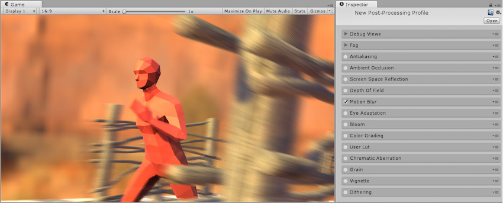
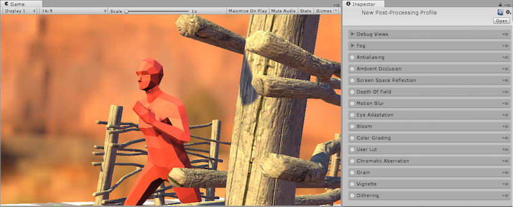
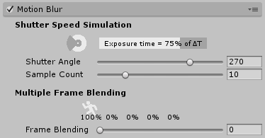

## Motion Blur

The effect descriptions on this page refer to the default effects found within the post-processing stack.

Motion Blur is a common post-processing effect that simulates the blurring of an image when objects filmed by a camera are moving faster than the camera’s exposure time. This can be caused by rapidly moving objects or a long exposure time. Motion Blur is used to subtle effect in most types of games but exaggerated in some genres, such as racing games.

The Motion Blur techniques supplied in the post-processing stack are:

* Shutter Speed Simulation

* Multiple Frame Blending

## Shutter Speed Simulation

Shutter Speed Simulation provides a more accurate representation of a camera’s blur properties. However, as it requires [Motion Vector](ScriptRef:DepthTextureMode.MotionVectors.html) support it is more expensive and not supported on some platforms. It is the recommended technique for desktop and console platforms. This effect approximates Motion Blur by storing the motion of pixels on screen in a Velocity buffer. This buffer is then used to blur pixels based on the distance they have moved since the last frame was drawn.

### Properties

| __Property:__| __Function:__ |
|:---|:---| 
| __Shutter Angle__| The angle of the rotary shutter. Larger values give longer exposure therefore a stronger blur effect. |
| __Sample Count__| The amount of sample points, which affects quality and performances. |

### Optimisation

* Reduce Sample Count

### Restrictions

* Unsupported in VR

### Requirements

* Motion Vectors

* Depth texture

* Shader model 3

See the [Graphics Hardware Capabilities and Emulation](GraphicsEmulation) page for further details and a list of compliant hardware.

## Multiple Frame Blending

The __Multiple Frame Blending__ effect simply multiplies the previous four frames over the current frame, weighted towards the more recent frames. Whilst this effect will work on all platforms, as it does not require Motion Vector or [Depth texture](SL-DepthTextures) support, it requires storing two history buffers (luma and chroma) of the last four frames which uses memory.

### Properties

| __Property:__| __Function:__ |
|:---|:---| 
| __Frame Blending__| The strength of multiple frame blending. The opacity of the preceding frames are determined from this coefficient and time differences. |

### Optimisation

* N/A

### Requirements

* Shader model 3

See the [Graphics Hardware Capabilities and Emulation](GraphicsEmulation) page for further details and a list of compliant hardware.

---

*  2017-05-24  <!-- include IncludeTextNewPageNoEdit -->

* New feature in 5.6