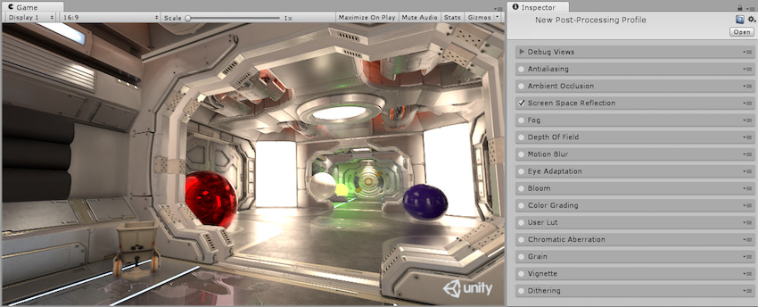
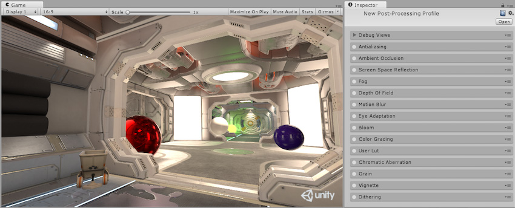
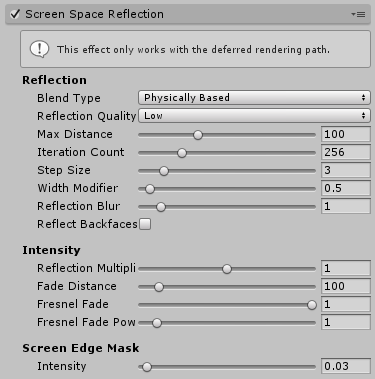
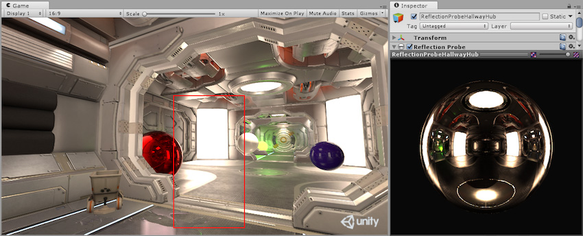
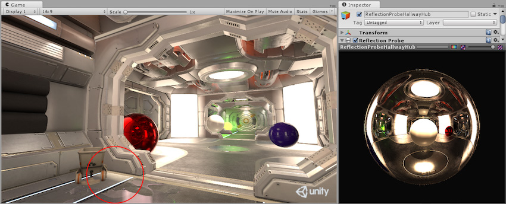

## Screen Space Reflection

The effect descriptions on this page refer to the default effects found within the post-processing stack.

Screen Space Reflection is a technique for reusing screen space data to calculate reflections. It is commonly used to create more subtle reflections such as on wet floor surfaces or in puddles.

Screen Space Reflection is an expensive technique, but when used correctly can give great results. Screen Space Reflection is only available in the [deferred rendering path](RenderTech-DeferredShading) as it relies on the Normals G-Buffer. As it is an expensive effect it is not recommended to be used on mobile.

### Properties

| __Property:__| __Function:__ |
|:---|:---| 
| __Blend Type__| How the reflections are blended into the render. |
| __Reflection Quality__| The size of the buffer used for resolve. Half resolution SSR is much faster, but less accurate. |
| __Max Distance__| Maximum reflection distance in world units. |
| __Iteration Count__| Maximum raytracing length. |
| __Step Size__| Ray tracing coarse step size. Higher traces farther, lower gives better quality silhouettes. |
| __Width Modifier__| Typical thickness of columns, walls, furniture, and other objects that reflection rays might pass behind. |
| __Reflection Blur__| Blurriness of reflections. |
| __Reflect Backfaces__| Renders the scene by culling all front faces and uses the resulting texture for estimating what the backfaces might look like when a point on the depth map is hit from behind.  |
| __Reflection Multiplier__| Nonphysical multiplier for the SSR reflections. 1.0 is physically based. |
| __Fade Distance__| How far away from the Max Distance to begin fading SSR. |
| __Fresnel Fade__| Amplify Fresnel fade out. Increase if floor reflections look good close to the surface and bad farther 'under' the floor. |
| __Fresnel Fade Power__| Higher values correspond to a faster Fresnel fade as the reflection changes from the grazing angle. |
| __(Screen Edge Mask) Intensity__| Higher values fade out SSR near the edge of the screen so that reflections don't pop under camera motion. |

### Optimisation

* Disable Reflect Backfaces

* Reduce Reflection Quality

* Reduce Iteration Count (increase step size to compensate)

* Use Additive Reflection

### Restrictions

* Unsupported in VR

### Details

Screen Space Reflection can be used to obtain more detailed reflections than other methods such as [Cubemaps](class-Cubemap) or [Reflection Probes](class-ReflectionProbe). Objects using Cubemaps for reflection are unable to obtain self reflection and Reflection Probe reflections are limited in their accuracy.

In the above image you can see inaccurate reflection in the red-highlighted area. This is due to the translation between the [Camera](class-Camera) and Reflection Probe. Also notice that as this Reflection Probe is baked it is unable to reflect dynamic object such as the colored spheres.

With realtime Reflection Probes (pictured above) dynamic objects are captured but, like in the example above, the position of the reflection is incorrect. In the red-highlighted area you can see the reflection of the white sphere.

Comparing these to the image at the top of the page (using Screen Space Reflection) we can clearly see the disparity in reflection accuracy, however these methods are much less expensive and should always be used when such accuracy is not necessary.

Screen Space Reflection is calculated by ray-marching from reflection points on the depth map to other surfaces. A reflection vector is calculated for each reflective point in the [depth buffer](SL-DepthTextures). This vector is marched in steps until an intersection is found with another point on the depth buffer. This second point is then draw to the original point as a reflection.

Reducing __Iteration Count__ reduces the amount of amount of times the ray is tested against the depth buffer, reducing the cost substantially. However, doing so will shorten the overall depth that is tested resulting in shorter reflections. Increasing the __Step Size__ increases the distance between these tests, regaining the overall depth but reducing precision.

When using the __Physically Based Blend Type__ the BRDF of the reflective material is sampled and used to alter the resulting reflection, this process is expensive but results in more realistic reflections, especially for rougher surfaces.

When using __Reflect Backfaces__ the effect will also raytrace in the opposite direction in attempt to approximate the reflection of the back of an object. This process vastly increases the cost of the effect but can be used to get approximate reflection on reflective objects with other objects in front of them.

### Requirements

* [Deferred rendering path](RenderTech-DeferredShading)

* [Depth & Normals texture](SL-CameraDepthTexture)

* Shader model 3

See the [Graphics Hardware Capabilities and Emulation](GraphicsEmulation) page for further details and a list of compliant hardware.

---

*  2017-05-24  <!-- include IncludeTextNewPageNoEdit -->

* New feature in 5.6
