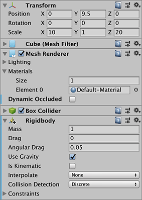

#Instance overrides

__Instance overrides__ allow you to create variations between Prefab instances, while still linking those instances to the same Prefab Asset.

When you modify a Prefab Asset, the changes are reflected in all of its instances. However, you can also make modifications directly to an individual instance. Doing this creates an __instance override__ on that particular instance.

An example would be if you had a Prefab Asset "Robot", which you placed in multiple levels in your game. However, each instance of the "Robot" has a different speed value, and a different audio clip assigned.

There are four different types of __instance override__:

* Overriding the value of a property

* Adding a component

* Removing a component

* Adding a child GameObject

There are some limitations with Prefab instances: you cannot reparent a GameObject that is part of a Prefab, and you cannot remove a GameObject that is part of the Prefab. You can, however, deactivate a GameObject, which is a good substitute for removing a GameObject (this counts as a property override).

In the Inspector window, instance overrides are shown with their name label in **bold**, and with a blue line in the left margin. When you add a new component a Prefab instance, the blue line in the margin spans the entire component.

Added and removed components also have plus and minus badges on their icons in the Inspector, and added GameObjects have a plus badge on their icon in the Hierarchy.

## Overrides take precedence

An overridden property value on a Prefab instance always takes precedence over the value from the Prefab Asset. This means that if you change a property on a Prefab Asset, it doesn’t have any effect on instances where that property is overridden.

If you make a change to a Prefab Asset, and it does not update all instances as expected, you should check whether that property is overridden on the instance. It is best to only use instance overrides when strictly necessary, because if you have a large number of instance overrides throughout your Project, it can be difficult to tell whether your changes to the Prefab Asset will or won’t have an effect on all of the instances.

## Alignment is specific to Prefab instance

The __alignment__ of a Prefab instance is a special case, and is handled differently to other properties. The __alignment__ values are never carried across from the Prefab Asset to the Prefab instances. This means they can always differ from the Prefab Asset’s alignment without it being an explicit instance override. Specifically, the alignment means the __Position__ and __Rotation__ properties on the root Transform of the Prefab instance, and for a Rect Transform this also includes the __Width__, __Height__, __Margins__, __Anchors__ and __Pivot__ properties.

This is because it is extremely rare to require multiple instances of a Prefab to take on the same position and rotation. More commonly, you will want your prefab instances to be at different positions and rotations, so Unity does not count these as Prefab overrides.

--------------------

* 2018-07-31  <!-- include IncludeTextNewPageSomeEdit -->

* Nested Prefabs and Prefab Variants added in 2018.3
