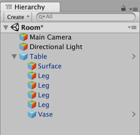

#Overrides at multiple levels

When you work with Prefabs inside other Prefabs, or with Prefab Variants, overrides can exist at multiple levels, and the same overrides can have multiple different Prefabs they can be applied to.

##Choice of apply target

When you have a Prefab instance which has nested Prefabs inside it, or which is a Prefab Variant, you might have a choice of which Prefab an override should be applied to.

Consider a Prefab "Vase" which is nested inside a Prefab “Table”, and the scene contains an instance of the “Table” Prefab.

If on this instance, a property on "Vase" is overridden, there are multiple Prefabs this override could be applied to: the “Vase” or the “Table”.

The __Apply All__ button in the Overrides drop-down window only allows applying the override to the outer Prefab - the "Table" in this case. But a choice of apply target is available when applying either via the context menu, or via the comparison view for individual components in the Overrides drop-down window.

In this example, if you choose __Apply to Prefab 'Vase'__, the value is applied to the ‘Vase’ Prefab Asset and is used for all instances of the ‘Vase’ Prefab.

And, if you choose __Apply as Override in Prefab 'Table'__, the value becomes an override on the instance of ‘Vase’ that is inside the ‘Table’ Prefab. The property is no longer marked as an override on the instance in the Scene, but if you open the ‘Table’ Prefab in Prefab Mode, the property on the ‘Vase’ Prefab instance is marked as an override there.

The ‘Vase’ Prefab Asset itself is not affected at all when overriding as an override in the 'Table' Prefab Asset. This means that all instances of the ‘Table’ Prefab now have the new value on their ‘Vase’ Prefab instance, but other instances of the ‘Vase’ Prefab that are not part of the ‘Table’ Prefab are not affected.

If the property on the ‘Vase’ Prefab itself is later changed, it will affect all instances of the ‘Vase’ Prefab, except where that property is overridden. Since it’s overridden on the ‘Vase’ instance inside the ‘Table’ Prefab, the change won’t affect any of the ‘Vase’ instances that are part of ‘Table’ instances.

##Applying to inner Prefabs may affect outer Prefabs too

Applying one or more properties to an inner Prefab Asset can sometimes modify outer Prefab Assets as well, because those properties get their overrides reverted in the outer Prefabs.

In our example, if __Apply to Prefab ‘Vase’__ is chosen and the 'Table' Prefab has an override of the value, this override in the 'Table' Prefab is reverted at the same time so that the property on the instance retains the value that was just applied. If this was not the case, the value on the instance would change right after being applied.

--------------------

* 2018-07-31  <!-- include IncludeTextNewPageSomeEdit -->

* Nested Prefabs and Prefab Variants added in 2018.3