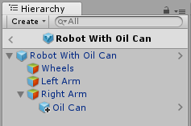

#Prefab Variants

Prefab Variants are useful when you want to have a set of predefined variations of a Prefab.

For example, you might want to have several different types of robot in your game, which are all based on the same basic robot Prefab. However you may want some robots to carry items, some to move at different speeds, or some to emit extra sound effects.

To do this, you could set up your initial robot Prefab to perform all the basic actions you want all robots to share, then you could create several Prefab Variants to:

* Make a robot move faster by using a property override on a script to change its speed.

* Make a robot carry an item by attaching an additional GameObject to its arm.

* Give robots a rusty joint by adding an AudioSource component that plays a rusty squeaking sound.

A Prefab Variant inherits the properties of another Prefab, called the base. Overrides made to the Prefab Variant take precedent over the base Prefab’s values. A Prefab Variant can have any other Prefab as its base, including Model Prefabs or other Prefab Variants.

## Creating a Prefab Variant

There are multiple ways to create a Prefab Variant based on another Prefab.

You can **right-click** on a Prefab in the Project view and select __Create &gt; Prefab Variant__. This creates a variant of the selected Prefab, which initially doesn’t have any overrides. You can open the Prefab Variant in Prefab Mode to begin adding overrides to it.

You can also **drag** a Prefab instance in the Hierarchy into the Project window. When you do this, a dialog asks if you want to create a new Original Prefab or a Prefab Variant. If you choose Prefab Variant you get a new Prefab Variant based on the Prefab instance you dragged. Any overrides you had on that instance are now inside the new Prefab Variant. You can open it in Prefab Mode to add additional overrides or edit or remove overrides.

Prefab Variants are shown with the blue Prefab icon decorated with arrows.

## Editing a Prefab Variant

When a Prefab Variant is opened in Prefab Mode, the root appears as a Prefab instance with the blue Prefab icon. This Prefab instance represents the base Prefab that the Prefab Variant inherits from; it doesn’t represent the Prefab Variant itself. Any edits you make to the Prefab Variant become overrides to this base that exists in the Variant.

In the screenshot above, if you were to select the __Robot With Oil Can__ root GameObject and click the __Select__ button in the Inspector, it will select the base Prefab __Robot__ and not the Variant __Robot With Oil Can__ because the Prefab instance is an instance of the base Prefab __Robot__ and the __Select__ button always selects the Prefab Asset that an instance comes from.

As with any Prefab instance, you can use prefab overrides in a Prefab Variant, such as modified property values, added components, removed components, and added child GameObjects. There are also the same limitations: you cannot reparent GameObjects in the Prefab Variant which come from its base Prefab. You also cannot remove a GameObject from a Prefab Variant which exists in its base Prefab. You can, however, deactivate GameObjects (as a property override) to achieve the same effect as removing a GameObject.

**Note**: When editing a Prefab Variant in Prefab Mode, you should understand that applying these overrides (via the Overrides drop-down window or context menus) will cause your variant’s variations to be applied to the base Prefab Asset. This is often **not** what you want. The point of a Prefab Variant is to provide a convenient way to store a meaningful and reusable collection of overrides, which is why they should normally remain as overrides and not get applied to the base Prefab Asset. To illustrate this point, if you were to apply the additional __Oil Can__ GameObject to the base Prefab Asset (the “Basic Robot”), then the Prefab Asset would also have the __Oil Can__. The whole point of the __Robot With Oil Can__ variant is that only this variation  carries an oil can, so the added __Oil Can__ GameObject should be left as an override inside the Prefab Variant.

When you open the Overrides drop-down window, you can always see in its header which object the overrides are to, and in which context the overrides exist. For a Prefab Variant, the header will say that the overrides are to the base Prefab and exist in the Prefab Variant. To make it extra clear, the __Apply All__ button also says __Apply All to Base__.

--------------------

* 2018-07-31  <!-- include IncludeTextNewPageSomeEdit -->

* Nested Prefabs and Prefab Variants added in 2018.3
