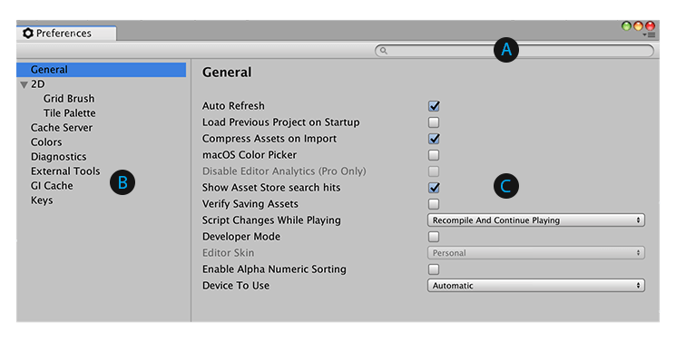
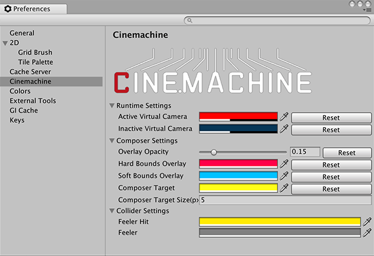
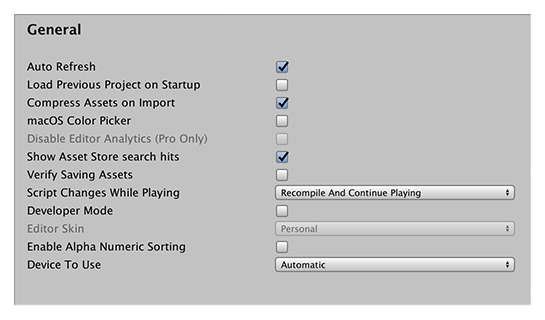
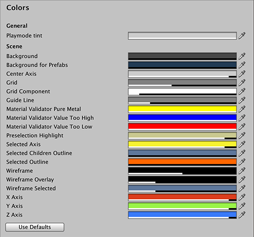
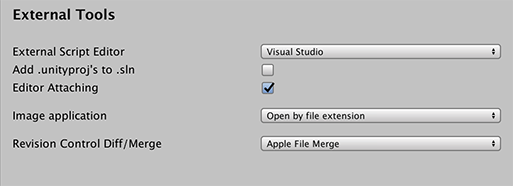
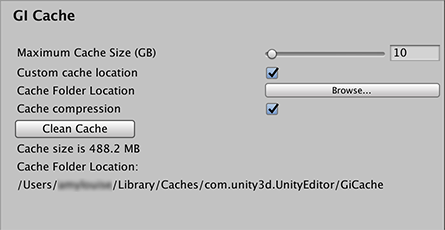
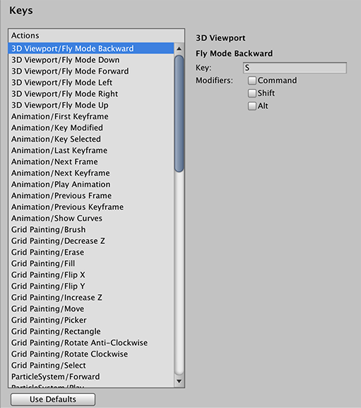

# Preferences

Unity provides a number of preferences that allow you to customize the behavior of the Unity Editor. 

 The *search box* allows you to enter keywords so you can filter the list on the left by category and highlight keywords on the right. For more information, see [Finding settings](comp-ManagerGroup#find-settings).

 Preferences are grouped by category. The *category list* displays a list of available categories. When you click on a preference category, all preferences matching that category appear in the details pane.

 The *details pane* displays the list of preferences for each category.

To access the **Preferences** window, go to __Edit__ > __Preferences__ (Windows) or __Unity__ > __Preferences__ (Mac) from the main menu in Unity. The following preference categories are available:

* [General](#General)
* [2D](#2D)
	* [Grid Brush](#2D-Brush)
	* [Tile Palette](#2D-Palette)
* [Cache Server](#Cache-Server)
* [Colors](#Colors)
* [External Tools](#External-Tools)
* [GI Cache](#GI-Cache)
* [Keys](#Keys)

## Package custom preferences

Some AssetStore or Unity packages add their own custom preferences to the **Preferences** window. Generally these use the package name as the preferences category. In this example, you can see the [Cinemachine package](https://docs.unity3d.com/Packages/com.unity.cinemachine@latest) preferences:

For information about a specific package's preferences, see the documentation for that package. This section contains documentation only for standard Unity preferences.

## General

 

**General** preferences allow you to customize working in Unity overall. 

| **Property** || **Function** |
|:---|:---|:---|
|__Auto Refresh__||Enable this option to update Assets automatically as they change.|
|__Load Previous Project on Startup__||Enable this option to always load the previous Project at startup.|
|__Compress Assets on Import__||Enable this option to automatically compress Assets during import.|
|__macOS Color Picker__|| Enable this option to use the native macOS color picker instead of Unity's own. |
|__Disable Editor Analytics__ (Pro only)||Enable this option to stop the Editor automatically sending information back to Unity.|
|**Show Asset Store search hits**|| Enable this option to show the number of free/paid Assets from the Asset Store in the Project Browser. |
|__Verify Saving Assets__||Enable this option if you wish to verify which Assets to save individually on quitting Unity.|
|__Script Changes While Playing__||Choose Unity’s behavior when scripts change while your game is running in the Editor.|
||*Recompile And Continue Playing*|Recompile your scripts and keep running the Scene. This is the default behaviour, but you might want to change it if your scripts rely on any non-serializable data.|
||*Recompile After Finished Playing*| Defer recompilation until you manually stop your Scene, avoiding any interruption.|
||*Stop Playing And Recompile*|Immediately stop your Scene for recompilation, allowing you to quickly restart testing.|
|__Editor Skin__||Choose which skin to use in the Unity Editor. This is only available for Plus and Pro editions of Unity.|
||*Personal*|Use the light grey background with black text.|
||*Professional*|Use the dark grey background with white text.|
|__Enable Alpha Numeric Sorting __||Enable this option to display a button in the top-right corner of the [Hierarchy](Hierarchy) window, which toggles between Transform sort (the default) and Alphanumeric sort.|
|__Asynchronous Shader Compilation__|| Check this box to make Unity compile shaders in the background. While compiling, the Unity engine uses a dummy shader to render geometry in the Editor. When shader compilation has finished, the engine swaps your shader variant back in. This means the Editor runs seamlessly, without having to wait for the Unity engine to compile every single shader before rendering.| 
|__Device To Use __||Choose which of your computer’s graphics devices Unity should use. You can leave this on Automatic unless you want Unity to use a specific device. This setting overrides any device specified in command line options.|

## 2D

Use the __Max Sprite Atlas Cache Size (GB)__ preference to set the maximum size of the [Sprite Atlas](SpriteAtlas) cache folder. Whenever possible, Unity keeps the size of this folder below this level.

### Grid Brush

Enable the **Show Flood Fill Preview** to preview the Tilemap you are painting in Flood Fill mode. This option is enabled by default, but you can disable it to improve performance for large fill areas.

### Tile Palette

Choose a behavior from the **Tile Palette Target Edit Mode** drop-down menu to determine how to edit a Prefab instance in the [Tile Palette](Tilemap-Palette) when that instance is selected as the Active Target.

| **Behavior** | **Description** |
|:---|:---|
|__Enable Dialog__| Always ask how to edit the instance (either in Prefab Mode or in the Scene). This is the default. |
|__Edit in Prefab Mode__| Edit the Paint target [in Prefab mode](EditingInPrefabMode). |
|__Edit in Scene__| Edit the Prefab instance [directly in the Scene](EditingPrefabViaInstance). |

## Cache Server

Any time an Asset changes, Unity automatically re-imports it. Setting up a Cache Server drastically reduces the time it takes to import Assets. You can set up a Cache Server using remote hosting or stored on your local computer. 

 

By default, the [Cache Server](CacheServer) is disabled. 

To enable it, choose one of the other options from the __Cache Server Mode__ drop-down menu:

| **Property** | **Function** |
|:---|:---|
|__Local__| Use a local Cache Server on this computer. The preferences for [Remote hosting](#remote) appear. |
|__Remote__| Use a Cache Server hosted on a remote computer. The preferences for [Local storage](#local) appear. |

### Remote hosting

 

These preferences are only available when the __Use Cache Server__ is set to __Remote__. 

| **Property** | **Function** |
|:---|:---|
|__IP Address__| Enter the IP address of the dedicated cache server that [an administrator set up](CacheServer#admin-setup). |
|__Check Connection__ | Click this button to attempt to connect to the remote Cache Server. |

### Local storage

 

These preferences are only available when the __Use Cache Server__ is set to __Local__. 

| **Property** | **Function** |
|:---|:---|
|__Maximum Cache Size (GB)__ | Specify the maximum size in gigabytes for the Cache Server on this computer’s storage. The minimum size is 1GB. The maximum size is 200GB.  The default cache size is 10GB. |
|__Custom cache location__ |Enable this option to specify a location where you want to store the cache. |
|__Cache Folder Location__ |Click the **Browse** button to specify a location for the cache. |
|__Cache size is__ ... | Message displaying the current size of the cache. Before clicking the __Check Cache Size__ button, this appears as **Cache size is unknown**. After clicking the button, the calculated cache size appears in the message. |
|__Check Cache Size__ |Click this to find out how much storage the Local Cache Server is using. This operation can take some time to complete if you have a large project. |
|__Clean Cache__ |Delete the contents of the cache. |

## Colors

 

The **Colors** preferences allow you to choose the colors that Unity uses when displaying various user interface elements.

## External Tools

 

The **External Tools** preferences allow you to set up external applications for scripting, working with images, and source control.

| **Property** | **Function** |
|:---|:---|
| __External Script Editor__ | Choose which application Unity should use to open script files. Unity automatically passes the correct arguments to script editors it has built-in support for. Unity has built-in support for Visual Studio (Express), Visual Studio Code, Xamarin Studio, MonoDevelop and JetBrains Rider. |
| __External Script Editor Args__ | Set the arguments to pass to the external script editor. `$(File)` is replaced with a path to a file being opened. `$(Line)` is replaced with a line number that editor should jump to. `$(ProjectPath)` is replaced with the path to the open project.  If not set on macOS, then the default mechanism for opening files is used. Otherwise, the external script editor is only launched with the arguments without trying to open the script file using the default mechanism.   See below for examples of external script editor arguments. |
| __Add .unityproj's to .sln__ | Enable this option to add UnityScript (.unityproj) projects to the generated solution (.sln) file. This is enabled by default for MonoDevelop and Xamarin Studio, and disabled by default for Visual Studio (Express) and Visual Studio Code. |
| __Editor Attaching__ | Enable this option to allow debugging of scripts in the Unity Editor. If this option is disabled, it is not possible to attach a script debugger to Unity to debug your scripts. |
| __Image application__ | Choose which application you want Unity to use to open image files. |
| __Revision Control Diff/Merge__ | Choose which application you want Unity to use to resolve file differences with the Asset server. Unity detects these tools in their default installation locations (and checks registry keys for TortoiseMerge, WinMerge, PlasticSCM Merge, and Beyond Compare 4 on Windows). |

### Examples of script editor arguments

* **Gvim/Vim**: `--remote-tab-silent +$(Line) "$File"`
* **Notepad2**: `-g $(Line) "$(File)"`
* **Sublime Text 2**: `"$(File)":$(Line)`
* **Notepad++**: `-n$(Line) "$(File)"`

## GI Cache 

The [Global Illumination](GIIntro) (GI) system uses [a cache on each computer](GICache) to store intermediate files used to pre-compute real-time Global Illumination. All projects on the computer share the cache.

| **Property** | **Function** |
|:---|:---|
|__Maximum Cache Size (GB)__| Use the slider to set the maximum GI cache folder size. Unity keeps the GI cache folder size below this number whenever possible. Unity periodically deletes unused files to create more space (deleting the oldest files first). This is an automatic process, and doesn't require you to do anything.  **Note:** If the current Scene is using all the files in the GI cache, increase your cache size. Otherwise, resource-intensive recomputation occurs when baking. This can happen when the Scene is very large or the cache size is too small. |
|__Custom cache location__|Enable this option to allow a custom location for the GI cache folder. By default, the GI cache is stored in the _Caches_ folder. All Projects share the cache folder. **Tip:** Storing the GI Cache on an SSD drive can speed up baking in cases where the baking process is I/O bound. |
|__Cache Folder Location__ |Click the **Browse** button to specify a location for the cache. |
|__Cache compression__|Enable this option to allow Unity to compress files in the GI cache and reduce the size of the generated data. The files are LZ4-compressed by default, and the naming scheme is a hash and a file extension. The hashes are computed based on the inputs to the lighting system, so changing any of the following can lead to recomputation of lighting: - Materials (Textures, Albedo, Emission) - Lights - Geometry - Static flags - Light Probe groups - Reflection probes - Lightmap Parameters **Tip:** If you need to access the raw Enlighten data, disable Cache Compression and clean the cache.|
|__Clean Cache__| Use this button to clear the cache directory.  It is not safe to delete the GI Cache directory manually while the Editor is running. This is because the Editor creates the _GiCache_ folder when it starts and maintains a set of references to those files. The __Clean Cache__ button ensures that the Editor releases all references to the files on disk before they are deleted. |

## Keys

 

This __Keys__ preferences allow you to set the hotkeys that activate various commands in Unity.

When you select one of the __Actions__ from the list on the left, Unity displays any current key assignments in the __Key__ and indicates when to use any key __Modifiers__ by showing or hiding a checkmark: 

| **Property** | **Function** |
|:---|:---|
|__Command__|When enabled, hold down the Control button (Windows) or the Command button (Mac). |
|__Shift__|When enabled, hold down the Shift button. |
|__Alt__|When enabled, hold down the Alt button (Windows) or the Option button (Mac). |

**Note:** Modifying a hotkey assignment is immediate, but you can revert all hotkey assignment changes by clicking the **Use Defaults** button.

------

* 2018-11-16 <!-- include IncludeTextAmendPageSomeEdit -->
* Updated list of external script editors in 2018.1
* Script Changes While Playing and Device To Use drop-down menus added in Unity 2018.2
* New unified settings and other updates for Unity 2018.3
* Selection outline color preference for child GameObjects added in 2018.3
