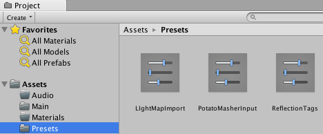

# Presets

Use Presets to reuse property settings across multiple components and assets.

With Presets you can also specify default settings for new components and the [import settings](ImportingAssets) for Assets. Use the [Presets](class-PresetManager) settings to view and choose the Presets to use for default settings. 

Use Presets to streamline your team’s workflows. You can even use Presets to specify settings for [Project Settings](comp-ManagerGroup) windows, including the **Preset** settings themselves. Use this feature to configure a project then [export it](HOWTO-exportpackage) as a custom package. Your team members can [import](AssetPackages) this package into their projects.

Presets are an Editor-only feature. You can [support Presets](SupportingPresets) in your extensions to the Unity Editor. Presets are not available at run time in the Unity Player. 

## Reusing property settings

You use Presets like copying and pasting. But instead of copying settings to the clipboard, you  save them to use later. And like pasting settings, applying a Preset to an item changes the properties in the item. 

For example, select a GameObject to edit the properties of its RigidBody component. Save these settings to a Preset. Then apply the Preset to RigidBody components in other GameObjects. The other components in the GameObjects are not affected; the Preset only applies its settings to the RigidBody component.

You can store Presets in the `Assets` folder of your project. Use the [Project](ProjectView) window to view and select Presets to edit in the __Inspector__.

## Saving property settings to a Preset

Use the __Select Preset__ window to save property settings.

**Tip: **You can also save a Preset while in Play Mode.

To save settings to a Preset:

1. Select the GameObject, Asset import settings, or Project Settings window from which you want to reuse settings.
2. In the __Inspector__ window, edit the properties.
3. Click the Preset icon at the top-right of the __Inspector__ window.  
4. In the Select Preset window, click __Save current to__.   A File Save dialog appears.

5. Choose the location of your new Preset, enter its name, and click __Save__.

## Applying a Preset

Apply a saved Preset with the __Select Preset__ window or by dragging and dropping a Preset from the __Project__ window onto the GameObject.

**Note:** Applying a Preset copies properties from the Preset to the item. It doesn’t link the Preset to the item. Changes you make to the Preset do not affect the items you have previously applied the Preset to.

To apply a Preset to a Project Settings window, an existing component, or import settings for an Asset:

1. Select the Settings window, GameObject, or Asset import settings that you want to apply a Preset to.

2. In the __Inspector__, click the __Preset__ icon.

3. In the __Select Preset __window, search for and select the Preset to apply.

	Selecting the Preset applies it to the component, asset, or Project Settings window.

4. Close the __Select Preset__ window.

Drag and drop a Preset from the [Project](ProjectView) window to apply properties to a component in a GameObject:

* Drop the Preset on an empty spot in the [Hierarchy](Hierarchy) window. Unity creates a new, empty GameObject and adds a component with properties copied from the Preset.

* Drop the Preset on an existing GameObject in the __Hierarchy__. Unity adds a new component and copies properties from the Preset.

* Drop the Preset on the [Inspector](UsingTheInspector) window at the end of a GameObject. Unity adds a new component and copies properties from the Preset.

* Drop the Preset on the __Inspector__ onto the title of an existing component. Unity copies properties from the Preset.

## Using Presets for transitions of Animation State nodes

You can save and apply Presets for [Animation State](class-State) nodes. However, the [transitions](class-Transition) in the Preset are shared among Presets and the nodes that you apply the Preset to. For example, you apply a Preset to two different nodes in the [Animator window](AnimatorWindow). In the Inspector window, you edit the settings for one of the transitions in the first node. Your change also appears in the other node and in the Preset.

## Using Presets for importing Assets

You can save Presets for Asset [import settings](ImportingAssets). However, applying a Preset to import settings does not affect the cross-platform settings. To apply a Preset so that it includes cross-platform settings, set the [Preset as a default](class-PresetManager) then use the __Reset__ command. 

You can also use a [script](DefaultPresetsByFolder) to apply a Preset to an Asset based on the location of the Asset in the Project window.

## Editing a Preset

Use the [Inspector](UsingTheInspector) window to edit a Preset Asset.

**Note:** Changing the properties in a Preset does not update the items that you applied the Preset to. For example, if you apply a Preset for a RigidBody component to a GameObject, then edit the Preset, the settings in the RigidBody component do not change.

 2017-03-27  <!-- include IncludeTextNewPageSomeEdit -->

New feature in [2018.1](https://docs.unity3d.com/2018.1/Documentation/Manual/30_search.html?q=newin20181) NewIn20181
