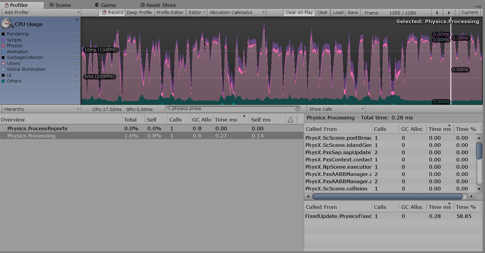

Physics Profiler
================

The Physics Profiler displays statistics about physics that have been processed by the physics engine in your Scene. This information can help you diagnose and resolve performance issues or unexpected discrepancies related to the physics in your Scene. 

See also [Physics Debug Visualization](PhysicsDebugVisualization).

Properties
----------

|**Property** |**Function** |
|:---|:---|
|__Active Dynamic__|The number of non-Kinematic Rigidbody components that are not sleeping.|
|__Active Kinematic__|The number of Kinematic Rigidbody components that are not sleeping. Note that Kinematic Rigidbody components with joints attached may be processed multiple times per frame, and this contributes to the number shown. A Kinematic Rigidbody is active when [MovePosition](ScriptRef:Rigidbody.MovePosition.html) or [MoveRotation](ScriptRef:Rigidbody.MoveRotation.html) is called in a frame, and remains active in the next frame.|
|__Static Colliders__|The number of Collider components on GameObjects that don’t have Rigidbody components attached to the GameObjects or their parent GameObjects. If such GameObjects or their parent GameObjects have Rigidbody components, the Colliders will not count as Static Colliders. Those Colliders are instead referred to as Compound Colliders. These help to arrange multiple Colliders of a body in a convenient way, rather than having all the Colliders on the same GameObject as the Rigidbody component.|
|**Rigidbody**|The number of Rigidbody components processed by the physics engine, irrespective of the components’ sleeping state.|
|__Trigger Overlaps__|The number of overlapping triggers (counted in pairs).|
|__Active Constraints__|The number of primitive constraints processed by the physics engine. Constraints are used as a building block of Joints as well as collision response. For example, restricting a linear or rotational degree of freedom of a [ConfigurableJoint](ScriptRef:ConfigurableJoint.html) involves a primitive constraint per each restriction.|
|__Contacts__|The total number of contact pairs between all Colliders in the Scene, including the amount of trigger overlap pairs as well. Note that contact pairs are created per Collider pair once the distance between them is below a certain user configurable limit, so you may see contacts generated for Rigidbody components that are not yet touching or overlapping. Refer to [Collider.contactOffset](ScriptRef:Collider-contactOffset.html) and [ContactPoint.separation](ScriptRef:ContactPoint-separation) for more details.|

**Notes**:

* The numbers might not correspond to the exact number of GameObjects with physics components in your Scene. This is because some physics components are processed at a different rate depending on which other components affect it (for example, an attached Joint component). To calculate the exact number of GameObjects with specific physics components attached, write a custom script using the [FindObjectsOfType](https://docs.unity3d.com/ScriptReference/Object.FindObjectsOfType.html) function.

* The Physics Profiler does not show the number of sleeping Rigidbody components. These are components which are not engaging with the physics engine, and are therefore not processed by the Physics Profiler. Refer to [Rigidbody overview: Sleeping](RigidbodiesOverview) for more information on sleeping Rigidbody components.

##Using the Physics Profiler to understand performance issues

The physics simulation runs on a separate fixed frequency update cycle from the main logic’s update loop, and can only advance time via a [Time.fixedDeltaTime](ScriptRef:Time-fixedDeltaTime.html) per call. This is similar to the difference between [Update](ScriptRef:MonoBehaviour.Update.html) and [FixedUpdate](ScriptRef:MonoBehaviour.FixedUpdate.html) (see documentation on the [Time](class-TimeManager) window for more). 

When a heavy logics or graphics frame occurs that takes a long amount of time, the Physics Profiler has to call the physics simulation multiple times per frame. This means that an already resource-intensive frame takes even more time and resources, which can easily cause the physics simulation to temporarily stop due to the __Maximum Allowed Timestep__ value (which can be set in __Edit__ > __Project Settings__, then select the __Time__ category). 

You can detect this in your project by selecting the [CPU Usage Profiler](ProfilerCPU) and checking the number of calls for __Physics.Processing__ or __Physics.Simulate__ in the __Overview__ section. 

In this example image, the value of 1 in the __Calls__ column indicates that the physics simulation was called one time over the last logical frame. 

A call count close to 10 might indicate an issue. As a first solution, reduce the frequency of the physics simulation; if the issue continues, check what could have caused the heavy frame right before the Physics Profiler had to use that many simulation calls in order to catch up with the game time. Sometimes, a heavy graphics frame may cause more physics simulation calls later on in a Scene. 

For more detailed information about the physics simulation in your Scene, click the triangle arrow to expand __Physics.Processing__ as shown in the screenshot above. This displays the actual names of the physics engine tasks that run to update your Scene. The two most common names you’re likely to see are:

* __Pxs__: short for ‘PhysX solver’, which are physics engine tasks required by joints as well as resolving contacts for overlapping bodies.

* __ScScene__: used for tasks required for updating the Scene, running the broad phase and narrow phase, and integrating bodies (moving them in space due to forces and impulses). See [Steven M. LaValle’s work on Planning Algorithms](http://planning.cs.uiuc.edu/node214.html) for a definition on two-phase collision detection phases.
